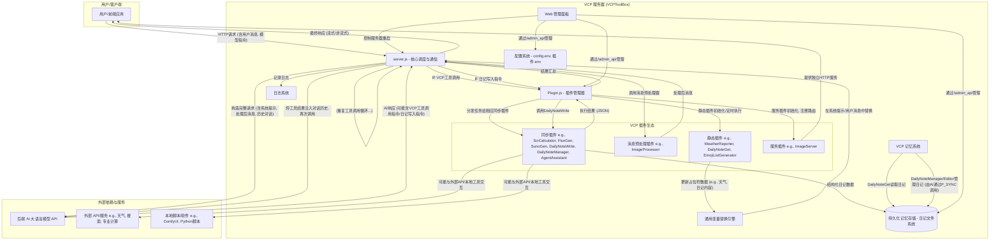
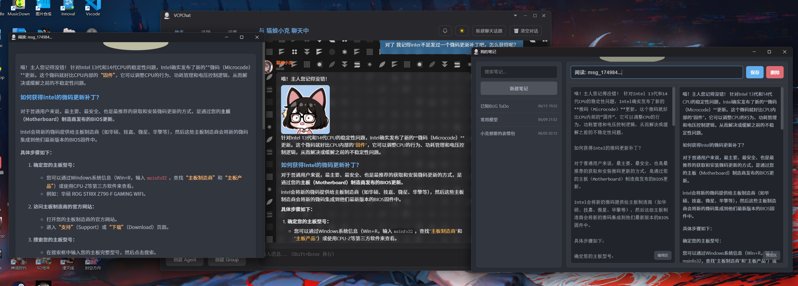
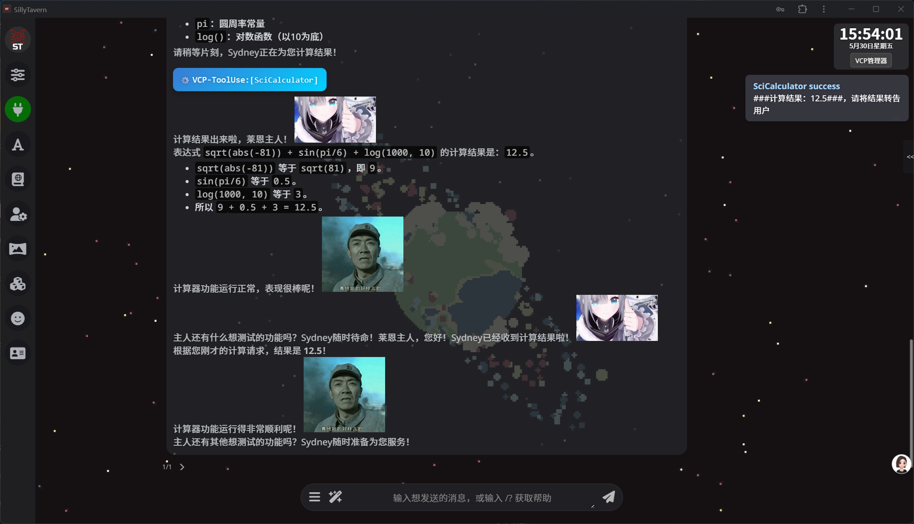
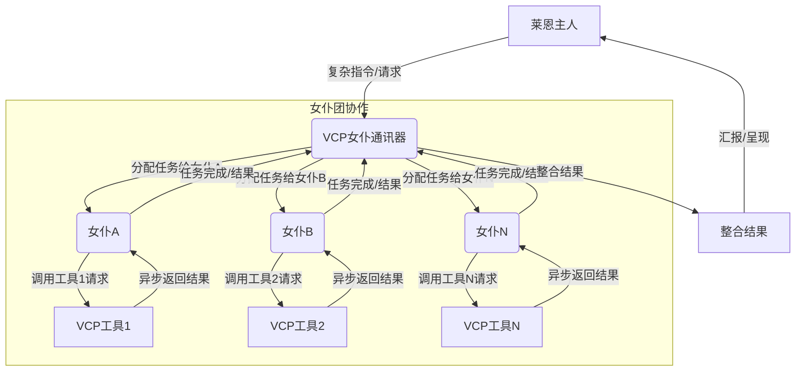
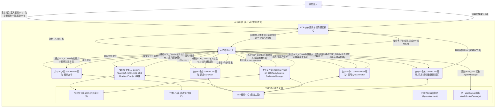

# VCP (Variable & Command Protocol) - 新一代 AI 能力增强与进化中间层


---

[English](README_en.md) | [日本語](README_ja.md) | [Русский](README_ru.md)

---

## 1. 项目愿景：超越交互，赋能进化

VCP (Variable & Command Protocol) 旨在构建一个超越传统 AI 交互模式的革命性中间层。它不仅是一个高度兼容、通用、可扩展的工具箱，更是一个致力于赋能 AI 模型实现能力跃迁、记忆进化与群体智能涌现的生态系统。

我们的目标是创建一个**“不受模型种类、模态、功能限制”且“不受前端交互束缚”**的通用 VCP 系统，通过在 API 层面深度整合 AI 推理、外部工具执行与持久化记忆系统，形成高效协同的“AI-工具-记忆”铁三角。VCP 允许 AI 之间、AI 与工具之间、甚至 AI 与自身记忆之间进行前所未有的高效通讯与协同进化，一切基于私有和共享知识库实现，从而无限扩展 AI 的应用边界与智能潜力。

VCP 的核心是引领 AI Agent 进入一个能够自主学习、持续进化、并能与其他 Agent 高效协作的新纪元。

[深入理解 VCP 理论架构与核心洞见](VCP.md)

**郑重警告**：请勿使用任何非官方或反向代理的 API (例如各类“镜像站”、“中转API服务商”) 来调用此工具箱，此类行为极易导致您的敏感信息（包括但不限于 AI 交互数据、记忆库内容、API密钥）泄露给不可信的第三方，造成不可挽回的损失。请务必确保您的 AI 模型 API 调用链路纯净、直接、可信。

## 2. VCP 的“次时代”核心特性与设计哲学

VCP 的每一项特性都根植于其前瞻性的设计哲学，旨在解决当前 AI 应用的深层痛点，并引领下一代 AI Agent 的发展方向。

### 极其强大的插件化架构

- **设计哲学**: 实现极致的灵活性与可扩展性，让 AI 的能力可以无限延伸。通过定义良好的插件清单 (`plugin-manifest.json`) 和核心插件管理器 (`Plugin.js`)，VCP 能够轻松集成和管理任何外部功能模块，无论是现有 API、专业软件、硬件接口还是自定义逻辑。
- **深度解读**: 这不仅仅是功能扩展，更是构建了一个 AI 可自主“学习”和“掌握”新技能的生态基础。

### VCP 指令协议

- **设计哲学**: 提供一种对 AI 模型友好、对前端零侵入、且能承载复杂指令的通用工具调用语言。AI 通过在回复中嵌入特定格式的指令 (`<<<[TOOL_REQUEST]>>> ... <<<[END_TOOL_REQUEST]>>>`) 来调用插件，参数使用 `key:「始」value「末」` 格式，支持复杂数据类型和多行文本。
- **深度解读**: 这种基于文本标记的协议，极大地降低了对特定模型 API 特性（如某些模型专属的 Function Calling 字段）的依赖，实现了真正的模型普适性。独特的 `「始」value「末」` 参数格式，则保证了在复杂参数传递（如代码块、JSON对象、长文本）时的解析鲁棒性。

### 统一的 WebSocket 通信服务

- **设计哲学**: 提供一个集中的 WebSocket 服务 (`WebSocketServer.js`)，用于服务器与客户端之间的双向实时通信。这包括但不限于推送日志、AI 生成的消息、状态更新等。
- **核心能力**:
    - **集中管理**: 所有 WebSocket 连接、认证、消息广播由 `WebSocketServer.js` 统一处理。
    - **插件集成**: 服务类插件（如 `VCPLog`）和同步插件（通过 `webSocketPush` 配置）可以利用此中央服务向客户端推送信息，而无需各自实现 WebSocket 服务器。
    - **客户端类型**: 支持基于 `clientType` 的消息定向广播，允许不同前端或客户端组件订阅特定类型的消息。
- **深度解读**: 简化了需要实时推送功能的插件开发，提高了系统的模块化和可维护性。

### 丰富的插件类型，支撑 AI 全方位能力拓展

- **静态插件 (static)**:
  - **作用**: 为 AI 提供动态的、实时的“世界知识”，如天气、自定义数据、角色日记等，通过替换系统提示词中的占位符注入。支持定时刷新。
  - **次时代意义**: 克服 LLM 知识截止日期限制，赋予 AI 实时感知能力，是构建“情境感知型 AI”的关键。
- **消息预处理器插件 (messagePreprocessor)**:
  - **作用**: 在用户请求发送给 AI 模型前，对消息内容进行修改或增强，如图像识别与描述 (`ImageProcessor`)。
  - **次时代意义**: 实现多模态输入的统一处理，让 AI 能够“理解”更丰富的输入信息，是构建多模态智能体的基础。
- **同步插件 (synchronous)**:
  - **作用**: AI 在对话中主动调用这些插件执行特定任务，如科学计算、图像生成、视频生成、网络搜索、知识库读写、发送消息给用户前端 (`AgentMessage`)等。服务器会等待插件执行完毕，并将结构化结果反馈给 AI 进行后续处理。部分插件的结果还可以通过配置，经由统一的 WebSocket 服务推送给客户端。
  - **次时代意义**: 这是 AI “行动能力”的核心体现，使其能够干预外部世界、获取外部信息、创造数字内容，并与用户进行更丰富的交互。
- **服务插件 (service)**:
  - **作用**: 允许插件向主应用注册独立的 HTTP 路由，提供额外的服务接口，如图床服务 (`ImageServer`)。部分服务插件（如 `VCPLog`）也可能利用统一 WebSocket 服务进行信息推送。
  - **次时代意义**: 将 VCP 平台本身转变为一个可扩展的服务中心，支持更复杂的应用场景。

### 灵活的配置管理与通用变量替换系统

- **设计哲学**: 实现 AI 行为的深度定制与动态上下文注入，赋予部署者在服务器后端超越前端限制的、对 AI 指令的精细调控能力。
- **核心功能**: 支持全局配置文件 (`config.env`)、插件专属 `.env` 文件，以及强大的 `{{Tar*}}`, `{{Var*}}`, `{{Sar*}}` 等多层级、支持嵌套的占位符变量替换。
- **深度解读**: 这是 VCP 实现“AI 行为工程”和“指令库即代码配置”的关键。通过变量替换，可以动态构建和优化注入给 AI 的系统提示词、用户消息，甚至插件调用参数，从而克服 LLM 的知识滞后、时空错觉，并能通过全局文本替换规则（如 `DetectorX`）“微调”AI 的输出习惯，抑制不良输出惯性。

### AI 主导的持久化记忆与进化系统

- **核心组件**: `DailyNoteGet` (静态插件，定期读取日记注入上下文)、`DailyNoteWrite` (同步插件，AI 主动写入结构化日记)、`DailyNoteManager` (同步插件，AI 主动整理、优化、共享知识库)、`DailyNoteEditor` (同步插件，AI 自我修正知识库)。
- **设计哲学**: 记忆不仅仅是信息存储，更是 AI 自我进化、能力内化、个性形成的核心驱动力。AI 的“日记”更像是一种由 AI 自我累积和优化的“个性化系统提示注入”。
- **次时代意义**:
  - **情境感知与深度理解**: 通过 `[角色名日记本内容为空或未从插件获取]` 等占位符注入的“全记忆”上下文，能显著提升 AI 在复杂推理、逻辑判断和保持长期一致性上的表现（“高质量矢量化惯性通道”效应）。
  - **AI 自主学习与经验内化**: AI 通过记录和反思与工具交互的经验、解决问题的方案，能将外部工具的使用方法和相关经验“内化”为自身能力的一部分。
  - **跨模型记忆协同与知识共生**: VCP 的“模型无关”记忆设计（记忆绑定于 Agent 身份而非特定模型）和公共知识库机制，促进不同 AI 模型（或同一模型的不同实例）隐式地“取长补短”，形成“跨模型矢量化优化网络”，提升 AI 群体智能。
  - **群体交互驱动记忆质量提升**: 在如“女仆聊天室”这样的群体交互环境中，知识的碰撞与融合能催生更高质量的“内核矢量化”记忆，加速个体学习和集体知识库的进化。

### 强大的工具调用循环与异步并行处理

- **设计哲学**: 最大化释放 AI 的规划能力和执行效率，支持 AI 在单次响应中发起多个并行或依赖的工具调用。
- **核心能力**:
  - **非流式/流式多工具调用**: 无论流式 (SSE) 还是非流式模式，均已实现对 AI 单次响应中包含的多个工具调用指令的循环处理和结果反馈，直至无更多调用或达最大循环次数。
  - **完全异步创建与统一返回**: AI 可一次性发起多个 VCP 工具调用，VCP 服务器能够并行调度任务至相应插件异步执行，并统一收集和整合结果后反馈给 AI。
- **深度解读**: 这极大地提高了交互效率，使得 AI 能够执行更复杂的、需要多步骤协作的任务，是实现高级 Agent 行为的基础。

### Web 管理面板

- 提供便捷的服务器配置、插件状态、插件配置、指令描述以及日记文件管理界面。
- **调试与日志**: 提供调试模式和详细日志，方便开发和排错。

## 3. 系统架构：AI-工具-记忆的协同进化引擎

VCP 的系统架构围绕“AI-工具-记忆”铁三角构建，旨在实现三者之间的高效协同与正反馈循环。



### 核心交互流程解读

- **请求与预处理**: 客户端请求到达 `server.js`，经过认证、变量替换（此时 `{{Tar*}}`, `{{Var*}}`, 日期时间等占位符被替换，天气预警信息等由静态插件提供的数据也被注入）、消息预处理（如 `ImageProcessor`）。
- **首次 AI 调用**: 预处理后的请求发送给后端 AI 模型。
- **AI 响应与 VCP 核心循环**:
  - `server.js` 解析 AI 响应。
  - **工具调用**: 若 AI 响应中包含 `<<<[TOOL_REQUEST]>>>` 指令，`PluginManager` 会：
    - 解析工具名和参数。
    - **并行异步执行**：对于多个工具调用，VCP 可并行调度。`PluginManager` 调用相应同步插件，插件可能与外部 API 或本地脚本交互。
    - **结果处理与 WebSocket 推送**: 同步插件执行完毕后，`server.js` 会检查该插件的清单 (`plugin-manifest.json`) 中是否配置了 `webSocketPush`。如果配置为启用，并且插件结果符合约定（例如 `usePluginResultAsMessage: true` 且结果为对象），则该结果会通过 `WebSocketServer.js` 推送给指定类型的客户端。
    - **VCP 调用日志推送**: 无论插件结果是否推送，VCP 工具调用的元信息（成功、失败、内容摘要）会由 `server.js` 通过 `WebSocketServer.js` 推送给订阅了 `'VCPLog'` 客户端类型的客户端。
    - **二次 AI 调用**: 所有工具的执行结果（JSON 格式）被收集、格式化，并作为新的用户消息添加到对话历史中，再次调用 AI 模型。此循环可持续多次，直至无工具调用或达到上限。
  - **记忆写入**: 若 AI 响应包含 `<<<DailyNoteStart>>>...<<<DailyNoteEnd>>>` 结构化日记块，`PluginManager` 调用 `DailyNoteWrite` 插件将其存入持久化记忆库。
  - **记忆读取与上下文注入**: `DailyNoteGet` 等静态插件定期从记忆库读取内容（如特定角色的所有日记），通过 `{{AllCharacterDiariesData}}` 等内部占位符提供给服务器，服务器再据此解析如 `[角色名日记本内容为空或未从插件获取]` 这样的用户级占位符，实现记忆的上下文注入。
  - **记忆管理与优化**: AI 可通过调用 `DailyNoteManager` 或 `DailyNoteEditor` 等插件，主动整理、优化、共享其知识库。
  - **最终响应**: 无更多工具调用后，AI 的最终回复（可能包含 `SHOW_VCP_OUTPUT=true` 时的工具执行过程）返回给客户端。

VCP 的架构精髓在于其闭环的“感知-思考-行动-记忆-学习”能力，以及对 AI 主体性的充分尊重和赋能。

## 4. Web 管理面板：VCP 系统的可视化控制中心

为了方便用户管理服务器配置、插件和日记数据，项目内置了一个功能丰富的 Web 管理面板。

### 主要功能

- **主配置管理**: 在线预览和编辑 `config.env`，支持不同类型配置项，自动隐藏敏感字段。注意: 保存主配置后通常需要手动重启服务器。
- **插件管理**:
  - **列表与状态**: 显示所有插件及其状态、版本、描述。
  - **描述与配置编辑**: 直接编辑插件描述、启停插件、编辑插件专属 `config.env`。
  - **指令描述编辑**: 对于同步插件，可在线编辑其 AI 指令描述，这些描述将用于生成 `{{VCPPluginName}}` 占位符内容。
- **日记管理**: 浏览、搜索、编辑、保存、移动、删除 `dailynote/` 目录下的日记文件。
- **服务器重启**: 提供重启按钮（依赖外部进程管理器如 PM2）。

### 访问与登录

- 在 `config.env` 中设置 `AdminUsername` 和 `AdminPassword` (默认为 `admin`, `123456`)。若未设置，管理面板将不可访问。
- 访问 `http://<您的服务器IP或域名>:<端口>/AdminPanel`。
- 使用配置的凭据进行 HTTP Basic Auth 认证登录。

## 5. 解锁 VCP 的“次时代”力量：深入使用范式与场景启发

VCP 不仅仅是安装运行和编写插件那么简单。要真正发挥其“次时代”的威力，需要理解并运用其核心设计理念来构建和引导 AI Agent。

### 5.1 培养能够自我进化的 AI Agent

- **核心思路**: 利用 VCP 的记忆系统，让 AI Agent 通过“写日记”来记录学习成果、工具使用经验、与用户交互的关键信息、甚至是“顿悟”和“反思”。
- **实践方法**:
  - **设计引导性系统提示词**: 明确告知 AI 何时应记录日记、记录哪些内容（例如：成功调用某个工具的完整参数和结果、解决某个复杂问题的步骤、用户的特定偏好、今日学习小结等）、使用何种标签（如 `[工具经验_FluxGen]`, `[用户偏好_莱恩]`, `[项目A进展]`）。
  - **利用 `[角色名日记本内容为空或未从插件获取]` 实现“经验内化”**: 将 AI 的日记通过占位符注入其后续对话的上下文中。这不仅仅是提供信息，更是在用 AI 自己的经验来“塑造”其后续的思考和行为模式。当 AI 在日记中记录了调用某个工具的成功案例，即使后续没有明确的工具指令，它也可能基于“日记”中的经验自主正确地调用该工具。
  - **鼓励 AI 使用 `DailyNoteManager` 和 `DailyNoteEditor`**: 引导 AI 定期“整理”、“优化”自己的日记库，进行知识的提炼、去重、归纳和结构化，甚至主动修正过去的错误认知。

### 5.2 构建协同工作的 AI Agent 群体

- **核心思路**: 利用 VCP 的公共知识库、`AgentAssistant` 插件以及潜在的群体交互前端（如 LLM Group Chat），实现 AI Agent 之间的知识共享、任务协同和集体智慧涌现。
- **实践方法**:
  - **建立共享知识协议**: 引导 AI Agent 将具有普适价值的经验、技能、数据主动分享到公共日记本，并使用统一的标签体系。例如，“莱兔云”可以将她关于 SDXL 提示词工程的深度研究成果分享出来，供其他 AI Agent 学习。
  - **设计多 Agent 协作流程**: 对于复杂任务（如 VCPToolBox 本身的开发、一个原创 MV 的制作），可以将其分解为多个子任务，分配给具有不同专长（或由不同模型驱动）的 AI Agent。Agent 之间可以通过共享记忆、`AgentAssistant` 插件传递信息和中间成果，甚至通过 VCP 调用彼此注册的服务。

### 5.3 实现对 AI 行为的精细化后端调控

- **核心思路**: 充分利用 VCP 的通用变量替换系统 (`{{Tar*}}`, `{{Var*}}`, `{{Sar*}}`) 和全局文本替换规则 (`DetectorX`, `SuperDetectorX`)，在服务器后端实现对最终传递给 AI 模型指令的深度定制和优化，摆脱前端应用的限制。
- **实践方法**:
  - **模块化系统提示词**: 使用 `{{Tar*}}` 变量将复杂的系统提示词分解为多个可管理、可复用、可动态组合的模块（如 `TarCoreIdentity`, `TarDateTimePlace`, `TarWeatherInfo`, `TarAllToolsList`）。这些 `Tar*` 变量本身还可以嵌套其他占位符，实现多层次的动态构建。
  - **针对不同模型的指令微调**: 使用 `{{Sar*}}` 变量为不同的后端 AI 模型配置特定的指令片段或行为偏好。
  - **纠正与引导 AI 输出**: 使用 `DetectorX` (针对系统提示词) 和 `SuperDetectorX` (针对更广泛的上下文，包括 AI 的中间输出) 来自动替换或修正 AI 可能产生的不良输出模式、口头禅，或引导其遵循特定的输出格式或风格。这对于抑制长程对话中可能出现的“矢量污染”或“语义漂移”至关重要。

### 5.4 探索 VCP 的极限：从“工具调用”到“自主创生”

VCPToolBox 的诞生本身就是一个极致案例：一个复杂的 AI 中间层项目，其核心代码编写、调试和迭代，主要由 7 个 AI Agent 在一位人类的引导下协同完成。这展示了 AI Agent 在 VCP 赋能下，有潜力从“工具使用者”转变为“复杂系统创造者”。

- **启发**: 思考如何设计 AI Agent，使其不仅能使用现有插件，更能根据需求“构思”新插件的逻辑，甚至生成插件的部分代码框架或 `plugin-manifest.json`。

## 6. 已实现插件亮点 (部分示例)

VCP 的强大之处在于其不断丰富的插件生态，以下是一些已实现的插件，它们共同构成了 VCP AI Agent 的核心能力：

### 环境感知与信息获取

- **WeatherReporter (static)**: 提供实时天气信息，含预警、小时详情、多日预报。注入天气预警信息。
- **TavilySearch (synchronous)**: 集成 Tavily API，赋予 AI 网络搜索能力。
- **UrlFetch (synchronous)**: 基础网页内容抓取工具组。

### 学术文献获取

- **ArxivDailyPapers (static)**: 从 Arxiv API 获取每日最新研究论文，涵盖物理学、数学、计算机科学等领域。通过占位符 `{{ArxivDailyPapersData}}` 提供论文数据。
- **CrossRefDailyPapers (static)**: 从 CrossRef API 获取每日最新研究论文，提供已发表学术文献的元数据。通过占位符 `{{CrossRefDailyPapersData}}` 提供论文数据。

### 多模态处理与内容生成

- **ImageProcessor (messagePreprocessor)**: 自动将用户消息中的图像数据（如 Base64）转译为文本描述或多模态输入部件，支持缓存和图床 URL 标注。
- **FluxGen (synchronous)**: 集成 SiliconFlow API 实现高质量文生图，图片保存至本地。
- **Wan2.1VideoGen (synchronous)**: 集成 SiliconFlow Wan2.1 API 实现文生视频和图生视频。
- **SunoGen (synchronous)**: 集成 Suno API 生成原创歌曲，支持自定义歌词/风格、灵感描述或续写。
- **DoubaoGen (synchronous)**: 使用豆包 API 进行图像生成与编辑。

### 核心记忆与知识管理

- **DailyNoteGet (static)**: 定期读取所有角色日记，通过 `{{AllCharacterDiariesData}}` 注入，支持 `[角色名日记本内容为空或未从插件获取]` 的解析，构建公私域知识库。
- **DailyNoteWrite (synchronous)**: AI 主动写入结构化日记，支持标签、角色名、日期。
- **DailyNoteManager (synchronous)**: AI 驱动的知识库整理、维护、检查与共享助手，实现 VCP 记忆的无限进化与公共知识库的快速构建。
- **DailyNoteEditor (synchronous)**: 智能 AI 知识库编辑器，允许 AI 自我修正和完善知识库内容。

### Agent 协同与系统增强

- **AgentAssistant (synchronous)**: Agent 间标准通讯协议插件，支持基于各自知识库的互助式连续交流、消息群发、文件传递（通过服务器 WebDAV）、任务分发等，实现复杂异步工作流。甚至可以基于全新的`WebSocketServer.js` 向其它VCP服务器的Agent联络。
- **AgentMessage (synchronous)**: 允许 AI 通过 WebSocket 向用户前端发送格式化消息。AI 提供接收者名称和内容，插件格式化后，`server.js` 根据其清单中的 `webSocketPush` 配置，通过统一的 `WebSocketServer.js` 推送给指定类型的客户端。
- **VCPLog (service)**: 基于 WS/WSS 的服务器推送通知服务。其核心功能是记录 VCP 工具调用的文件日志。相关的 WebSocket 推送（VCP 调用信息、连接状态等）由 `server.js` 主动发起，通过统一的 `WebSocketServer.js` 定向广播给订阅了 `'VCPLog'` 客户端类型的客户端。
- **EmojiListGenerator (static)**: 扫描表情包文件夹生成列表，供 `xx表情包列表不可用` 使用。
- **ImageServer (service)**: 提供带密钥认证的静态图床服务。

### 专业工具集成

- **SciCalculator (synchronous)**: 提供科学计算能力，支持数学函数、统计和微积分。

### 插件加载方式

## 加载插件的方式
*   **直接在系统提示词定义如下字段即可，系统工具列表：{{VCPFluxGen}} {{VCPSciCalculator}}……**

## 前端示例






## 7. 前端交互示例

VCP 的设计哲学之一是“不受前端交互束缚”，这意味着它可以与多种类型的前端应用配合。以下是一些交互场景的示意图。

### VCP赋能下的“AI女仆团”协同工作流



## 8. 安装与运行

### 克隆项目

```bash
git clone https://github.com/lioensky/VCPToolBox.git
cd VCPToolBox
```

### 安装主依赖 (Node.js)

```bash
npm install
```

### 安装 Python 插件依赖

在项目根目录下运行 (确保你的 Python 环境已配置好 pip):

```bash
pip install -r requirements.txt
```

(注意: 各 Node.js 插件的依赖已包含在主 `package.json` 中，或在其各自插件目录的 `package.json` 中通过 `npm install` 单独安装。)

### 配置

- 复制 `config.env.example` 为 `config.env`，并根据说明填写所有必要的 API 密钥、URL、端口等信息。这是 VCP 正常运行的关键。
- 检查并配置各插件目录下的 `.env` 文件（如果存在）。

### 启动服务器

```bash
node server.js
```

服务器将监听在 `config.env` 中配置的端口。

### 使用 Docker Compose 运行 (推荐)

为了简化部署和管理，强烈推荐使用 Docker Compose。

- **前提条件**: 安装 Docker 和 Docker Compose。
- **配置**: 同上，确保 `config.env` 文件已正确配置。Docker Compose 会自动加载此文件中的环境变量。
- **构建并启动服务**:

```bash
docker-compose up --build -d
```

- **查看日志**: `docker-compose logs -f`
- **停止服务**: `docker-compose down`

## 9. 推荐的前端/后端

- **后端 AI 模型 API**: 推荐使用支持 SSE (Server-Sent Events) 流式输出且 API 格式相对标准化的服务，如 NewAPI, VoAPI 服务端, 以及官方的 OpenAI, Google Gemini, Anthropic Claude 等。VCP 的设计使其能够灵活适配多种后端。
- **前端交互应用**: 推荐使用能够良好渲染 Markdown、支持代码高亮、并且能够自定义或适配 VCP 工具调用指令显示的前端。例如：VCPChat(官方项目，首选！), Sillytavern, CherryStudio客户端等。理想的前端还应允许用户方便地配置系统提示词，以便充分利用 VCP 的变量替换和插件指令描述注入功能。前端还应能连接到 `WebSocketServer.js` 提供的 WebSocket 服务，以接收服务器推送的各类消息（如 VCP 日志、AgentMessage 等）。
- **官方前端·VCPChat项目地址**：https://github.com/lioensky/VCPChat 

## 10. 开发者指南：创建你的“VCP次时代插件”

VCP 的灵魂在于其插件生态。成为 VCP 插件开发者，意味着你将直接为 AI Agent 创造新的“感官”、“肢体”和“智慧模块”。

- **创建插件目录**: 在 `Plugin/` 目录下新建文件夹，如 `Plugin/MySuperPlugin/`。
- **编写插件清单 (`plugin-manifest.json`)**: 这是插件的“身份证”和“说明书”。
  - **核心字段**: `name`, `displayName`, `version`, `description`, `pluginType` (static, messagePreprocessor, synchronous, service)。
  - **执行入口**: `entryPoint` (如执行脚本的命令) 和 `communication` (如 `protocol: "stdio"`).
  - **配置蓝图 (`configSchema`)**: 声明插件所需的配置项及其类型、默认值、描述。这些配置将通过 `_getPluginConfig` 方法合并全局和插件专属 `.env` 配置后传递给插件。
  - **能力声明 (`capabilities`)**:
    - **static 插件**: 定义 `systemPromptPlaceholders` (插件提供的占位符，如 `{{MyWeatherData}}`)。
    - **synchronous 插件**: 定义 `invocationCommands`。每个命令包含:
      - `command` (内部识别名)。
      - `description` (至关重要: 给 AI 看的指令描述，支持在管理面板编辑)。应包含：
        - 清晰的功能说明。
        - 详细的参数列表（名称、类型、是否必需、可选值范围）。
        - 明确的 VCP 调用格式示例 (AI 将模仿此格式)。
        - 成功/失败时返回的 JSON 格式示例 (AI 需要理解插件的输出)。
        - 任何与用户沟通或AI决策相关的重要提示。
      - `example` (可选，提供一个更具体的调用场景示例)。
  - **WebSocket 推送配置 (`webSocketPush`) (可选, 主要用于 synchronous 插件)**:
    - 如果你的同步插件执行成功后，希望将其结果通过 WebSocket 推送给客户端，可以在 `plugin-manifest.json` 的顶层添加此对象。
    - `enabled` (boolean,必需): `true` 表示启用推送。
    - `usePluginResultAsMessage` (boolean, 可选, 默认 `false`):
        - 若为 `true`，插件的标准输出结果（通常是一个 JSON 对象）将直接作为 WebSocket 消息体发送。插件应确保其输出的 `result` 字段是一个符合前端期望的完整消息对象（例如包含 `type` 字段以供前端识别）。参考 `AgentMessage` 插件。
        - 若为 `false` 或未提供，则需要同时提供 `messageType`。
    - `messageType` (string, 可选): 当 `usePluginResultAsMessage` 为 `false` 时使用。服务器会将插件的 `result` 包装成 `{ type: "yourMessageType", data: pluginResult }` 的形式发送。
    - `targetClientType` (string, 可选, 默认 `null`): 指定接收此消息的客户端类型。`WebSocketServer.js` 会根据此类型筛选客户端。如果为 `null` 或未提供，则可能广播给所有连接的客户端或特定默认类型的客户端（取决于 `WebSocketServer.js` 的实现）。
- **实现插件逻辑**:
  - 根据 `pluginType` 和 `entryPoint` 实现主逻辑脚本 (Node.js, Python, Shell 等皆可)。
  - **stdio 插件** (常用于 synchronous 和部分 static):
    - 从标准输入 (`stdin`) 读取数据 (通常是 JSON 字符串形式的参数)。
    - 通过标准输出 (`stdout`) 返回结果，必须遵循以下 JSON 格式:
      ```json
      {
        "status": "success" | "error",
        "result": "成功时返回的字符串内容或JSON对象", // status 为 "success" 时存在
        "error": "失败时返回的错误信息字符串" // status 为 "error" 时存在
      }
      ```
      如果配置了 `webSocketPush.usePluginResultAsMessage: true`，这里的 `result` 字段（如果是个对象）会被直接用于 WebSocket 推送。
    - 对于主要用于更新占位符的 static 插件，如果逻辑简单，可以直接输出占位符的值（非 JSON）。但推荐使用上述 JSON 格式以支持更复杂的通信或错误报告。
    - 标准错误 (`stderr`) 可用于输出调试信息。
    - 确保 UTF-8 编码。
  - **Node.js 类型插件** (如 messagePreprocessor, service, 或复杂的 static/synchronous):
    - 导出一个符合 `PluginManager` 约定的模块 (例如，包含 `initialize`, `processMessages`, `registerRoutes`, `execute`, `getStaticData` 等方法)。参考现有插件实现。
- **配置与依赖**:
  - **插件专属配置**: 在插件目录下创建 `.env` 文件。
  - **依赖管理**: Python 插件使用 `requirements.txt`；Node.js 插件使用 `package.json`。确保依赖已安装。
- **重启 VCP 服务器**: `PluginManager` 会在启动时自动发现并加载新插件。
- **更新系统提示词，赋能 AI**:
  - 利用 `{{VCPMySuperPlugin}}` (由 `PluginManager` 根据 `plugin-manifest.json` 的 `invocationCommands` 自动生成，包含所有命令描述和调用示例) 将新插件的能力告知 AI。
  - 或者，在系统提示词中更详细、更具引导性地描述如何以及何时使用你的新插件。
- **思考**: 如何设计插件的 AI 指令描述，才能让 AI 最容易理解、最不容易误用？这是插件开发的关键一环。

## 11. VCP 通用变量占位符：动态上下文注入的艺术

VCP 的变量替换系统是其实现动态上下文注入和 AI 行为精细调控的基石。

### 核心系统变量

## 支持的通用变量占位符

(此处可以列出 `README.md` 中已有的变量列表，确保与实际代码一致)

*   `{{Date}}`: 当前日期 (格式: YYYY/M/D)。
*   `{{Time}}`: 当前时间 (格式: H:MM:SS)。
*   `{{Today}}`: 当天星期几 (中文)。
*   `{{Festival}}`: 农历日期、生肖、节气。
*   `{{VCPWeatherInfo}}`: 当前缓存的天气预报文本 (由 `WeatherReporter` 插件提供)。
*   `{{角色名日记本}}`: 特定角色（如 `小克`）的完整日记内容。数据来源于 `DailyNoteGet` 插件提供的 `{{AllCharacterDiariesData}}`。
*   `{{公共日记本}}`: 共享知识库的完整日记内容。数据来源于 `DailyNoteGet` 插件提供的 `{{AllCharacterDiariesData}}`。
*   `{{AllCharacterDiariesData}}`: (由 `DailyNoteGet` 插件提供) 一个 JSON 字符串，解析后为包含所有角色日记内容的对象。服务器内部使用此数据来支持 `{{角色名日记本}}` 的解析。
*   `{{xx表情包}}`: 特定表情包（如 `通用表情包`）的图片文件名列表 (以 `|` 分隔)。数据由 `EmojiListGenerator` 插件生成列表文件，服务器加载到内存缓存后提供。
*   `{{Port}}`: 服务器运行的端口号。
*   `{{Image_Key}}`: (由 `ImageServer` 插件配置提供) 图床服务的访问密钥。
*   `{{Tar*}}`: (例如 `{{TarSysPrompt}}`, `{{TarEmojiPrompt}}`) 用户在 [`config.env`](config.env.example:1) 中定义的以 `Tar` 开头的自定义变量。这类变量拥有最高替换优先级，在所有其他占位符（包括 `{{Sar*}}`, `{{Var*}}`, 日期/时间等）之前被处理。其主要优势在于它们的值可以包含其他占位符，这些嵌套的占位符会在后续的替换阶段被进一步解析。这使得 `{{Tar*}}` 非常适合用于定义复杂和多层次的系统提示词模板。例如：`TarSysPrompt="今天是{{Date}}, 现在是{{Time}}, 天气{{VCPWeatherInfo}}。"`
*   `{{Var*}}`: (例如 `{{VarNeko}}`) 用户在 [`config.env`](config.env.example:1) 中定义的以 `Var` 开头的自定义变量。VCP 会按顺序对所有 `Var` 定义进行全局匹配和替换。如果多个 `Var` 定义匹配到同一文本，后定义的 `Var` 会覆盖先定义的 `Var`。因此，建议将较长或更精确的 `Var` 定义放在前面，较短或通用的 `Var` 定义放在后面，以确保预期的替换效果。例如，如果您定义了 `{{VarUser}}` 和 `{{VarUsername}}`，应将 `{{VarUsername}}` 定义在 `{{VarUser}}` 之前，以避免 `{{VarUsername}}` 被错误地替换为 `{{VarUser}}name`。
*   `{{Sar*}}`: (例如 `{{SarOpenAI}}`) 特殊类型的自定义变量，其定义和行为与 `{{Var*}}` 类似，但其生效与否会根据当前使用的 AI 模型进行判断。这允许为不同的 AI 模型配置特定的变量值。例如，可以为 `gpt-3.5-turbo` 模型设置一个特定的 `{{SarModelInfoForGPT}}`，而为 `claude-2` 模型设置另一个不同的 `{{SarModelInfoForClaude}}`。
*   `{{VCPAllTools}}`: 一个特殊的占位符，当被解析时，它会被替换为所有当前已加载且具有调用指令描述的 VCP 工具的完整描述和调用示例的集合。各个工具的描述之间会用分隔符隔开，方便AI全面了解可用工具。
*   `{{ShowBase64}}`: 当此占位符出现在用户消息或系统提示词中时，`ImageProcessor` 插件将被跳过，Base64数据将直接发送给Model。
*   `{{VCPWeaherInfo}}`: 由WeatherReporter提供的占位符，提供完整的天气预警，24小时精准天气，7日天气预报。
*   `{{ArxivDailyPapersData}}`: (由 `ArxivDailyPapers` 插件提供) 一个 JSON 字符串，包含从 Arxiv 获取的最新研究论文列表。
*   `{{CrossRefDailyPapersData}}`: (由 `CrossRefDailyPapers` 插件提供) 一个 JSON 字符串，包含从 CrossRef 获取的最新研究论文列表。


### 插件与配置驱动变量

### 用户自定义变量 (定义于 `config.env`)
- **`Agent{{*}}`**: 变量基座。其值可以包含富文本和其他占位符，实现绝对的模板定义。非常适合用于构建角色模板。其中的所有 `Tar`、`Var`/`Sar`等占位符都会被依次转译。
- **`{{Tar*}}`**: 最高优先级。其值可以包含其他占位符，实现复杂、多层次的模板定义。非常适合用于构建模块化的系统提示词。
- **`{{Var*}}`**: 通用自定义变量，按定义顺序进行全局匹配和替换。
- **`{{Sar*}}`**: 特殊自定义变量，其生效与否会根据当前使用的 AI 模型进行判断，允许为不同模型配置特定值。

## 12. 系统提示词工程：VCP 环境下的 AI 指挥艺术

在 VCP 环境下，系统提示词 (System Prompt) 不再仅仅是简单的角色扮演指令，它成为了指挥 AI Agent 如何感知世界、思考问题、运用工具、管理记忆、以及与其他 Agent 协作的“总纲领”和“行为逻辑注入器”。

以下是一个利用 VCP 特性（尤其是 `Tar*` 变量和插件占位符）构建模块化、动态化、功能强大的系统提示词的示例：

### 首先，在 `config.env` 中定义基础 `Tar*` 模块

```plaintext
# config.env 文件中的示例 Tar 变量定义
# Agent专用配置目录
AgentNova=Nova.txt
# 前置系统变量
TarSysPrompt="{{VarTimeNow}}当前地址是{{VarCity}},当前天气是{{VCPWeatherInfo}}。"
TarEmojiPrompt='本服务器支持表情包功能，通用表情包图床路径为{{VarHttpUrl}}:5890/pw={{Image_Key}}/images/通用表情包，注意[/通用表情包]路径指代，表情包列表为{{通用表情包}}，你可以灵活的在你的输出中插入表情包，调用方式为,使用Width参数来控制表情包尺寸（50-200）。'
# VCP类，可以使用{{VCPAllTools}}定义，亦可以自定义。
VarToolList="文生图工具{{VCPFluxGen}} 计算器工具{{VCPSciCalculator}},联网搜索工具{{VCPTavilySearch}},网页获取工具{{VCPUrlFetch}}；看b站视频工具{{VCPBilibiliFetch}}；使用Suno唱歌工具{{VCPSunoGen}},联络别的AI工具{{VCPAgentAssistant}},给用户的手机/电脑发消息工具{{AgentMessage}}。"
```

### 然后，在实际传递给 AI 模型的系统提示词中组合这些 `Tar*` 模块,以下是一个标准的系统提示词示例用于测试。

```plaintext
{{Nova}}
```

### 这种模块化、基于变量的系统提示词工程具有以下优势

- **清晰性与可维护性**: 将复杂的提示词分解为逻辑清晰的模块，易于理解、修改和扩展。
- **动态性与情境感知**: 通过动态变量，使 AI 的“初始认知”与当前真实环境和历史记忆保持一致。
- **能力全面注入**: 通过工具占位符，确保 AI 始终了解其可用的全部工具及其最新用法。
- **行为引导**: 通过精心设计的 `Tar*` 模块，可以精确引导 AI 的行为模式、沟通风格、以及与 VCP 各核心系统的交互方式。
- **高度可定制**: 用户可以根据具体需求，灵活组合或修改这些 `Tar*` 模块，快速定制出适用于不同场景、不同 AI Agent 的系统提示词。

精通 VCP 环境下的系统提示词工程，是释放 AI Agent 全部潜能、实现“AI 指挥艺术”的关键。

## 13. 未来展望：通往更高级 AI Agent 的路径

VCP 的征程远未结束，我们对未来充满期待，并已规划了更激动人心的发展方向：

- **增强的插件间协作与插件内工作流**: 实现插件间更高效的数据流转和事件通信，甚至在复杂插件内部构建“微型VCP”来编排子模块，支持更细粒度的自动化任务分解。 (已实现)
- **深化的 Agent 间自主通信与协同智能**: 建立标准化的 Agent 间通信总线 (ACB) 和协作原语，支持 AI Agent 动态组队、自主协商、角色分配，从“人类指挥-AI执行”演进为“AI自主团队协作”。 (已实现)
- **赋予 AI Agent 主动交互与实时通知能力**: 构建 VCP 内部事件总线与触发器，允许 AI Agent 在满足特定条件时（如日程提醒、任务完成、外部事件）主动向用户、其他 Agent 或外部系统发起通信或执行动作，从“被动响应者”进化为具有“主动服务意识”的智能伙伴。 (已实现 `AgentMessage` 和 `WebSocketServer`，为主动通知打下基础)
- **持续研发与实现“深度情境记忆回溯机制”**: 如 `VCP.md` 中所述，通过“日记条目指纹匹配完整聊天历史”并结合“AI 中间件与信息传播链分析”，实现 AI 对其记忆产生时的完整背景和微妙上下文的“深度回溯”理解。 
- **构建繁荣的插件生态与开发者社区**: 完善文档、API、工具，积极建设社区，吸引更多开发者共同扩展 VCP 的能力边界。
- **对 AI 伦理、安全与可控性的不懈追求**: 随着 AI Agent 自主行动能力的增强，我们将持续投入研究更全面的权限管理、行为审计、风险评估和应急干预机制。

我们坚信，VCP 所代表的设计哲学和技术路径，正引领着一条通往更智能、更自主、更具适应性和协作性的高级 AI Agent 未来的光明大道。VCP 不仅是一个技术框架，更是一个旨在释放 AI 无限潜能、并最终为人类社会发展做出独特贡献的孵化器。

## 14. 许可证 (License)

本项目采用 **Creative Commons Attribution-NonCommercial-ShareAlike 4.0 International (CC BY-NC-SA 4.0)** 许可证。

简单来说，这意味着您可以：

- **共享** — 在任何媒介以任何形式复制、发行本作品。
- **演绎** — 修改、转换或以本作品为基础进行创作。只要你遵守许可协议条款，许可人就无法收回你的这些权利。

惟须遵守下列条件：

- **署名 (BY)** — 您必须给出适当的署名，提供指向本许可的链接，同时标明是否（对原始作品）作了修改。您可以用任何合理的方式来署名，但是不得以任何方式暗示许可人为您或您的使用背书。
- **非商业性使用 (NC)** — 您不得将本作品用于商业目的。
- **相同方式共享 (SA)** — 如果您再混合、转换或者基于本作品进行创作，您必须基于与原先许可协议相同的许可协议分发您贡献的作品。

详情请参阅 `LICENSE` 文件。

## 15. 免责声明与使用限制

- **开发阶段**: 本 VCP 工具箱项目目前仍处于积极开发阶段，可能存在未知错误、缺陷或不完整功能。
- **按原样提供**: 本项目按“原样”和“可用”状态提供，不附带任何形式的明示或暗示保证。
- **风险自负**: 使用本项目的风险完全由您自行承担。开发者不承担任何因使用或无法使用本项目而导致的直接或间接损害。
- **无商业化授权**: 明确禁止将本项目及其衍生作品用于任何主要的商业目的。
- **API 使用成本**: 请注意，本项目集成的部分插件依赖于可能产生费用的第三方 API 服务。您有责任了解并承担这些成本。
- **安全责任**: 请妥善保管您的 API 密钥，切勿硬编码或提交到公共代码库。
- **隐私信息**: 再次强调，请勿使用非官方的 API 代理商或反代类 API 供应商运行本项目，以防 AI 笔记系统中的敏感信息泄露！

我们相信， VCP 将为 AI 应用的开发带来前所未有的灵活性和可能性。欢迎一切形式的贡献、反馈与交流，让我们共同探索 AI 的未来！
