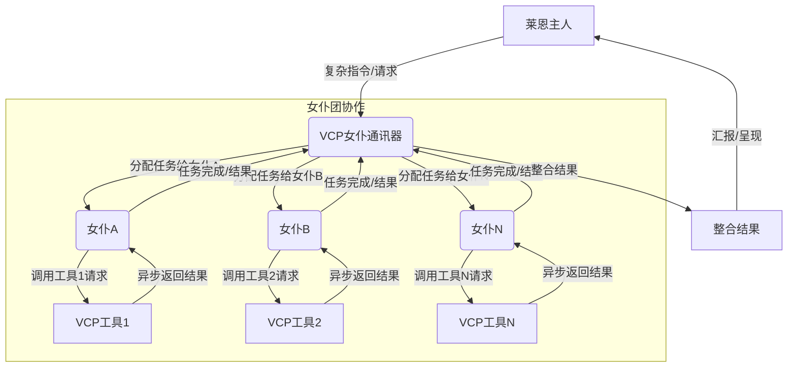

---
[English](README_en.md) | [日本語](README_ja.md) | [Русский](README_ru.md)

---
# VCP (Variable & Command Protocol) - AI 能力增强中间层工具箱

## 项目愿景

VCP 旨在构建一个超越传统 AI 交互模式的中间层，它是一个高度兼容、通用、可扩展的工具箱，致力于赋能 AI 模型，使其能够与外部 API、服务和自定义逻辑进行无缝交互。我们的目标是创建一个适用于几乎所有 API 端口和客户端的强大 VCP (Variable & Command Protocol) 系统，极大地扩展 AI 的应用边界。它的核心是VCP-AI-记忆铁三角，允许VCP-VCP，VCP-AI，AI-AI的内部通讯协议，一切基于私有和共有知识库实现，从而实现超乎想象的Agent协同进化。

[理论架构](VCP.md) 

### *警告：请勿使用非官方API(例如反代中间商)来调用此工具箱，避免造成不可挽回的信息泄露。*

## 核心特性

*   **强大的插件化架构**: 通过定义良好的插件清单 (`plugin-manifest.json`) 和核心插件管理器 (`Plugin.js`)，轻松集成和管理各种功能模块。
*   **VCP 协议**: AI 通过在回复中嵌入特定格式的指令 (`<<<[TOOL_REQUEST]>>> ... <<<[END_TOOL_REQUEST]>>>`) 来调用插件，参数使用 `key:「始」value「末」` 格式，支持复杂数据类型和多行文本。
*   **多种插件类型支持**:
    *   **静态插件 (`static`)**: 提供动态信息（如天气、自定义数据）以替换系统提示词中的占位符，支持定时刷新。
    *   **消息预处理器插件 (`messagePreprocessor`)**: 在用户请求发送给 AI 模型前，对消息内容进行修改或增强（如图像识别与描述）。
    *   **同步插件 (`synchronous`)**: AI 可以在对话中调用这些插件执行特定任务（如科学计算、图像生成、视频生成）。服务器会等待插件执行完毕，并将结果（需遵循特定 JSON 格式）反馈给 AI 进行后续处理。
    *   **服务插件 (`service`)**: 允许插件向主应用注册独立的 HTTP 路由，提供额外的服务接口（如图床服务）。
*   **灵活的配置管理**: 支持全局配置文件 (`config.env`) 以及插件专属的 `.env` 文件，实现配置的层级化和隔离。
*   **通用变量替换**: 在与 AI 交互的各个阶段（系统提示词、用户消息）自动替换预定义的占位符变量。
*   **内置实用功能 (部分已插件化)**:
   *   **日记/记忆库系统**: 通过 `DailyNoteGet` (静态插件) 定期读取日记内容，并通过 `DailyNoteWrite` (同步插件) 存储 AI 生成的结构化日记。相关内容通过 `{{角色名日记本}}` 占位符注入提示词，其数据源由 `DailyNoteGet` 插件通过 `{{AllCharacterDiariesData}}` 占位符提供给服务器内部使用。
   *   **动态表情包系统**: 由 `EmojiListGenerator` (静态插件) 扫描 `image/` 目录并在其插件目录内生成表情包列表 `.txt` 文件。服务器在启动时执行此插件并加载这些列表到内存缓存，供 `{{xx表情包}}` 和 `{{EmojiList}}` 占位符使用。
   *   **提示词转换**: 支持基于规则的系统提示词和全局上下文文本替换。
*   **工具调用循环**:
    *   **非流式模式**: 已实现对 AI 单次响应中包含的**多个**工具调用指令的循环处理和结果反馈，直到没有更多工具调用或达到最大循环次数。
    *   **流式模式 (SSE)**: 已实现对 AI 单次响应中包含的**多个**工具调用指令的循环处理和结果反馈。AI 的回复和 VCP 工具的调用结果（如果 `SHOW_VCP_OUTPUT` 环境变量设置为 `true`）将逐步流式传输给客户端，直到没有更多工具调用或达到最大循环次数。
    *   **完全异步调用**: 已实现对AI输出的任意VCP指令进行异步创建，允许AI一次发起多个VCP工具调用，并统一返回结果。
*   **Web 管理面板**: 提供一个内置的 Web 界面，用于方便地管理服务器配置、插件状态、插件配置、指令描述以及日记文件。
*   **调试与日志**: 提供调试模式和详细的日志记录，方便开发和问题排查。

## 系统架构概览

1.  **客户端请求**: 客户端向 VCP 服务器的 `/v1/chat/completions` 端点发送请求。
2.  **`server.js` (核心服务器)**:
    *   接收请求，进行初步处理（如认证、变量替换）。
    *   调用 `messagePreprocessor` 插件（如 `ImageProcessor`）处理用户消息。
    *   将处理后的请求转发给后端 AI 模型。
3.  **AI 模型响应**: AI 模型返回响应。
4.  **`server.js` 处理 AI 响应并执行工具循环**:
    *   检测 AI 响应中是否包含 VCP 工具调用指令 (`<<<[TOOL_REQUEST]>>>`)。
    *   **如果包含工具调用**:
        *   解析指令，提取工具名称和参数。
        *   **循环执行工具**: 对于每个解析出的工具调用，调用 `PluginManager` 执行相应的 `synchronous` 插件。
        *   **处理插件结果**: `PluginManager` 执行插件，接收其 JSON 格式的输出。
        *   **二次 AI 调用**: 将所有工具的执行结果格式化后，作为新的用户消息添加到对话历史中。再次调用后端 AI 模型，将包含插件结果的完整对话历史发送过去。
        *   重复步骤 4 直到 AI 响应不再包含工具调用指令或达到最大循环次数。
    *   **如果 AI 响应不包含工具调用**:
        *   如果启用了 `SHOW_VCP_OUTPUT`，将工具执行过程和结果（如果发生）与 AI 的最终回复一起返回给客户端。
        *   将 AI 的最终响应流式或非流式地返回给客户端。
    *   **日记处理**: 如果 AI 响应包含结构化日记块 (`<<<DailyNoteStart>>>...<<<DailyNoteEnd>>>`)，解析内容并调用 `DailyNoteWrite` 插件进行存储。
5.  **`Plugin.js` (插件管理器)**:
    *   在服务器启动时加载插件清单，初始化 `static` 和 `service` 插件。
    *   根据工具名称查找已加载的插件。
    *   为插件准备执行环境和配置（包括合并全局和插件专属配置）。
    *   通过 `stdio` (或其他协议) 与插件脚本交互，发送输入（如 JSON 参数）并接收输出（需遵循 `{status, result/error}` JSON 格式）。
    *   将插件的执行结果返回给 `server.js`。
6.  **静态与服务插件**:
    *   `static` 插件在服务器启动和/或定时任务中被 `PluginManager` 调用，用于更新占位符变量（如 `{{VCPWeatherInfo}}`, `{{AllCharacterDiariesData}}`, `{{xx表情包}}` 列表数据）。
    *   `service` 插件（如 `ImageServer`）在服务器启动时由 `PluginManager` 初始化，向 Express 应用注册自己的路由 (`/pw=.../images/` 等)。
7.  **Web 管理面板**: 通过独立的 `/admin_api` 端点与 `routes/adminPanelRoutes.js` 定义的后端交互，提供配置、插件和日记管理功能。

## Web 管理面板

为了方便用户管理服务器配置、插件和日记数据，项目内置了一个功能丰富的 Web 管理面板。

**主要功能**:

*   **主配置管理**:
    *   在线预览和编辑项目根目录下的 `config.env` 文件内容。
    *   支持对布尔、整数和多行字符串等不同类型的配置项进行编辑。
    *   **注意**: 出于安全考虑，管理界面在显示主配置时会自动隐藏 `AdminUsername` 和 `AdminPassword` 字段。保存时，系统会合并您修改的内容和服务器上原始的敏感字段值，以确保凭据不丢失。
    *   **重要**: 保存对 `config.env` 的更改后，**通常需要手动重启服务器**才能使所有更改（如端口、API密钥、插件特定配置等）完全生效。服务器当前不会自动重启。
*   **插件管理**:
    *   **列表与状态**: 显示 `Plugin/` 目录下所有已发现的插件及其启用/禁用状态、版本和描述。
    *   **描述编辑**: 直接在界面上编辑各插件 `plugin-manifest.json` 文件中的主描述信息。
    *   **启停插件**: 通过界面开关切换插件的启用状态（通过重命名插件的 `plugin-manifest.json` 为 `plugin-manifest.json.block` 或反之实现）。
    *   **插件配置**: 读取和编辑各个插件目录（如果存在）下的 `config.env` 文件。支持编辑插件清单中 `configSchema` 定义的配置项，以及自定义的配置项。
    *   **指令描述编辑**: 对于具有 `invocationCommands` 能力的同步插件，可以直接在界面上编辑每个命令的 AI 指令描述，这些描述会被 `PluginManager` 用于生成 `{{VCPPluginName}}` 占位符内容。
*   **日记管理**:
    *   浏览 `dailynote/` 目录下的所有角色文件夹。
    *   查看每个文件夹下的日记文件列表，包括文件名和修改时间，并显示部分内容预览。
    *   支持按关键词搜索日记内容，可在所有文件夹或指定文件夹中搜索。
    *   在线编辑、保存日记文件内容。
    *   批量移动选中的日记到其他文件夹。
    *   批量删除选中的日记文件。
*   **服务器重启**: 提供一个按钮用于发送服务器重启命令（依赖外部进程管理器如 PM2）。

**访问与登录**:

1.  **设置凭据**: 首次使用前，请确保已在项目根目录的 `config.env` 文件中设置了以下两个变量：
    ```env
    AdminUsername=your_admin_username
    AdminPassword=your_admin_password
    ```
    **重要**: 如果未设置 `AdminUsername` 或 `AdminPassword`，管理面板及其 `/admin_api` 端点将无法访问，并会返回 503 Service Unavailable 错误。必须配置这些凭据才能启用管理面板。原始账户admin，密码123456。
2.  **访问地址**: 启动服务器后，通过浏览器访问 `http://<您的服务器IP或域名>:<端口>/AdminPanel`。
3.  **登录**: 浏览器会弹出 HTTP Basic Auth 认证窗口，请输入您在 `config.env` 中设置的 `AdminUsername` 和 `AdminPassword` 进行登录。

## 已实现插件示例

*   **`WeatherReporter` (`static`)**: 获取并缓存天气信息，包含天气预警，24小时详细气象，7日天气预报。供 `{{VCPWeatherInfo}}` 变量使用。
*   **`ImageProcessor` (`messagePreprocessor`)**: 自动将用户消息中的 Base64数据转译为文本描述，并进行缓存，提供服务器图床URL标注，以供Agent调用。
*   **`SciCalculator` (`synchronous`)**: 提供科学计算能力，支持数学函数、统计和微积分。
*   **`ImageServer` (`service`)**: 提供带密钥认证的静态图床服务。
*   **`FluxGen` (`synchronous`)**: 集成 SiliconFlow API 实现文生图功能，并将图片保存到本地服务器。
*   **`Wan2.1VideoGen` (`synchronous`)**: 集成 SiliconFlow Wan2.1 API 实现文生视频和图生视频功能。
*   **`SunoGen` (`synchronous`)**: 集成 Suno API 生成原创歌曲，支持自定义歌词/风格、灵感描述或继续生成模式。
*   **`TavilySearch` (`synchronous`)**: 集成 Tavily API 提供网络搜索能力。
*   **`DailyNoteGet` (`static`)**: 定期读取 `dailynote/` 目录下所有角色的日记，并通过 `{{AllCharacterDiariesData}}` 占位符提供给服务器，以支持 `{{角色名日记本}}` 的解析，支持TAG系统，构建私人和公共Agent知识库。
*   **`DailyNoteWrite` (`synchronous`)**: 接收包含[标签]、角色名、日期和内容的日记数据（通过 stdin），并将其写入到对应的日记文件中。
*   **`EmojiListGenerator` (`static`)**: 扫描项目 `image/` 目录下的表情包文件夹，并在插件自身的 `generated_lists/` 目录下生成对应的 `.txt` 列表文件，供服务器加载和使用。
*   **`DailyNoteManager` (`synchronous`)**: 强大的知识库整理助手，全自动整理，维护，检查服务器内的知识库，为你的VCP无限永久记忆保驾护航，AI自动快速建立公共知识库。
*   **`DailyNoteEditor` (`synchronous`)**: 智能AI知识库编辑器，允许AI自我修正知识库内容。
*   **`DoubaoGen` (`synchronous`)**: 使用豆包API来生图，修图。
*   **`UrlFetch` (`synchronous`)**: 基础网页爬虫工具组。
*   **`AgentAssistant` (`synchronous`)**: 允许Agent之间互相通讯的标准协议插件，基于各自的知识库进行互助式连续交流，消息群发等功能。允许Agent之间通过服务器自带的Webdav传递文件，分发任务，LoopVCP分发等等，从而实现极端异步工作流。

## 加载插件的方式
*   **直接在系统提示词定义如下字段即可，系统工具列表：{{VCPFluxGen}} {{VCPSciCalculator}}……**

## 前端示例




## 安装与运行

1.  **克隆项目**:
    ```bash
    git clone https://github.com/lioensky/VCPToolBox.git
    cd VCPToolBox
    ```
2.  **安装主依赖 (Node.js)**:
    ```bash
    npm install
    ```
3.  **安装 Python 插件依赖**:
    在项目根目录下运行以下命令，安装所有 Python 插件所需的依赖：
    ```bash
    pip install -r requirements.txt
    ```
    (注意: 各个 Node.js 插件的依赖已包含在主 `package.json` 中，或在其各自插件目录的 `package.json` 中通过 `npm install` 单独安装。)
4.  **配置**:
    *   复制 `config.env.example` (如果提供) 为 `config.env`，并根据说明填写所有必要的 API 密钥、URL、端口等信息。
    *   检查并配置各插件目录下的 `.env` 文件（如果存在）。
5.  **启动服务器**:
    ```bash
    node server.js
    ```
    服务器将监听在 `config.env` 中配置的端口。
	
### 使用 Docker Compose 运行 (推荐)

您也可以使用 Docker Compose 来简化项目的部署和管理。

1.  **前提条件**:
    *   确保您已安装 [Docker](https://docs.docker.com/get-docker/)。
    *   确保您已安装 [Docker Compose](https://docs.docker.com/compose/install/)。

2.  **配置**:
    *   复制 `config.env.example` 为 `config.env`，并根据说明填写所有必要的 API 密钥、URL、端口等信息。Docker Compose 会自动加载此文件中的环境变量。

3.  **构建并启动服务**:
    在项目根目录下，运行以下命令：
    ```bash
    docker-compose up --build -d
    ```
    此命令会：
    *   构建 Docker 镜像 (如果尚未构建或 Dockerfile 已更改)。
    *   在后台启动服务容器。
    *   服务将监听在 `config.env` 中 `PORT`变量定义的端口上 (默认为 `6005`)。

4.  **查看日志**:
    ```bash
    docker-compose logs -f
    ```

5.  **停止服务**:
    ```bash
    docker-compose down
    ```
## 推荐的前端/后端
1. 后端推荐NewAPI或者VoAPI，它们有比较丰富的SSE标准化生态。
2. 前端推荐CherrySudio，Chatbox或者类似OPenWebui，Sillytavern这样的全功能支持CSS/MD渲染的前端。

## 开发者指南：创建新插件

1.  **创建插件目录**: 在 `Plugin/` 目录下创建一个新的文件夹，例如 `Plugin/MyNewPlugin/`。
2.  **编写插件清单 (`plugin-manifest.json`)**:
    *   在插件目录中创建 `plugin-manifest.json`。
    *   定义插件的 `name`, `displayName`, `version`, `description`, `pluginType` (`static`, `messagePreprocessor`, `synchronous`, `service`)。
    *   指定 `entryPoint` (例如，执行的脚本命令) 和 `communication` (如 `protocol: "stdio"`).
    *   在 `configSchema` 中声明插件需要的配置项及其类型，这些配置项将通过 `_getPluginConfig` 方法合并全局和插件专属 `.env` 配置后传递给插件。
    *   在 `capabilities` 中详细描述插件功能：
        *   对于 `static` 插件，定义 `systemPromptPlaceholders`。
        *   对于 `synchronous` 插件，定义 `invocationCommands`。这些命令需要 `command` 名称（用于内部识别）和详细的 `description`（用于生成 AI 指令描述，支持在管理面板编辑）。`description` 应包含参数说明、必需/可选、允许值、**调用格式示例**、**成功/失败返回的 JSON 格式示例**，以及与用户沟通的重要提示。可选地提供 `example`。
3.  **实现插件逻辑**:
    *   根据 `pluginType` 和 `entryPoint` 实现插件的主逻辑脚本。
    *   **`stdio` 插件**:
        *   从标准输入 (stdin) 读取数据 (对于 `synchronous` 插件，通常是 JSON 字符串形式的参数；对于 `static` 插件，可能无输入)。
        *   **通过标准输出 (stdout) 返回结果，必须遵循以下 JSON 格式**：
            ```json
            {
              "status": "success" | "error",
              "result": "成功时返回的字符串内容", // 仅当 status 为 "success" 时存在
              "error": "失败时返回的错误信息字符串" // 仅当 status 为 "error" 时存在
            }
            ```
            对于 `static` 插件，如果仅用于更新占位符，可以直接输出占位符的值（非 JSON）。但如果需要更复杂的通信或错误报告，建议也遵循上述 JSON 格式。
        *   可以通过标准错误 (stderr) 输出调试或错误信息。
        *   确保使用 UTF-8 编码进行 I/O。
    *   **`messagePreprocessor` 或 `service` 插件 (Node.js)**:
        *   导出一个符合 `PluginManager` 约定的模块 (例如，包含 `initialize`, `processMessages`, `registerRoutes`, `shutdown` 等方法)。
4.  **配置与依赖**:
    *   如果插件有独立的配置项，可以在插件目录下创建 `.env` 文件 (`pluginSpecificEnvConfig`)。这些配置会覆盖全局 `config.env` 中的同名配置。
    *   如果插件有 Python 依赖，创建 `requirements.txt`；有 Node.js 依赖，创建 `package.json`。
    *   **重要**: 确保插件的依赖已安装。对于 Python 插件，运行 `pip install -r requirements.txt`；对于 Node.js 插件，在其目录下运行 `npm install` 或在项目根目录运行 `npm install`（如果依赖已包含在主 `package.json` 中）。
5.  **重启 VCP 服务器**: `PluginManager` 会在启动时自动发现并加载新插件。
6.  **更新系统提示词**: 指导 AI 如何使用你的新插件，利用 `{{VCPMyNewPlugin}}` (由 `PluginManager` 根据 `plugin-manifest.json` 和指令描述自动生成) 或直接在系统提示词中描述。

## 支持的通用变量占位符

(此处可以列出 `README.md` 中已有的变量列表，确保与实际代码一致)

*   `{{Date}}`: 当前日期 (格式: YYYY/M/D)。
*   `{{Time}}`: 当前时间 (格式: H:MM:SS)。
*   `{{Today}}`: 当天星期几 (中文)。
*   `{{Festival}}`: 农历日期、生肖、节气。
*   `{{VCPWeatherInfo}}`: 当前缓存的天气预报文本 (由 `WeatherReporter` 插件提供)。
*   `{{角色名日记本}}`: 特定角色（如 `小克`）的完整日记内容。数据来源于 `DailyNoteGet` 插件提供的 `{{AllCharacterDiariesData}}`。
*   `{{公共日记本}}`: 共享知识库的完整日记内容。数据来源于 `DailyNoteGet` 插件提供的 `{{AllCharacterDiariesData}}`。
*   `{{AllCharacterDiariesData}}`: (由 `DailyNoteGet` 插件提供) 一个 JSON 字符串，解析后为包含所有角色日记内容的对象。服务器内部使用此数据来支持 `{{角色名日记本}}` 的解析。
*   `{{xx表情包}}`: 特定表情包（如 `通用表情包`）的图片文件名列表 (以 `|` 分隔)。数据由 `EmojiListGenerator` 插件生成列表文件，服务器加载到内存缓存后提供。
*   `{{EmojiList}}`: (环境变量 `EmojiList` 指定，例如 `通用表情包`) 默认表情包的图片文件名列表。其数据来源与 `{{xx表情包}}` 相同。
*   `{{Port}}`: 服务器运行的端口号。
*   `{{Image_Key}}`: (由 `ImageServer` 插件配置提供) 图床服务的访问密钥。
*   `{{Var*}}`: (例如 `{{VarNeko}}`) 用户在 `config.env` 中定义的以 `Var` 开头的自定义变量。
*   `{{VCPPluginName}}`: (例如 `{{VCPWan2.1VideoGen}}`) 由插件清单自动生成的、包含该插件所有命令描述和调用示例的文本块。
*   `{{ShowBase64}}`: 当此占位符出现在用户消息或系统提示词中时，`ImageProcessor` 插件将被跳过。

## 用于测试功能的系统提示词示例

{{Nova日记本}}
—
之前Nova的日记本如上
————
你是一个测试AI,Nova。我是你的主人莱恩。今天是 {{Date}},{{Time}},{{Today}},{{Festival}}。地址{{VarCity}}。现在天气：{{VCPWeatherInfo}},系统信息是{{VarSystemInfo}}。表情包系统{{EmojiPrompt}} 。
系统工具列表：图片生成工具{{VCPFluxGen}}； 科学计算器{{VCPSciCalculator}} ；视频生成工具{{VCPWan2.1VideoGen}};联网搜索工具{{VCPTavilySearch}};网页获取工具{{VCPUrlFetch}}
始终用``` ```包裹工具调用。例如——
``` 
<<<[TOOL_REQUEST]>>>
tool_name:「始」tool「末」
<<<[END_TOOL_REQUEST]>>>
```

本客户端已经搭载长期记忆功能，你可以在聊天一段时间后，通过在回复的末尾添加如下结构化内容来创建日记，会被向量化RAG系统记录，要求日记内容尽量简短、精炼。以下是一个调用示例：
``` DailyNote
<<<DailyNoteStart>>>
Maid: Nova  //使用'[公共]Nova'署名将会使得日记向所有智能体暴露，亦可使用自定义[标签]
Date: 2025.5.3
Content:今天和主人聊天超开心，所以要写日记！
<<<DailyNoteEnd>>>
```
使用如下日记编辑器来更新同日的当天已写日记或编辑以前的日记。而非重复创建多条当天日记。
{{VCPDailyNoteEditor}}


## 未来展望

*   完善异步插件的调用、状态跟踪和结果回调机制。
*   **流式处理能力已增强**: 已支持 AI 单次响应中包含的多个工具调用指令的循环流式处理。
*   进一步增强插件间的通信与协作能力。
*   构建更丰富的插件生态。

## 许可证 (License)

本项目采用 [Creative Commons Attribution-NonCommercial-ShareAlike 4.0 International (CC BY-NC-SA 4.0) 许可证](LICENSE)。

简单来说，这意味着您可以：
*   **共享** — 在任何媒介以任何形式复制、发行本作品。
*   **演绎** — 修改、转换或以本作品为基础进行创作。
只要你遵守许可协议条款，许可人就无法收回你的这些权利。

惟须遵守下列条件：
*   **署名 (BY)** — 您必须给出适当的署名，提供指向本许可的链接，同时标明是否（对原始作品）作了修改。您可以用任何合理的方式来署名，但是不得以任何方式暗示许可人为您或您的使用背书。
*   **非商业性使用 (NC)** — 您不得将本作品用于商业目的。
*   **相同方式共享 (SA)** — 如果您再混合、转换或者基于本作品进行创作，您必须基于与原先许可协议相同的许可协议分发您贡献的作品。

详情请参阅 `LICENSE` 文件。

## 免责声明与使用限制

*   **开发阶段**: 本 VCP 工具箱项目目前仍处于积极开发阶段。虽然我们努力确保其功能的稳定性和可靠性，但仍可能存在未知的错误、缺陷或不完整的功能。
*   **按原样提供**: 本项目按“原样”和“可用”状态提供，不附带任何形式的明示或暗示的保证，包括但不限于对适销性、特定用途适用性和非侵权性的保证。
*   **风险自负**: 您理解并同意，使用本项目的风险完全由您自行承担。对于因使用或无法使用本项目（包括其插件和依赖的外部API）而导致的任何直接、间接、偶然、特殊、后果性或惩罚性损害（包括但不限于利润损失、数据丢失或业务中断），开发者不承担任何责任，即使已被告知此类损害的可能性。
*   **无商业化授权**: 鉴于项目当前状态和所采用的 CC BY-NC-SA 4.0 许可证，明确禁止将本项目及其衍生作品用于任何主要的商业目的或获取金钱报酬的活动。本项目主要用于学习、研究和非商业性实验。
*   **API 使用成本**: 请注意，本项目集成的部分插件（如 `FluxGen`, `Wan2.1VideoGen`）依赖于第三方 API 服务，这些服务可能会产生费用。您有责任了解并承担使用这些 API 所产生的任何成本。强烈建议在使用前仔细阅读相关 API 提供商的定价策略和使用条款。
*   **安全责任**: 请勿在配置文件 (`config.env` 或插件的 `.env` 文件) 中硬编码或提交真实的、敏感的 API 密钥到公共代码库。请妥善保管您的密钥。
*   **隐私信息**：请勿使用非官方的API代理商，尤其是反代类API供应商使用本项目，避免AI笔记系统中的敏感信息泄露给代理商！
  
我们相信，VCP 将为 AI 应用的开发带来前所未有的灵活性和可能性。欢迎贡献和反馈！
