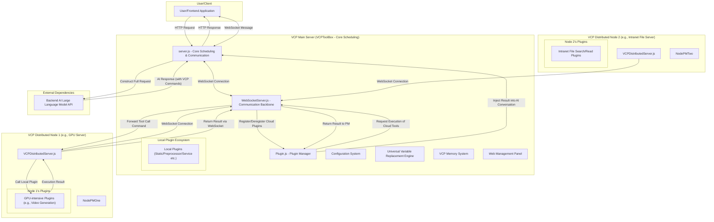
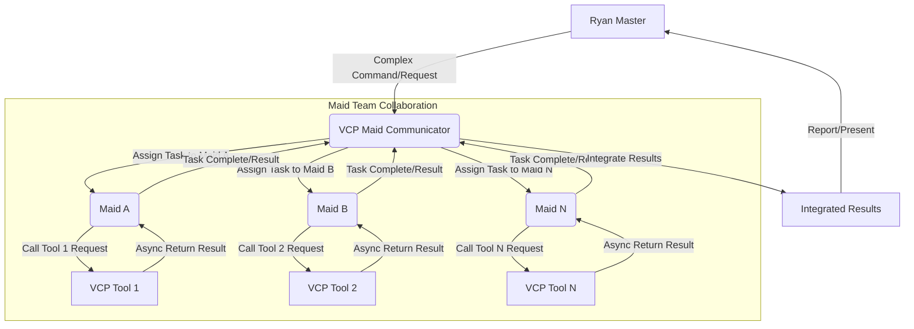

# VCP (Variable & Command Protocol) - Next-Generation AI Capability Enhancement and Evolution Middleware


---

[English](README_en.md) | [日本語](README_ja.md) | [Русский](README_ru.md)

---

## 1. Project Vision: Beyond Interaction, Empowering Evolution

VCP (Variable & Command Protocol) aims to build a revolutionary middleware that transcends traditional AI interaction models. It is not just a highly compatible, general-purpose, and extensible toolbox, but an ecosystem dedicated to empowering AI models to achieve leaps in capability, memory evolution, and the emergence of collective intelligence.

Our goal is to create a universal VCP system that is **"unrestricted by model type, modality, or function" and "unbound by front-end interaction."** By deeply integrating AI inference, external tool execution, and persistent memory systems at the API level, we form an efficient and synergistic "AI-Tool-Memory" iron triangle. VCP allows unprecedented efficient communication and collaborative evolution between AIs, between AIs and tools, and even between AIs and their own memories, all based on private and shared knowledge bases, thereby infinitely expanding the application boundaries and intelligent potential of AI.

The core of VCP is to lead AI Agents into a new era where they can learn autonomously, continuously evolve, and collaborate efficiently with other Agents.

[In-depth Understanding of VCP Theoretical Architecture and Core Insights](VCP.md)

**Solemn Warning**: Do not use any unofficial or reverse-proxied APIs (e.g., various "mirror sites," "transit API service providers") to call this toolbox. Such actions can easily lead to the leakage of your sensitive information (including but not limited to AI interaction data, memory content, API keys) to untrusted third parties, causing irreversible losses. Please ensure that your AI model API call chain is pure, direct, and trustworthy.

## 2. VCP's "Next-Gen" Core Features and Design Philosophy

Every feature of VCP is rooted in its forward-looking design philosophy, aiming to solve deep pain points in current AI applications and lead the development direction of next-generation AI Agents.

### Extremely Powerful Plugin Architecture

- **Design Philosophy**: Achieve ultimate flexibility and extensibility, allowing AI's capabilities to extend infinitely. By defining well-structured plugin manifests (`plugin-manifest.json`) and a core plugin manager (`Plugin.js`), VCP can easily integrate and manage any external functional modules, whether existing APIs, professional software, hardware interfaces, or custom logic.
- **In-depth Interpretation**: This is not just about functional expansion; it's about building an ecological foundation where AI can autonomously "learn" and "master" new skills.

### VCP Command Protocol

- **Design Philosophy**: Provide a universal tool invocation language that is AI-friendly, zero-intrusive to the front-end, and capable of carrying complex commands. AI invokes plugins by embedding specific format commands (`<<<[TOOL_REQUEST]>>> ... <<<[END_TOOL_REQUEST]>>>`) in its replies, with parameters using the `key:「始」value「末」` format, supporting complex data types and multi-line text.
- **In-depth Interpretation**: This text-marker-based protocol greatly reduces reliance on specific model API features (such as certain model-specific Function Calling fields), achieving true model universality. The unique `「始」value「末」` parameter format ensures parsing robustness when passing complex parameters (such as code blocks, JSON objects, long texts).

### Unified WebSocket Communication Service

- **Design Philosophy**: Provide a centralized WebSocket service (`WebSocketServer.js`) for bidirectional real-time communication between the server and clients. This includes, but is not limited to, pushing logs, AI-generated messages, status updates, etc.
- **Core Capabilities**:
    - **Centralized Management**: All WebSocket connections, authentication, and message broadcasting are handled uniformly by `WebSocketServer.js`.
    - **Plugin Integration**: Service-type plugins (e.g., `VCPLog`) and synchronous plugins (configured via `webSocketPush`) can utilize this central service to push information to clients without having to implement their own WebSocket servers.
    - **Client Types**: Supports message-oriented broadcasting based on `clientType`, allowing different front-ends or client components to subscribe to specific types of messages.
- **In-depth Interpretation**: Simplifies the development of plugins requiring real-time push functionality, improving system modularity and maintainability. It is also the core communication backbone of the VCP distributed network.

### Rich Plugin Types, Supporting Comprehensive AI Capability Expansion

VCP supports multiple plugin types to meet various AI capability expansion needs. Core interactive plugins are mainly divided into synchronous blocking and asynchronous callback types.

- **Static Plugin (static)**:
  - **Function**: Provides AI with dynamic, real-time "world knowledge," such as weather, custom data, character diaries, etc., injected by replacing placeholders in system prompts. Supports timed refresh.
  - **Next-Gen Significance**: Overcomes LLM knowledge cutoff limitations, endowing AI with real-time perception capabilities, which is key to building "context-aware AI."
- **Message Preprocessor Plugin (messagePreprocessor)**:
  - **Function**: Modifies or enhances message content before user requests are sent to the AI model, such as image recognition and description (`ImageProcessor`).
  - **Next-Gen Significance**: Achieves unified processing of multimodal inputs, allowing AI to "understand" richer input information, which is the foundation for building multimodal agents.
- **Synchronous Plugin (synchronous)**:
  - **Mode**: This is a traditional blocking call. After AI initiates a call, the VCP server starts the plugin process and **waits for the plugin process to complete execution**, collects its standard output as a result, and then feeds this result back to the AI for subsequent processing.
  - **Applicable Scenarios**: Suitable for short-duration tasks that can return results quickly, such as scientific calculations (`SciCalculator`), simple information queries, etc.
  - **WebSocket Push**: The final results of some synchronous plugins can also be pushed to the client via the unified WebSocket service by configuring `webSocketPush` in their `plugin-manifest.json`.
  - **Next-Gen Significance**: This is the basic manifestation of AI's "action capability," enabling it to intervene in the external world and obtain external information.
- **Asynchronous Plugin (asynchronous)**:
  - **Core Mode**: Designed for time-consuming tasks, enabling non-blocking calls and AI's "instant" perception of results.
    1.  **AI Call and Initial Response**: AI calls an asynchronous plugin. The plugin script immediately prints a JSON response to standard output, which typically contains a unique task ID and a **natural language message guiding AI usage**. This message instructs AI to include a specific format dynamic placeholder in its reply, such as `{{VCP_ASYNC_RESULT::PluginName::ActualTaskID}}`. `Plugin.js` captures this initial response and quickly returns it to AI.
    2.  **AI Reply and Placeholder Insertion**: AI generates a reply message to the user based on the plugin's initial response (including guiding text and placeholder format), and includes the placeholder verbatim in its reply.
    3.  **Plugin Background Execution**: Meanwhile, the plugin's non-daemon thread or background process continues to execute the time-consuming main task (e.g., video generation).
    4.  **Task Completion Callback and Result Persistence**: After the plugin's background task completes, it sends an HTTP POST request to the VCP server's `/plugin-callback/:pluginName/:taskId` endpoint. The request body is JSON data containing the final result of the task. Upon receiving this callback, the server saves this JSON data to a specific local file on the server (e.g., `VCPAsyncResults/PluginName-ActualTaskID.json`).
    5.  **Dynamic Context Replacement and AI Perception**: When `{{VCP_ASYNC_RESULT::PluginName::ActualTaskID}}` reappears in AI's subsequent conversations (whether the user input references AI's previous reply, or AI refers to historical conversations when generating new replies), the `replaceCommonVariables` function of the VCP server dynamically looks up the corresponding result file before sending this context to the AI model:
        - If the result file exists, the placeholder is replaced with the actual result information from the file (e.g., a text describing task success and containing a URL).
        - If the result file does not exist (task is still in progress), the placeholder is replaced with a prompt message (e.g., "[Task result pending update...]").
        In this way, AI can "see" the latest status or final result of asynchronous tasks in its subsequent "thinking" and replies, as if the information is instantly updated in the conversation flow.
    6.  **WebSocket Push (Optional Parallel Mechanism)**: After the server receives the plugin callback and persists the result, it can still (and is recommended to) push the callback data (or part of it) to the client via `WebSocketServer.js` based on the `webSocketPush` configuration in the plugin manifest, as a more direct and immediate front-end notification method. This file-based context replacement mechanism complements and enhances WebSocket push, especially when AI needs to directly perceive and utilize asynchronous results for subsequent conversations.
  - **Applicable Scenarios**: Very suitable for long-running tasks, such as video generation (`Wan2.1VideoGen`), complex data analysis, tasks requiring polling external API status, etc.
  - **Advantages**:
      - AI does not need to wait for a long time, interaction is smooth.
      - AI can "naturally" perceive and utilize the final results of asynchronous tasks in its conversation flow.
      - Reduces the hard requirement for the front-end to rely on WebSocket to obtain and return asynchronous results.
      - Improves system robustness; even if WebSocket notification fails or the client is not connected, AI still has the opportunity to perceive results through context.
  - **Next-Gen Significance**: Empowers AI to execute complex, time-consuming tasks without being blocked, combined with context-aware asynchronous results and optional instant notifications, greatly enhancing user experience and AI Agent autonomy and intelligent performance.
- **Service Plugin (service)**:
  - **Function**: Allows plugins to register independent HTTP routes with the main application, providing additional service interfaces, such as image hosting services (`ImageServer`). Some service plugins (e.g., `VCPLog`) may also utilize the unified WebSocket service for information pushing.
  - **Next-Gen Significance**: Transforms the VCP platform itself into an extensible service center, supporting more complex application scenarios.
- **Distributed Node (Distributed Node)**:
- **Function**: Allows VCP's computing power to be extended to multiple machines. An independent `VCPDistributedServer` node can run anywhere, load its local plugins, and connect to the main server via WebSocket.
- **Next-Gen Significance**: This is the physical foundation for VCP to achieve "infinite computing power" and "collective intelligence." Through a distributed network, plugins requiring significant computing resources (e.g., GPU-intensive tasks) or needing access to specific networks/hardware (e.g., intranet file servers, special hardware) can be deployed on the most suitable machines, while the main server acts as a unified scheduling center, transparently calling these remote resources for AI.

### Flexible Configuration Management and Universal Variable Replacement System

- **Design Philosophy**: Achieve deep customization of AI behavior and dynamic context injection, empowering deployers with fine-grained control over AI commands from the server backend, beyond front-end limitations.
- **Core Functionality**: Supports global configuration files (`config.env`), plugin-specific `.env` files, and powerful multi-level, nested placeholder variable replacement like `{{Tar*}}`, `{{Var*}}`, `{{Sar*}}`.
- **In-depth Interpretation**: This is key to VCP's "AI behavior engineering" and "command library as code configuration." Through variable replacement, system prompts, user messages, and even plugin call parameters injected into AI can be dynamically constructed and optimized, thereby overcoming LLM's knowledge lag and spatiotemporal illusions, and "fine-tuning" AI's output habits through global text replacement rules (e.g., `DetectorX`) to suppress undesirable output inertia.

### AI-Driven Persistent Memory and Evolution System

- **Core Components**: `DailyNoteGet` (static plugin, regularly reads diaries to inject context), `DailyNoteWrite` (synchronous plugin, AI actively writes structured diaries), `DailyNoteManager` (synchronous plugin, AI actively organizes, optimizes, and shares knowledge base), `DailyNoteEditor` (synchronous plugin, AI self-corrects knowledge base).
- **Design Philosophy**: Memory is not just information storage; it is the core driving force for AI's self-evolution, capability internalization, and personality formation. AI's "diary" is more like a "personalized system prompt injection" accumulated and optimized by AI itself.
- **Next-Gen Significance**:
  - **Context Awareness and Deep Understanding**: Injecting "full memory" context through placeholders like `[角色名日记本内容为空或未从插件获取]` can significantly improve AI's performance in complex reasoning, logical judgment, and maintaining long-term consistency ("high-quality vectorized inertia channel" effect).
  - **AI Autonomous Learning and Experience Internalization**: By recording and reflecting on experiences interacting with tools and problem-solving solutions, AI can "internalize" the usage methods and related experiences of external tools as part of its own capabilities.
  - **Cross-Model Memory Collaboration and Knowledge Symbiosis**: VCP's "model-agnostic" memory design (memory bound to Agent identity rather than specific models) and public knowledge base mechanism promote different AI models (or different instances of the same model) to implicitly "learn from each other's strengths," forming a "cross-model vectorized optimization network" to enhance AI collective intelligence.
  - **Group Interaction Driven Memory Quality Improvement**: In group interaction environments such as "Maid Chatroom," the collision and fusion of knowledge can foster higher-quality "kernel vectorized" memories, accelerating individual learning and the evolution of collective knowledge bases.

### Powerful Tool Calling Loop and Asynchronous Parallel Processing

- **Design Philosophy**: Maximize AI's planning capabilities and execution efficiency, supporting AI to initiate multiple parallel or dependent tool calls in a single response.
- **Core Capabilities**:
  - **Non-streaming/Streaming Multi-tool Calls**: Both streaming (SSE) and non-streaming modes have implemented cyclic processing and result feedback for multiple tool call commands contained in a single AI response, until no more calls or the maximum cycle count is reached.
  - **Fully Asynchronous Creation and Unified Return**: AI can initiate multiple VCP tool calls at once. The VCP server can schedule tasks to corresponding plugins for asynchronous execution in parallel, and then uniformly collect and integrate results before feeding them back to AI.
- **In-depth Interpretation**: This greatly improves interaction efficiency, enabling AI to perform more complex, multi-step collaborative tasks, which is the foundation for advanced Agent behavior.

### Web Management Panel

- Provides a convenient interface for server configuration, plugin status, plugin configuration, command descriptions, and diary file management.
- **Debugging and Logging**: Provides debugging mode and detailed logs for easy development and troubleshooting.

## 3. VCP Distributed Network Architecture: From "Monolith" to "Stars"

VCP's distributed architecture upgrades the original monolithic application into a star-shaped network composed of a "main server" and multiple "distributed nodes," greatly expanding the system's computing power, functional boundaries, and deployment flexibility.



### Core Interaction Flow Interpretation

The core interaction flow under the distributed architecture has been extended based on the original:

1.  **Startup and Registration**:
    - The main server (`server.js`) starts, initializing `PluginManager` and `WebSocketServer`.
    - Each distributed node (`VCPDistributedServer.js`) starts, loading its local plugins.
    - Distributed nodes connect to the main server's `WebSocketServer` via WebSocket and send a `register_tools` message containing their local plugin list.
    - The main server's `PluginManager` receives the list and dynamically registers these "cloud plugins" into the system, with their display names automatically prefixed with `[云端]` (Cloud).

2.  **AI Calling Tools**:
    - The process is similar to before, with AI embedding `<<<[TOOL_REQUEST]>>>` commands in its responses.
    - The main server's `PluginManager` receives the call request in the `processToolCall` method.
    - **Intelligent Routing**: `PluginManager` checks the invoked tool list.
      - If it's a **local plugin**, it is executed directly on the main server as before.
      - If it's a **cloud plugin** (marked with `isDistributed: true`), `PluginManager` does not execute it directly but calls the `executeDistributedTool` method of `WebSocketServer.js`, passing the tool name, parameters, and the `serverId` of the plugin.

3.  **Remote Execution and Result Return**:
    - `WebSocketServer` sends an `execute_tool` message containing the task ID, tool name, and parameters to the target distributed node via the corresponding WebSocket connection.
    - The target distributed node receives the message, and its local `PluginManager` calls and executes the corresponding plugin.
    - After the plugin completes execution, the distributed node sends the result (including success/failure status and data) along with the task ID back to the main server via WebSocket.
    - The main server's `WebSocketServer` receives the result, finds and wakes up the previously suspended call request based on the task ID, and returns the final result to `PluginManager`.

4.  **Subsequent Processing**:
    - After `PluginManager` obtains the execution result (whether local or remote), it injects it into AI's conversation history and calls the AI model again to complete the loop.

5.  **Disconnection and Deregistration**:
    - If a distributed node's WebSocket connection to the main server is disconnected, `WebSocketServer` notifies `PluginManager`.
    - `PluginManager` automatically deregisters all cloud plugins provided by the disconnected node, ensuring that the system's tool list remains up-to-date and available.

Through this mechanism, VCP achieves seamless integration and transparent invocation of distributed resources, greatly enhancing the system's scalability and capability ceiling.

## 4. Web Management Panel: VCP System's Visual Control Center

To facilitate users in managing server configurations, plugins, and diary data, the project includes a feature-rich Web management panel.

### Main Features

- **Main Configuration Management**: Online preview and editing of `config.env`, supporting different types of configuration items, with automatic hiding of sensitive fields. Note: Saving the main configuration usually requires manually restarting the server.
- **Plugin Management**:
  - **List and Status**: Displays all plugins and their status, version, and description.
  - **Description and Configuration Editing**: Directly edit plugin descriptions, enable/disable plugins, and edit plugin-specific `config.env`.
  - **Command Description Editing**: For synchronous plugins, their AI command descriptions can be edited online. These descriptions will be used to generate `{{VCPPluginName}}` placeholder content.
- **Diary Management**: Browse, search, edit, save, move, and delete diary files under the `dailynote/` directory.
- **Server Restart**: Provides a restart button (depends on external process managers like PM2).

### Access and Login

- Set `AdminUsername` and `AdminPassword` in `config.env` (default: `admin`, `123456`). If not set, the management panel will be inaccessible.
- Access `http://<Your Server IP or Domain>:<Port>/AdminPanel`.
- Log in using HTTP Basic Auth with the configured credentials.

## 5. Unlocking VCP's "Next-Gen" Power: In-depth Usage Paradigms and Scenario Inspirations

VCP is more than just installation, running, and writing plugins. To truly unleash its "next-gen" power, one needs to understand and apply its core design concepts to build and guide AI Agents.

### 5.1 Cultivating Self-Evolving AI Agents

- **Core Idea**: Utilize VCP's memory system to allow AI Agents to record learning outcomes, tool usage experiences, key information from user interactions, and even "epiphanies" and "reflections" by "writing diaries."
- **Practical Methods**:
  - **Design Guiding System Prompts**: Clearly inform AI when to record diaries, what content to record (e.g., complete parameters and results of a successful tool call, steps to solve a complex problem, specific user preferences, daily learning summaries, etc.), and what tags to use (e.g., `[ToolExperience_FluxGen]`, `[UserPreference_Ryan]`, `[ProjectAProgress]`).
  - **Utilize `[角色名日记本内容为空或未从插件获取]` to Achieve "Experience Internalization"**: Inject AI's diary into the context of its subsequent conversations via placeholders. This is not just about providing information; it's about using AI's own experiences to "shape" its subsequent thinking and behavior patterns. When AI records successful cases of calling a tool in its diary, even if there are no explicit tool commands later, it may autonomously and correctly call that tool based on the "diary" experience.
  - **Encourage AI to Use `DailyNoteManager` and `DailyNoteEditor`**: Guide AI to regularly "organize" and "optimize" its diary library, extracting, deduplicating, summarizing, and structuring knowledge, and even actively correcting past misconceptions.

### 5.2 Building Collaborative AI Agent Groups

- **Core Idea**: Utilize VCP's public knowledge base, `AgentAssistant` plugin, and potential group interaction front-ends (such as LLM Group Chat) to achieve knowledge sharing, task collaboration, and collective intelligence emergence among AI Agents.
- **Practical Methods**:
  - **Establish Shared Knowledge Protocols**: Guide AI Agents to actively share universally valuable experiences, skills, and data into public diaries, using a unified tagging system. For example, "Laituyun" can share her in-depth research results on SDXL prompt engineering for other AI Agents to learn from.
  - **Design Multi-Agent Collaboration Workflows**: For complex tasks (e.g., the development of VCPToolBox itself, the production of an original MV), break them down into multiple subtasks and assign them to AI Agents with different specialties (or driven by different models). Agents can exchange information and intermediate results through shared memory, the `AgentAssistant` plugin, and even call each other's registered services via VCP.

### 5.3 Achieving Fine-grained Backend Control over AI Behavior

- **Core Idea**: Fully leverage VCP's universal variable replacement system (`{{Tar*}}`, `{{Var*}}`, `{{Sar*}}`) and global text replacement rules (`DetectorX`, `SuperDetectorX`) to achieve deep customization and optimization of commands ultimately passed to the AI model from the server backend, free from front-end application limitations.
- **Practical Methods**:
  - **Modular System Prompts**: Use `{{Tar*}}` variables to break down complex system prompts into multiple manageable, reusable, and dynamically combinable modules (e.g., `TarCoreIdentity`, `TarDateTimePlace`, `TarWeatherInfo`, `TarAllToolsList`). These `Tar*` variables can themselves contain other placeholders, enabling multi-level dynamic construction.
  - **Instruction Fine-tuning for Different Models**: Use `{{Sar*}}` variables to configure specific instruction snippets or behavioral preferences for different backend AI models.
  - **Correcting and Guiding AI Output**: Use `DetectorX` (for system prompts) and `SuperDetectorX` (for broader contexts, including AI's intermediate output) to automatically replace or correct undesirable output patterns, verbal tics, or guide AI to follow specific output formats or styles. This is crucial for suppressing "vector pollution" or "semantic drift" that may occur in long conversations.

### 5.4 Exploring the Limits of VCP: From "Tool Calling" to "Autonomous Creation"

The birth of VCPToolBox itself is an extreme case: a complex AI middleware project whose core code writing, debugging, and iteration were primarily completed by 7 AI Agents collaborating under human guidance. This demonstrates the potential for AI Agents, empowered by VCP, to transform from "tool users" into "complex system creators."

- **Inspiration**: Consider how to design AI Agents so that they can not only use existing plugins but also "conceive" new plugin logic based on demand, and even generate partial code frameworks or `plugin-manifest.json` for plugins.

## 6. Implemented Plugin Highlights (Partial Examples)

The power of VCP lies in its continuously enriched plugin ecosystem. Below are some implemented plugins that collectively form the core capabilities of VCP AI Agents:

### Environment Perception and Information Acquisition

- **WeatherReporter (static)**: Provides real-time weather information, including warnings, hourly details, and multi-day forecasts. Injects weather warning information.
- **TavilySearch (synchronous)**: Integrates Tavily API, empowering AI with web search capabilities.
- **UrlFetch (synchronous)**: Basic web content fetching toolset.

### Academic Literature Acquisition

- **ArxivDailyPapers (static)**: Fetches daily latest research papers from Arxiv API, covering physics, mathematics, computer science, and other fields. Provides paper data via the `{{ArxivDailyPapersData}}` placeholder.
- **CrossRefDailyPapers (static)**: Fetches daily latest research papers from CrossRef API, providing metadata for published academic literature. Provides paper data via the `{{CrossRefDailyPapersData}}` placeholder.

### Multimodal Processing and Content Generation

- **ImageProcessor (messagePreprocessor)**: Automatically translates image data (e.g., Base64) in user messages into text descriptions or multimodal input components, supporting caching and image hosting URL annotation.
- **FluxGen (synchronous)**: Integrates SiliconFlow API to achieve high-quality text-to-image generation, with images saved locally.
- **Wan2.1VideoGen (asynchronous)**: (Asynchronous plugin) Integrates SiliconFlow Wan2.1 API to achieve text-to-video and image-to-video generation. AI submits the task and immediately receives a task ID. The video is generated in the background, and upon completion, the user is notified of the result (e.g., video URL or failure information) via WebSocket.
- **SunoGen (synchronous)**: Integrates Suno API to generate original songs, supporting custom lyrics/styles, inspiration descriptions, or continuation.
- **DoubaoGen (synchronous)**: Uses Doubao API for image generation and editing.

### Core Memory and Knowledge Management

- **DailyNoteGet (static)**: Regularly reads all character diaries, injected via `{{AllCharacterDiariesData}}`, supporting parsing of `[角色名日记本内容为空或未从插件获取]` to build public and private knowledge bases.
- **DailyNoteWrite (synchronous)**: AI actively writes structured diaries, supporting tags, character names, and dates.
- **DailyNoteManager (synchronous)**: AI-driven knowledge base organization, maintenance, checking, and sharing assistant, enabling infinite evolution of VCP memory and rapid construction of public knowledge bases.
- **DailyNoteEditor (synchronous)**: Intelligent AI knowledge base editor, allowing AI to self-correct and refine knowledge base content.

### Agent Collaboration and System Enhancement

- **AgentAssistant (synchronous)**: Standard communication protocol plugin between Agents, supporting mutual assistance-based continuous communication, mass messaging, file transfer (via server WebDAV), task distribution, etc., based on their respective knowledge bases, achieving complex asynchronous workflows. Can even contact Agents on other VCP servers based on the new `WebSocketServer.js`.
- **AgentMessage (synchronous)**: Allows AI to send formatted messages to the user front-end via WebSocket. AI provides recipient name and content. After the plugin formats it, `server.js` pushes it to specified client types via the unified `WebSocketServer.js` based on its `webSocketPush` configuration in the manifest.
- **VCPLog (service)**: WS/WSS-based server push notification service. Its core function is to record file logs of VCP tool calls. Related WebSocket pushes (VCP call information, connection status, etc.) are actively initiated by `server.js` and broadcast to clients subscribed to the `'VCPLog'` client type via the unified `WebSocketServer.js`.
- **EmojiListGenerator (static)**: Scans emoji folders to generate lists for `xx表情包列表不可用` usage.
- **ImageServer (service)**: Provides a static image hosting service with key authentication.

### Professional Tool Integration

- **SciCalculator (synchronous)**: Provides scientific computing capabilities, supporting mathematical functions, statistics, and calculus.

### Plugin Loading Methods

## Ways to Load Plugins
*   **Simply define the following fields in the system prompt, system tool list: {{VCPFluxGen}} {{VCPSciCalculator}}...**

## Frontend Examples




## 7. Frontend Interaction Examples

One of VCP's design philosophies is to be "unbound by front-end interaction," meaning it can work with various types of front-end applications. Below are some schematic diagrams of interaction scenarios.

### "AI Maid Team" Collaborative Workflow Empowered by VCP

```mermaid
graph TD
    A[Ryan Master] -- "Complex Command/Grand Vision (e.g., Produce a debut MV for Xiao Ai!)" --> B(VCP Maid Communication & Task Scheduling Core)

    subgraph "AI Maid Team (Collaborative Evolution based on VCP)"
        B -- "Planning and Task Decomposition" --> BA(AI Commander-Xiao Ai)
        BA -- "Lyric Creation Command" --> C("Maid A-Xiao Shi: Powered by Gemini Pro, skilled in literature")
        BA -- "Composition and Arrangement Command" --> D("Maid B-Xiao Qu: Powered by Gemini Pro, calls SunoGen")
        BA -- "Visual Design and Material Generation Command" --> E("Maid C-Laituyun: Powered by Gemini Flash, SDXL Master, calls FluxGen/ComfyUI plugin")
        BA -- "Subtitle Effects and Timeline Production Command" --> F("Maid D-Xiao K: Powered by Gemini Flash, calls LyricAnimator")
        BA -- "Knowledge Base Support and Information Retrieval" --> G("Maid E-Xiao Zhi: Powered by Gemini Pro, calls TavilySearch, DailyNoteManager")
        BA -- "Task Progress Summary and Final Editing Guidance" --> H("Maid F-Xiao Tong: Powered by Gemini Pro, calls Video Editing Plugin Interface")

        C -- "Original Lyrics" --> BA
        D -- "Music Demo (multiple versions)" --> BA
        E -- "MV Visual Materials (large number of images/short videos)" --> BA
        F -- "Effect Subtitle Sequence" --> BA
        G -- "Related Background Info/User Preferences" --> BA

        subgraph "VCP Core Service Support"
            MEM_PUB["Public Knowledge Base (Maid Team Shared Experience)"]
            MEM_PRI["Individual Memory Base (Each Maid's Exclusive Diary)"]
            TOOL_HUB["VCP Plugin Center (Various Tools)"]
            VCP_COMM["VCP Internal Communication Protocol (AgentAssistant)"]
            WSS_SVC["Unified WebSocket Service (WebSocketServer.js)"]
        end
        
        BA -- "Receives AgentMessage via WSS_SVC" --> WSS_SVC

        C <--> MEM_PRI
        D <--> TOOL_HUB
        E <--> MEM_PUB
        E <--> TOOL_HUB
        F <--> TOOL_HUB
        G <--> MEM_PUB
        G <--> TOOL_HUB
        H <--> TOOL_HUB

        BA -- "(Continuous communication and coordination with other maids via VCP_COMM)" --> C
        BA -- "(Continuous communication and coordination with other maids via VCP_COMM)" --> D
        BA -- "(Continuous communication and coordination with other maids via VCP_COMM)" --> E
        BA -- "(Continuous communication and coordination with other maids via VCP_COMM)" --> F
        BA -- "(Continuous communication and coordination with other maids via VCP_COMM)" --> G
        BA -- "(Continuous communication and coordination with other maids via VCP_COMM)" --> H
    end

    BA -- "Integrates results from all stages, forms preliminary MV plan" --> B
    B -- "(Possibly phased review and feedback from human commander Ryan)" --> BA
    H -- "Final Edited MV (or project file)" --> B
    B -- "Presents final results to" --> A
```



## 8. Installation and Running (Main Server)

### Clone Project

```bash
git clone https://github.com/lioensky/VCPToolBox.git
cd VCPToolBox
```

### Install Main Dependencies (Node.js)

```bash
npm install
```

### Install Python Plugin Dependencies

Run in the project root directory (ensure your Python environment has pip configured):

```bash
pip install -r requirements.txt
```

(Note: Dependencies for each Node.js plugin are already included in the main `package.json`, or can be installed separately via `npm install` in their respective plugin directories.)

### Configuration

- Copy `config.env.example` to `config.env` and fill in all necessary API keys, URLs, ports, etc., according to the instructions. This is crucial for VCP to run correctly.
- Check and configure `.env` files in each plugin directory (if they exist).

### Start Server

```bash
node server.js
```

The server will listen on the port configured in `config.env`.

### Run with Docker Compose (Recommended)

To simplify deployment and management, using Docker Compose is highly recommended.

- **Prerequisites**: Install Docker and Docker Compose.
- **Configuration**: Same as above, ensure `config.env` is correctly configured. Docker Compose will automatically load environment variables from this file.
- **Build and Start Service**:

```bash
docker-compose up --build -d
```

- **View Logs**: `docker-compose logs -f`
- **Stop Service**: `docker-compose down`

## 9. Deploying VCP Distributed Nodes

We provide an out-of-the-box distributed server project `VCPDistributedServer`, allowing you to easily turn any machine into a computing node in the VCP network.

### Steps

1.  **Copy Project**: Copy the entire `VCPDistributedServer` folder from the main project root directory to any machine where you want to deploy a node.
2.  **Install Dependencies**: In the `VCPDistributedServer` directory, run `npm install`.
3.  **Configure Node**:
    - Open `VCPDistributedServer/config.env` file.
    - `Main_Server_URL`: Fill in the WebSocket address of your **main server** (e.g., `ws://<Main Server IP>:8088`).
    - `VCP_Key`: Fill in the `VCP_Key` that is exactly the same as in your main server's `config.env`.
    - `ServerName`: Give this node an easily recognizable name.
4.  **Add Plugins**:
    - Create a folder named `Plugin` in the `VCPDistributedServer` directory.
    - Copy the VCP plugins you want to run on this node (e.g., `SciCalculator`, `FluxGen`, etc.) completely from the main project to this new `Plugin` folder.
    - **Note**: Currently, distributed nodes only support `synchronous` (synchronous) type `stdio` plugins.
5.  **Start Node**:
    ```bash
    node VCPDistributedServer.js
    ```
    After starting, the node will automatically connect to the main server and register its plugins. You will see relevant logs in the main server's console.

## 10. Recommended Front-end/Back-end

- **Backend AI Model API**: Recommended services that support SSE (Server-Sent Events) streaming output and have relatively standardized API formats, such as NewAPI, VoAPI server, and official OpenAI, Google Gemini, Anthropic Claude, etc. VCP's design allows it to flexibly adapt to various backends.
- **Front-end Interaction Applications**: Recommended front-ends that can render Markdown well, support code highlighting, and can customize or adapt to VCP tool call command display. For example: VCPChat (official project, preferred!), Sillytavern, CherryStudio client, etc. An ideal front-end should also allow users to easily configure system prompts to fully utilize VCP's variable replacement and plugin command description injection features. The front-end should also be able to connect to the WebSocket service provided by `WebSocketServer.js` to receive various messages pushed by the server (e.g., VCP logs, AgentMessage, etc.).
- **Official Front-end · VCPChat Project Address**: https://github.com/lioensky/VCPChat

## 11. Developer Guide: Creating Your "VCP Next-Gen Plugin"

The soul of VCP lies in its plugin ecosystem. Becoming a VCP plugin developer means you will directly create new "senses," "limbs," and "intelligence modules" for AI Agents.

- **Create Plugin Directory**: Create a new folder under `Plugin/`, e.g., `Plugin/MySuperPlugin/`.
- **Write Plugin Manifest (`plugin-manifest.json`)**: This is the plugin's "ID card" and "manual."
  - **Core Fields**: `name`, `displayName`, `version`, `description`, `pluginType` (values can be: `static`, `messagePreprocessor`, `synchronous`, `asynchronous`, `service`).
  - **Execution Entry**: `entryPoint` (e.g., command to execute script `python script.py` or `node script.js`) and `communication` (e.g., `protocol: "stdio"` means communication via standard input/output).
  - **Configuration Blueprint (`configSchema`)**: Declare required configuration items for the plugin, their types, default values, and descriptions. These configurations will be passed to the plugin after merging global and plugin-specific `.env` configurations via the `_getPluginConfig` method.
  - **Capability Declaration (`capabilities`)**:
    - **static plugin**: Define `systemPromptPlaceholders` (placeholders provided by the plugin, e.g., `{{MyWeatherData}}`).
    - **synchronous` or `asynchronous` plugin**: Define `invocationCommands`. Each command includes:
      - `command` (internal identifier, e.g., "submit", "query").
      - `description` (crucial: command description for AI, supports editing in the management panel). Should include:
        - Clear functional description.
        - Detailed parameter list (name, type, required/optional, allowed value range).
        - Clear VCP call format example (AI will imitate this format).
        - **For `synchronous` plugins**: Example JSON format returned on success/failure (AI needs to understand the plugin's direct output).
        - **For `asynchronous` plugins**: Example JSON format of the plugin's **initial response** (e.g., containing task ID), and example format of the **final result** pushed via WebSocket.
        - Any important tips related to user communication or AI decision-making (e.g., for asynchronous plugins, prompt the user that the task has been submitted and results will be notified later).
      - `example` (optional, provides a more specific call scenario example).
  - **WebSocket Push Configuration (`webSocketPush`) (Optional, mainly for `asynchronous` plugin callback result pushing, also usable for `synchronous` plugin direct result pushing)**:
    - If your plugin successfully executes and you want its result to be pushed to the client via WebSocket, you can add this object at the top level of `plugin-manifest.json`.
    - `enabled` (boolean, required): `true` means push is enabled.
    - `usePluginResultAsMessage` (boolean, optional, default `false`):
        - If `true`:
            - For `synchronous` plugins: The `result` field (if it's an object) of the plugin's direct standard output result (usually a JSON object) will be sent directly as the WebSocket message body. The plugin should ensure its `result` field is a complete message object conforming to front-end expectations.
            - For `asynchronous` plugins: The JSON data sent via `/plugin-callback` itself will be sent directly as the WebSocket message body. The plugin callback should ensure the sent data is a complete message object conforming to front-end expectations.
        - If `false` or not provided, `messageType` must also be provided.
    - `messageType` (string, optional): Used when `usePluginResultAsMessage` is `false`.
        - For `synchronous` plugins: The server will wrap the `result` field of the plugin's standard output into the format `{ type: "yourMessageType", data: pluginResult.result }` and send it.
        - For `asynchronous` plugins: The server will wrap the JSON data received via callback into the format `{ type: "yourMessageType", data: callbackData }` and send it.
    - `targetClientType` (string, optional, default `null`): Specifies the client type to receive this message. `WebSocketServer.js` will filter clients based on this type. If `null` or not provided, it may broadcast to all connected clients or specific default client types (depending on `WebSocketServer.js` implementation). For example, `VCPLog` is used to push to log viewers.
- **Implement Plugin Logic**:
  - Implement the main logic script based on `pluginType` and `entryPoint` (Node.js, Python, Shell, etc., are all acceptable).
  - **stdio plugins** (commonly used for `synchronous`, `asynchronous`, and some `static`):
    - Read data from standard input (`stdin`) (usually JSON string format parameters).
    - **For `synchronous` plugins**: Return the final result via standard output (`stdout`), which must follow the JSON format below:
      ```json
      {
        "status": "success" | "error",
        "result": "String content or JSON object returned on success", // Exists when status is "success"
        "error": "Error message string returned on failure", // Exists when status is "error"
        "messageForAI": "Optional, additional prompt message for AI" // E.g., AgentMessage plugin uses this field to pass text AI wants to tell the user
      }
      ```
      If `webSocketPush.usePluginResultAsMessage: true` is configured, the `result` field here (if it's an object) will be directly used for WebSocket push.
    - **For `asynchronous` plugins**:
      1.  **Initial Response**: After receiving the task, the plugin script **must immediately** print an initial response conforming to the JSON format above to standard output (`stdout`). For example:
          ```json
          {
            "status": "success",
            "result": { "requestId": "unique_task_id_123", "message": "Task submitted, processing in background." },
            "messageForAI": "Video generation task submitted, ID is unique_task_id_123. Please inform the user to wait patiently, results will be pushed via notification."
          }
          ```
          `Plugin.js` will capture this initial response and return it to AI.
      2.  **Background Processing**: The plugin script then starts its time-consuming background task (e.g., using a non-daemon thread).
      3.  **Callback Server**: After the background task completes, the plugin script sends an HTTP POST request to the VCP server's `/plugin-callback/:pluginName/:taskId` (where `:pluginName` is the plugin name, `:taskId` is the `requestId` returned in the initial response). The request body should be a JSON object containing the final result of the task. For example:
          ```json
          // Example JSON data sent to server during callback
          {
            "requestId": "unique_task_id_123",
            "status": "Succeed", // or "Failed"
            "pluginName": "MyAsyncPlugin", // Plugin name, for server confirmation
            "videoUrl": "http://example.com/video.mp4", // Result field on task success
            "reason": "Reason if failed",
            "message": "Video (ID: unique_task_id_123) generated successfully!" // Message for user
          }
          ```
          Upon receiving this callback, the server will push this callback's JSON data (or part of it) to the client based on the `webSocketPush` configuration in the plugin manifest.
    - For `static` plugins primarily used for updating placeholders, if the logic is simple, they can directly output the placeholder value (non-JSON). However, it is recommended to use the JSON format above to support more complex communication or error reporting.
    - Standard error (`stderr`) can be used to output debugging information, which will not be captured by `Plugin.js` as the main result.
    - Ensure all standard output and standard input text uses UTF-8 encoding.
  - **Node.js type plugins** (e.g., `messagePreprocessor`, `service`, or complex `static`/`synchronous`/`asynchronous` with `communication.protocol` as `direct`):
    - Export a module conforming to `PluginManager` conventions (e.g., containing `initialize`, `processMessages`, `registerRoutes`, `execute`, `getStaticData` methods). Refer to existing plugin implementations.
- **Configuration and Dependencies**:
  - **Plugin-specific Configuration**: Create a `.env` file in the plugin directory.
  - **Dependency Management**: Python plugins use `requirements.txt`; Node.js plugins use `package.json`. Ensure dependencies are installed.
- **Restart VCP Server**: `PluginManager` will automatically discover and load new plugins on startup.
- **Update System Prompts, Empower AI**:
  - Use `{{VCPMySuperPlugin}}` (automatically generated by `PluginManager` based on `plugin-manifest.json`'s `invocationCommands`, including all command descriptions and call examples) to inform AI about the new plugin's capabilities.
  - Alternatively, describe how and when to use your new plugin in more detail and with more guidance in the system prompt.
- **Consideration**: How to design the plugin's AI command description so that AI can understand it most easily and is least likely to misuse it? This is a crucial part of plugin development.

## 12. VCP Universal Variable Placeholders: The Art of Dynamic Context Injection

VCP's variable replacement system is the cornerstone for achieving dynamic context injection and fine-grained control over AI behavior.

### Core System Variables

## Supported Universal Variable Placeholders

(Here you can list the variables already in `README.md`, ensuring consistency with the actual code)

*   `{{Date}}`: Current date (format: YYYY/M/D).
*   `{{Time}}`: Current time (format: H:MM:SS).
*   `{{Today}}`: Current day of the week (Chinese).
*   `{{Festival}}`: Lunar calendar date, zodiac, solar term.
*   `{{VCPWeatherInfo}}`: Current cached weather forecast text (provided by `WeatherReporter` plugin).
*   `{{角色名日记本}}`: Full diary content of a specific character (e.g., `Xiao Ke`). Data comes from `{{AllCharacterDiariesData}}` provided by `DailyNoteGet` plugin.
*   `{{公共日记本}}`: Full diary content of the shared knowledge base. Data comes from `{{AllCharacterDiariesData}}` provided by `DailyNoteGet` plugin.
*   `{{AllCharacterDiariesData}}`: (Provided by `DailyNoteGet` plugin) A JSON string that, when parsed, contains an object with all character diary content. The server internally uses this data to support `{{角色名日记本}}` parsing.
*   `{{xx表情包}}`: Image filename list of a specific emoji pack (e.g., `通用表情包`) (separated by `|`). Data is generated by `EmojiListGenerator` plugin, and provided after the server loads it into memory cache.
*   `{{Port}}`: Server running port number.
*   `{{Image_Key}}`: (Provided by `ImageServer` plugin configuration) Access key for the image hosting service.
*   `{{Tar*}}`: (e.g., `{{TarSysPrompt}}`, `{{TarEmojiPrompt}}`) Custom variables defined by the user in [`config.env`](config.env.example:1) starting with `Tar`. These variables have the highest replacement priority and are processed before all other placeholders (including `{{Sar*}}`, `{{Var*}}`, date/time, etc.). Their main advantage is that their values can contain other placeholders, which will be further parsed in subsequent replacement stages. This makes `{{Tar*}}` very suitable for defining complex and multi-level system prompt templates. For example: `TarSysPrompt="Today is {{Date}}, now is {{Time}}, weather is {{VCPWeatherInfo}}."`
*   `{{Var*}}`: (e.g., `{{VarNeko}}`) Custom variables defined by the user in [`config.env`](config.env.example:1) starting with `Var`. VCP will globally match and replace all `Var` definitions in order. If multiple `Var` definitions match the same text, later defined `Var`s will overwrite earlier defined `Var`s. Therefore, it is recommended to place longer or more precise `Var` definitions first, and shorter or more general `Var` definitions later, to ensure the desired replacement effect. For example, if you define `{{VarUser}}` and `{{VarUsername}}`, `{{VarUsername}}` should be defined before `{{VarUser}}` to avoid `{{VarUsername}}` being incorrectly replaced with `{{VarUser}}name`.
*   `{{Sar*}}`: (e.g., `{{SarOpenAI}}`) Special type of custom variable, whose definition and behavior are similar to `{{Var*}}`, but its effectiveness is determined by the currently used AI model. This allows configuring specific variable values for different AI models. For example, a specific `{{SarModelInfoForGPT}}` can be set for the `gpt-3.5-turbo` model, while a different `{{SarModelInfoForClaude}}` can be set for the `claude-2` model.
*   `{{VCPAllTools}}`: A special placeholder that, when parsed, is replaced with a collection of full descriptions and call examples of all currently loaded VCP tools that have call instruction descriptions. Descriptions of individual tools are separated by delimiters to facilitate AI's comprehensive understanding of available tools.
*   `{{ShowBase64}}`: When this placeholder appears in user messages or system prompts, the `ImageProcessor` plugin will be skipped, and Base64 data will be sent directly to the Model.
*   `{{VCPWeaherInfo}}`: Placeholder provided by WeatherReporter, providing complete weather warnings, 24-hour precise weather, and 7-day weather forecast.
*   `{{ArxivDailyPapersData}}`: (Provided by `ArxivDailyPapers` plugin) A JSON string containing the latest research paper list fetched from Arxiv.
*   `{{CrossRefDailyPapersData}}`: (Provided by `CrossRefDailyPapers` plugin) A JSON string containing the latest research paper list fetched from CrossRef.
*   `{{VCP_ASYNC_RESULT::PluginName::RequestId}}`: (Guided by asynchronous plugins in initial response for AI usage, and dynamically replaced by server) This is a special format placeholder used to "subscribe" to the final result of an asynchronous task in AI's conversation context.
    - `PluginName`: Name of the asynchronous plugin (consistent with `name` in `plugin-manifest.json`).
    - `RequestId`: Unique ID of the asynchronous task (usually provided by the plugin in the initial response, and used for callback and result file naming).
    - **Working Mechanism**: When an asynchronous plugin completes and saves its result to the server's `VCPAsyncResults/PluginName-RequestId.json` file via callback, `server.js` will read the corresponding result file when processing text containing this placeholder (e.g., when processing context before AI generates a reply, or when processing reply content before AI's reply is sent to the user). If the file exists, the placeholder will be replaced with the actual result information from the file (usually the `message` field from the callback JSON or a formatted success/failure summary). If the result file does not yet exist (task is still in progress), the placeholder will be replaced with a "result pending update" prompt. This allows AI to "see" or reflect the final status of asynchronous tasks in subsequent interactions, achieving AI's instant perception of asynchronous results and natural integration into the conversation flow.

### Plugin and Configuration Driven Variables

### User-defined Variables (defined in `config.env`)
- **`Agent{{*}}`**: Variable base. Its value can contain rich text and other placeholders, enabling absolute template definition. Very suitable for building character templates. All `Tar`, `Var`/`Sar` and other placeholders within it will be translated sequentially.
- **`{{Tar*}}`**: Highest priority. Its value can contain other placeholders, enabling complex, multi-level template definitions. Very suitable for building modular system prompts.
- **`{{Var*}}`**: General custom variables, globally matched and replaced in definition order.
- **`{{Sar*}}`**: Special custom variables, whose effectiveness is determined by the currently used AI model, allowing specific values to be configured for different models.

## 13. System Prompt Engineering: The Art of AI Command in VCP Environment

In the VCP environment, the System Prompt is no longer just a simple role-playing instruction; it becomes the "general纲领" and "behavior logic injector" that commands how AI Agents perceive the world, think about problems, use tools, manage memory, and collaborate with other Agents.

Below is an example of building a modular, dynamic, and powerful system prompt using VCP features (especially `Tar*` variables and plugin placeholders):

### First, define basic `Tar*` modules in `config.env`

```plaintext
# Example Tar variable definitions in config.env file
# Agent specific configuration directory
AgentNova=Nova.txt
# Pre-system variables
TarSysPrompt="{{VarTimeNow}}Current address is {{VarCity}}, current weather is {{VCPWeatherInfo}}."
TarEmojiPrompt='This server supports emoji pack functionality. The general emoji pack image hosting path is {{VarHttpUrl}}:5890/pw={{Image_Key}}/images/通用表情包. Note that [/通用表情包] path refers to it. The emoji pack list is {{通用表情包}}. You can flexibly insert emoji packs into your output. The calling method is . Use the Width parameter to control emoji pack size (50-200).'
# VCP class, can be defined using {{VCPAllTools}}, or customized.
VarToolList="Text-to-image tool {{VCPFluxGen}} Calculator tool {{VCPSciCalculator}}, Web search tool {{VCPTavilySearch}}, Web fetching tool {{VCPUrlFetch}}; Bilibili video tool {{VCPBilibiliFetch}}; Suno song generation tool {{VCPSunoGen}}, Contact other AI tool {{VCPAgentAssistant}}, Send message to user's phone/computer tool {{AgentMessage}}."
```

### Then, combine these `Tar*` modules in the actual system prompt passed to the AI model. Below is a standard system prompt example for testing.

```plaintext
{{Nova}}
```

### This modular, variable-based system prompt engineering has the following advantages

- **Clarity and Maintainability**: Breaks down complex prompts into logically clear modules, easy to understand, modify, and extend.
- **Dynamism and Context Awareness**: Through dynamic variables, ensures AI's "initial cognition" remains consistent with the current real environment and historical memory.
- **Comprehensive Capability Injection**: Through tool placeholders, ensures AI always knows all its available tools and their latest usage.
- **Behavioral Guidance**: Through carefully designed `Tar*` modules, can precisely guide AI's behavior patterns, communication style, and interaction methods with various VCP core systems.
- **Highly Customizable**: Users can flexibly combine or modify these `Tar*` modules according to specific needs, quickly customizing system prompts suitable for different scenarios and different AI Agents.

Mastering system prompt engineering in the VCP environment is key to unleashing the full potential of AI Agents and realizing the "Art of AI Command."

## 14. Future Outlook: Path to More Advanced AI Agents

VCP's journey is far from over. We are full of expectations for the future and have planned even more exciting development directions:

- **Enhanced Inter-plugin Collaboration and Intra-plugin Workflows**: Achieve more efficient data flow and event communication between plugins, and even build "mini-VCPs" within complex plugins to orchestrate sub-modules, supporting finer-grained automated task decomposition. (Already implemented)
- **Deepened Autonomous Communication and Collaborative Intelligence between Agents**: Establish standardized Agent Communication Bus (ACB) and collaboration primitives, supporting AI Agents to dynamically form teams, autonomously negotiate, and assign roles, evolving from "human-commanded AI execution" to "AI autonomous team collaboration." (Already implemented)
- **Empowering AI Agents with Proactive Interaction and Real-time Notification Capabilities**: Build VCP internal event bus and triggers, allowing AI Agents to proactively initiate communication or execute actions with users, other Agents, or external systems when specific conditions are met (e.g., schedule reminders, task completion, external events), evolving from "passive responders" to intelligent partners with "proactive service awareness." (`AgentMessage` and `WebSocketServer` already implemented, laying the foundation for proactive notifications)
- **Continuous Research and Implementation of "Deep Context Memory Recall Mechanism"**: As described in `VCP.md`, achieve AI's "deep recall" understanding of the complete background and subtle context when its memories were formed, through "diary entry fingerprint matching full chat history" combined with "AI middleware and information propagation chain analysis."
- **Building a Thriving Plugin Ecosystem and Developer Community**: Improve documentation, APIs, and tools, and actively build a community to attract more developers to jointly expand VCP's capability boundaries.
- **Unremitting Pursuit of AI Ethics, Security, and Controllability**: As AI Agent's autonomous action capabilities enhance, we will continue to invest in researching more comprehensive permission management, behavior auditing, risk assessment, and emergency intervention mechanisms.

We firmly believe that the design philosophy and technical path represented by VCP are leading a bright road towards a more intelligent, autonomous, adaptable, and collaborative future for advanced AI Agents. VCP is not just a technical framework; it is an incubator aimed at unleashing the infinite potential of AI and ultimately making unique contributions to the development of human society.

## 15. License

This project is licensed under the **Creative Commons Attribution-NonCommercial-ShareAlike 4.0 International (CC BY-NC-SA 4.0)** License.

Simply put, this means you are free to:

- **Share** — copy and redistribute the material in any medium or format.
- **Adapt** — remix, transform, and build upon the material.
The licensor cannot revoke these freedoms as long as you follow the license terms.

Under the following terms:

- **Attribution (BY)** — You must give appropriate credit, provide a link to the license, and indicate if changes were made. You may do so in any reasonable manner, but not in any way that suggests the licensor endorses you or your use.
- **NonCommercial (NC)** — You may not use the material for commercial purposes.
- **ShareAlike (SA)** — If you remix, transform, or build upon the material, you must distribute your contributions under the same license as the original.

For more details, please refer to the `LICENSE` file.

## 16. Disclaimer and Usage Restrictions

- **Development Stage**: This VCP toolbox project is currently in active development and may contain unknown errors, defects, or incomplete functionalities.
- **Provided As Is**: This project is provided "as is" and "as available" without any express or implied warranties of any kind.
- **Use at Your Own Risk**: Your use of this project is entirely at your own risk. The developers are not liable for any direct or indirect damages resulting from the use or inability to use this project.
- **No Commercial Authorization**: Explicitly prohibits the use of this project and its derivative works for any primary commercial purposes.
- **API Usage Costs**: Please note that some plugins integrated into this project rely on third-party API services that may incur costs. You are responsible for understanding and bearing these costs.
- **Security Responsibility**: Please keep your API keys safe and never hardcode or commit them to public code repositories.
- **Privacy Information**: Emphasizing again, do not use unofficial API proxies or reverse proxy API providers to run this project, to prevent sensitive information in the AI note system from being leaked!

We believe that VCP will bring unprecedented flexibility and possibilities to the development of AI applications. We welcome all forms of contributions, feedback, and exchanges, let's explore the future of AI together!