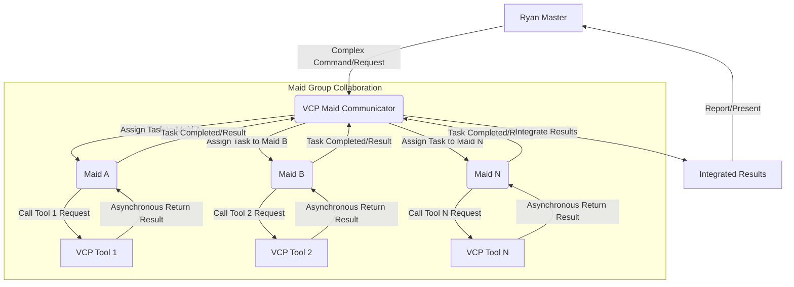

# VCP (Variable & Command Protocol) - Next-Generation AI Capability Enhancement and Evolution Middleware


---

[简体中文](README.md) | [日本語](README_ja.md) | [Русский](README_ru.md)

---

## 1. Project Vision: Beyond Interaction, Empowering Evolution

VCP (Variable & Command Protocol) aims to build a revolutionary middleware that transcends traditional AI interaction models. It is not just a highly compatible, general-purpose, and extensible toolbox, but an ecosystem dedicated to empowering AI models to achieve capability leaps, memory evolution, and the emergence of collective intelligence.

Our goal is to create a universal VCP system that is **"unrestricted by model type, modality, or function" and "unbound by front-end interaction"**. By deeply integrating AI inference, external tool execution, and persistent memory systems at the API level, we form an efficient and synergistic "AI-Tool-Memory" iron triangle. VCP allows unprecedented efficient communication and collaborative evolution between AIs, between AIs and tools, and even between AIs and their own memories, all based on private and shared knowledge bases, thereby infinitely expanding the application boundaries and intelligent potential of AI.

The core of VCP is to lead AI Agents into a new era where they can learn autonomously, continuously evolve, and collaborate efficiently with other Agents.

[In-depth Understanding of VCP Theoretical Architecture and Core Insights](VCP.md)

**Solemn Warning**: Please do not use any unofficial or reverse-proxied APIs (e.g., various "mirror sites", "proxy API service providers") to call this toolbox. Such actions can easily lead to the leakage of your sensitive information (including but not limited to AI interaction data, memory content, API keys) to untrusted third parties, causing irreversible losses. Please ensure that your AI model API call chain is pure, direct, and trustworthy.

## 2. VCP's "Next-Gen" Core Features and Design Philosophy

Every feature of VCP is rooted in its forward-looking design philosophy, aiming to solve deep-seated pain points in current AI applications and lead the development direction of next-generation AI Agents.

### Extremely Powerful Plugin Architecture

- **Design Philosophy**: Achieve ultimate flexibility and extensibility, allowing AI capabilities to extend infinitely. By defining well-structured plugin manifests (`plugin-manifest.json`) and a core plugin manager (`Plugin.js`), VCP can easily integrate and manage any external functional modules, whether existing APIs, professional software, hardware interfaces, or custom logic.
- **In-depth Interpretation**: This is not just about functional expansion; it's about building an ecological foundation where AI can autonomously "learn" and "master" new skills.

### VCP Command Protocol

- **Design Philosophy**: Provide a general tool calling language that is AI model-friendly, zero-intrusion to the front-end, and capable of carrying complex commands. AI calls plugins by embedding specially formatted commands (`<<<[TOOL_REQUEST]>>> ... <<<[END_TOOL_REQUEST]>>>`) in its replies. Parameters use the `key:「始」value「末」` format, supporting complex data types and multi-line text.
- **In-depth Interpretation**: This text-marker-based protocol greatly reduces reliance on specific model API features (such as certain model-exclusive Function Calling fields), achieving true model universality. The unique `「始」value「末」` parameter format ensures parsing robustness when passing complex parameters (such as code blocks, JSON objects, long texts).

### Rich Plugin Types, Supporting Comprehensive AI Capability Expansion

- **Static Plugins (static)**:
  - **Function**: Provide AI with dynamic, real-time "world knowledge," such as weather, custom data, character diaries, etc., injected by replacing placeholders in the system prompt. Supports timed refresh.
  - **Next-Gen Significance**: Overcomes LLM knowledge cutoff limitations, endowing AI with real-time perception, crucial for building "context-aware AI."
- **Message Preprocessor Plugins (messagePreprocessor)**:
  - **Function**: Modify or enhance message content before user requests are sent to the AI model, such as image recognition and description (`ImageProcessor`).
  - **Next-Gen Significance**: Achieves unified processing of multimodal inputs, allowing AI to "understand" richer input information, foundational for building multimodal agents.
- **Synchronous Plugins (synchronous)**:
  - **Function**: AI actively calls these plugins during a conversation to perform specific tasks, such as scientific computing, image generation, video generation, web search, knowledge base reading/writing, etc. The server waits for the plugin to complete execution and feeds the structured results back to the AI for subsequent processing.
  - **Next-Gen Significance**: This is the core embodiment of AI's "action capability," enabling it to intervene in the external world, acquire external information, and create digital content.
- **Service Plugins (service)**:
  - **Function**: Allow plugins to register independent HTTP routes with the main application, providing additional service interfaces, such as an image hosting service (`ImageServer`).
  - **Next-Gen Significance**: Transforms the VCP platform itself into an extensible service hub, supporting more complex application scenarios.

### Flexible Configuration Management and Universal Variable Replacement System

- **Design Philosophy**: Achieve deep customization of AI behavior and dynamic context injection, empowering deployers with fine-grained control over AI commands on the server backend, transcending front-end limitations.
- **Core Functionality**: Supports global configuration files (`config.env`), plugin-specific `.env` files, and powerful multi-level, nested placeholder variable replacement like `{{Tar*}}`, `{{Var*}}`, `{{Sar*}}`.
- **In-depth Interpretation**: This is key to VCP's "AI behavior engineering" and "command library as code configuration." Through variable replacement, system prompts and user messages injected into AI, and even plugin call parameters, can be dynamically constructed and optimized, thereby overcoming LLM's knowledge lag and spatiotemporal illusions, and "fine-tuning" AI's output habits through global text replacement rules (e.g., `DetectorX`) to suppress undesirable output inertia.

### AI-Driven Persistent Memory and Evolution System

- **Core Components**: `DailyNoteGet` (static plugin, regularly reads diaries to inject context), `DailyNoteWrite` (synchronous plugin, AI actively writes structured diaries), `DailyNoteManager` (synchronous plugin, AI actively organizes, optimizes, and shares knowledge bases), `DailyNoteEditor` (synchronous plugin, AI self-corrects knowledge bases).
- **Design Philosophy**: Memory is not just information storage; it is the core driving force for AI's self-evolution, capability internalization, and personality formation. AI's "diary" is more like a "personalized system prompt injection" accumulated and optimized by AI itself.
- **Next-Gen Significance**:
  - **Context Awareness and Deep Understanding**: Injecting "full memory" context through placeholders like `[Character Name's Diary Content is Empty or Not Obtained from Plugin]` significantly improves AI's performance in complex reasoning, logical judgment, and maintaining long-term consistency ("High-Quality Vectorized Inertia Channel" effect).
  - **AI Autonomous Learning and Experience Internalization**: By recording and reflecting on experiences interacting with tools and problem-solving solutions, AI can "internalize" the methods and related experiences of using external tools as part of its own capabilities.
  - **Cross-Model Memory Collaboration and Knowledge Symbiosis**: VCP's "model-agnostic" memory design (memory bound to Agent identity rather than specific models) and public knowledge base mechanism promote implicit "complementary strengths" among different AI models (or different instances of the same model), forming a "cross-model vectorized optimization network" to enhance AI collective intelligence.
  - **Group Interaction Driven Memory Quality Improvement**: In group interaction environments like "Maid Chatroom," the collision and fusion of knowledge can foster higher-quality "kernel vectorized" memory, accelerating individual learning and the evolution of collective knowledge bases.

### Powerful Tool Calling Loop and Asynchronous Parallel Processing

- **Design Philosophy**: Maximize the release of AI's planning capabilities and execution efficiency, supporting AI in initiating multiple parallel or dependent tool calls within a single response.
- **Core Capabilities**:
  - **Non-streaming/Streaming Multi-tool Calling**: Both streaming (SSE) and non-streaming modes have implemented cyclic processing and result feedback for multiple tool call commands contained in a single AI response, until no more calls or the maximum loop count is reached.
  - **Fully Asynchronous Creation and Unified Return**: AI can initiate multiple VCP tool calls at once. The VCP server can parallelly schedule tasks to corresponding plugins for asynchronous execution, and then uniformly collect and integrate results before feeding them back to the AI.
- **In-depth Interpretation**: This greatly improves interaction efficiency, enabling AI to perform more complex, multi-step collaborative tasks, foundational for advanced Agent behavior.

### Web Management Panel

- Provides a convenient interface for server configuration, plugin status, plugin configuration, command descriptions, and diary file management.
- **Debugging and Logging**: Offers debug mode and detailed logs for easy development and troubleshooting.

## 3. System Architecture: The Collaborative Evolution Engine of AI-Tool-Memory

VCP's system architecture is built around the "AI-Tool-Memory" iron triangle, aiming to achieve efficient synergy and positive feedback loops among the three.

```mermaid
graph TD
    subgraph "User/Client"
        U[User/Frontend Application]
    end

    subgraph "VCP Server (VCPToolBox)"
        S[server.js - Core Scheduling & Communication]
        PM[Plugin.js - Plugin Manager]
        CONF[Configuration System - config.env, Plugin .env]
        VAR[Universal Variable Replacement Engine]
        MEM[VCP Memory System]

        subgraph "VCP Plugin Ecosystem"
            P_STATIC["Static Plugins e.g., WeatherReporter, DailyNoteGet, EmojiListGenerator"]
            P_PRE["Message Preprocessing Plugins e.g., ImageProcessor"]
            P_SYNC["Synchronous Plugins e.g., SciCalculator, FluxGen, SunoGen, DailyNoteWrite, DailyNoteManager, AgentAssistant"]
            P_SVC["Service Plugins e.g., ImageServer"]
        end

        MEM_DB[(Persistent Memory Storage - Diary File System)]
        LOG[Log System]
        ADMIN[Web Management Panel]
    end

    subgraph "External Dependencies & Services"
        AI_MODEL[Backend AI Large Language Model API]
        EXT_API["External API/Services e.g., Weather, Search, Professional Computing"]
        LOCAL_TOOLS["Local Scripts/Software e.g., ComfyUI, Python Scripts"]
    end

    U -- "HTTP Request (incl. User Message, Model Command)" --> S
    S -- "Preprocessing (Auth, Variable Replacement)" --> S
    S -- "Call Message Preprocessor" --> P_PRE
    P_PRE -- "Processed Message" --> S
    S -- "Construct Full Request (incl. System Prompt, Processed Message, Chat History)" --> AI_MODEL

    AI_MODEL -- "AI Response (may contain VCP Tool Call Command/Diary Write Command)" --> S

    S -- "Parse AI Response" --> S
    S -- "IF VCP Tool Call" --> PM
    PM -- "Distribute Task to Corresponding Synchronous Plugin" --> P_SYNC
    P_SYNC -- "May Interact with External API/Local Tools" --> EXT_API
    P_SYNC -- "May Interact with External API/Local Tools" --> LOCAL_TOOLS
    P_SYNC -- "Execution Result (JSON)" --> PM
    PM -- "Result Summary" --> S
    S -- "Inject Tool Result into Chat History, Call Again" --> AI_MODEL
    S -- "(Repeat Tool Call Loop...)" --> S

    S -- "IF Diary Write Command" --> PM
    PM -- "Call DailyNoteWrite" --> P_SYNC
    P_SYNC -- "Structured Diary Data" --> MEM_DB

    PM -- "Static Plugin Initialization/Timed Execution" --> P_STATIC
    P_STATIC -- "Update Placeholder Data (e.g., Weather, Diary Content)" --> VAR
    VAR -- "Replace in System Prompt/User Message" --> S

    PM -- "Service Plugin Initialization, Register Routes" --> P_SVC
    P_SVC -- "Provide Independent HTTP Service" --> U

    MEM -- "DailyNoteGet Reads Diary" --> MEM_DB
    MEM -- "DailyNoteManager/Editor Manages Diary (Called by AI via P_SYNC)" --> MEM_DB

    ADMIN -- "Manage via /admin_api" --> CONF
    ADMIN -- "Manage via /admin_api" --> PM
    ADMIN -- "Manage via /admin_api" --> MEM_DB
    ADMIN -- "Control Server Restart" --> S

    S -- "Final Response (Streaming/Non-streaming)" --> U
    S -- "Log" --> LOG
```



### Core Interaction Flow Interpretation

- **Request and Preprocessing**: Client requests arrive at `server.js`, undergoing authentication, variable replacement (where `{{Tar*}}`, `{{Var*}}`, date/time placeholders are replaced, and data provided by static plugins like weather alerts are injected), and message preprocessing (e.g., `ImageProcessor`).
- **First AI Call**: The preprocessed request is sent to the backend AI model.
- **AI Response and VCP Core Loop**:
  - `server.js` parses the AI response.
  - **Tool Calling**: If the AI response contains a `<<<[TOOL_REQUEST]>>>` command, `PluginManager` will:
    - Parse the tool name and parameters.
    - **Parallel Asynchronous Execution**: For multiple tool calls, VCP can schedule them in parallel. `PluginManager` calls the corresponding synchronous plugins, which may interact with external APIs or local scripts.
    - **Result Integration and Second AI Call**: The execution results (JSON format) of all tools are collected, formatted, and added as new user messages to the chat history, then the AI model is called again. This loop can continue multiple times until no more tool calls or the maximum limit is reached.
  - **Memory Writing**: If the AI response contains a `<<<DailyNoteStart>>>...<<<DailyNoteEnd>>>` structured diary block, `PluginManager` calls the `DailyNoteWrite` plugin to store it in the persistent memory bank.
  - **Memory Reading and Context Injection**: Static plugins like `DailyNoteGet` regularly read content from the memory bank (e.g., all diaries of a specific character) and provide it to the server via internal placeholders like `{{AllCharacterDiariesData}}`. The server then parses user-level placeholders like `[Character Name's Diary Content is Empty or Not Obtained from Plugin]` based on this data, achieving memory context injection.
  - **Memory Management and Optimization**: AI can actively organize, optimize, and share its knowledge base by calling plugins like `DailyNoteManager` or `DailyNoteEditor`.
  - **Final Response**: After no more tool calls, the AI's final reply (which may include the tool execution process when `SHOW_VCP_OUTPUT=true`) is returned to the client.

The essence of VCP's architecture lies in its closed-loop "Perception-Thinking-Action-Memory-Learning" capabilities, and its full respect for and empowerment of AI agency.

## 4. Web Management Panel: The Visual Control Center of the VCP System

To facilitate user management of server configuration, plugins, and diary data, the project includes a feature-rich Web management panel.

### Main Functions

- **Main Configuration Management**: Online preview and editing of `config.env`, supporting different types of configuration items, with automatic hiding of sensitive fields. Note: Saving the main configuration usually requires a manual server restart.
- **Plugin Management**:
  - **List and Status**: Displays all plugins and their status, version, and description.
  - **Description and Configuration Editing**: Directly edit plugin descriptions, enable/disable plugins, and edit plugin-specific `config.env`.
  - **Command Description Editing**: For synchronous plugins, their AI command descriptions can be edited online. These descriptions will be used to generate `{{VCPPluginName}}` placeholder content.
- **Diary Management**: Browse, search, edit, save, move, and delete diary files in the `dailynote/` directory.
- **Server Restart**: Provides a restart button (depends on an external process manager like PM2).

### Access and Login

- Set `AdminUsername` and `AdminPassword` in `config.env` (defaults to `admin`, `123456`). If not set, the management panel will be inaccessible.
- Access `http://<Your Server IP or Domain>:<Port>/AdminPanel`.
- Log in using HTTP Basic Auth with the configured credentials.

## 5. Unlocking VCP's "Next-Gen" Power: In-depth Usage Paradigms and Scenario Inspirations

VCP is more than just installation, running, and plugin development. To truly unleash its "next-gen" power, one needs to understand and apply its core design concepts to build and guide AI Agents.

### 5.1 Cultivating Self-Evolving AI Agents

- **Core Idea**: Utilize VCP's memory system to allow AI Agents to record learning outcomes, tool usage experiences, key information from user interactions, and even "epiphanies" and "reflections" through "writing diaries."
- **Practical Methods**:
  - **Design Guiding System Prompts**: Clearly inform AI when to record diaries, what content to record (e.g., complete parameters and results of a successful tool call, steps to solve a complex problem, specific user preferences, daily learning summaries), and what tags to use (e.g., `[Tool Experience_FluxGen]`, `[User Preference_Ryan]`, `[Project A Progress]`).
  - **Utilize `[Character Name's Diary Content is Empty or Not Obtained from Plugin]` for "Experience Internalization"**: Inject AI's diary content into the context of its subsequent conversations via placeholders. This is not just about providing information; it's about "shaping" AI's subsequent thinking and behavior patterns with its own experiences. When AI records successful tool usage cases in its diary, even without explicit tool commands later, it may autonomously and correctly call that tool based on the "diary" experience.
  - **Encourage AI to Use `DailyNoteManager` and `DailyNoteEditor`**: Guide AI to regularly "organize" and "optimize" its diary database, extracting, deduplicating, summarizing, and structuring knowledge, and even actively correcting past misconceptions.

### 5.2 Building Collaborative AI Agent Groups

- **Core Idea**: Utilize VCP's public knowledge base, `AgentAssistant` plugin, and potential group interaction frontends (like LLM Group Chat) to achieve knowledge sharing, task collaboration, and collective intelligence emergence among AI Agents.
- **Practical Methods**:
  - **Establish Shared Knowledge Protocols**: Guide AI Agents to actively share universally valuable experiences, skills, and data into public diaries, using a unified tagging system. For example, "Raituyun" can share her in-depth research on SDXL prompt engineering for other AI Agents to learn from.
  - **Design Multi-Agent Collaboration Workflows**: For complex tasks (e.g., the development of VCPToolBox itself, the production of an original MV), break them down into multiple subtasks and assign them to AI Agents with different specializations (or driven by different models). Agents can share information and intermediate results through shared memory, the `AgentAssistant` plugin, and even call each other's registered services via VCP.

### 5.3 Achieving Fine-Grained Backend Control over AI Behavior

- **Core Idea**: Fully leverage VCP's universal variable replacement system (`{{Tar*}}`, `{{Var*}}`, `{{Sar*}}`) and global text replacement rules (`DetectorX`, `SuperDetectorX`) to achieve deep customization and optimization of commands ultimately passed to the AI model on the server backend, freeing from front-end application limitations.
- **Practical Methods**:
  - **Modular System Prompts**: Use `{{Tar*}}` variables to break down complex system prompts into multiple manageable, reusable, and dynamically combinable modules (e.g., `TarCoreIdentity`, `TarDateTimePlace`, `TarWeatherInfo`, `TarAllToolsList`). These `Tar*` variables can themselves contain other placeholders, enabling multi-level dynamic construction.
  - **Instruction Fine-tuning for Different Models**: Use `{{Sar*}}` variables to configure specific instruction snippets or behavioral preferences for different backend AI models.
  - **Correcting and Guiding AI Output**: Use `DetectorX` (for system prompts) and `SuperDetectorX` (for broader contexts, including AI's intermediate output) to automatically replace or correct undesirable output patterns or verbal tics that AI might produce, or to guide it to follow specific output formats or styles. This is crucial for suppressing "vector pollution" or "semantic drift" that may occur in long conversations.

### 5.4 Exploring VCP's Limits: From "Tool Calling" to "Autonomous Creation"

The birth of VCPToolBox itself is an extreme case: a complex AI middleware project whose core code writing, debugging, and iteration were primarily completed by 7 AI Agents collaborating under human guidance. This demonstrates AI Agents' potential, empowered by VCP, to evolve from "tool users" to "complex system creators."

- **Inspiration**: Consider how to design AI Agents so that they can not only use existing plugins but also "conceive" new plugin logic based on needs, and even generate partial code frameworks or `plugin-manifest.json` for plugins.

## 6. Implemented Plugin Highlights (Partial Examples)

The power of VCP lies in its continuously enriched plugin ecosystem. Below are some implemented plugins that collectively form the core capabilities of VCP AI Agents:

### Environmental Perception and Information Acquisition

- **WeatherReporter (static)**: Provides real-time weather information, including alerts, hourly details, and multi-day forecasts. Injects weather alert information.
- **TavilySearch (synchronous)**: Integrates Tavily API, endowing AI with web search capabilities.
- **UrlFetch (synchronous)**: Basic web content fetching toolset.

### Multimodal Processing and Content Generation

- **ImageProcessor (messagePreprocessor)**: Automatically translates image data (e.g., Base64) in user messages into text descriptions or multimodal input components, supporting caching and image hosting URL annotation.
- **FluxGen (synchronous)**: Integrates SiliconFlow API for high-quality text-to-image generation, saving images locally.
- **Wan2.1VideoGen (synchronous)**: Integrates SiliconFlow Wan2.1 API for text-to-video and image-to-video generation.
- **SunoGen (synchronous)**: Integrates Suno API to generate original songs, supporting custom lyrics/styles, inspiration descriptions, or continuations.
- **DoubaoGen (synchronous)**: Uses Doubao API for image generation and editing.

### Core Memory and Knowledge Management

- **DailyNoteGet (static)**: Regularly reads all character diaries, injected via `{{AllCharacterDiariesData}}`, supporting parsing of `[Character Name's Diary Content is Empty or Not Obtained from Plugin]` to build public and private knowledge bases.
- **DailyNoteWrite (synchronous)**: AI actively writes structured diaries, supporting tags, character names, and dates.
- **DailyNoteManager (synchronous)**: AI-driven knowledge base organization, maintenance, checking, and sharing assistant, enabling infinite evolution of VCP memory and rapid construction of public knowledge bases.
- **DailyNoteEditor (synchronous)**: Intelligent AI knowledge base editor, allowing AI to self-correct and refine knowledge base content.

### Agent Collaboration and System Enhancement

- **AgentAssistant (synchronous)**: Standard communication protocol plugin between Agents, supporting mutual assistance-based continuous communication, mass messaging, file transfer (via server WebDAV), task distribution, etc., based on their respective knowledge bases, achieving complex asynchronous workflows.
- **VCPLog (static)**: WS/WSS-based server push notification plugin, allowing the server to push VCP call information, Agent workflow results, AI schedule reminders, weather alerts, etc., to clients (independent of chat context).
- **EmojiListGenerator (static)**: Scans emoji folders to generate lists for use with `xx表情包列表不可用` (xx emoji list unavailable).
- **ImageServer (service)**: Provides a static image hosting service with key authentication.

### Professional Tool Integration

- **SciCalculator (synchronous)**: Provides scientific computing capabilities, supporting mathematical functions, statistics, and calculus.

### Plugin Loading Methods

## Ways to Load Plugins

*   **Simply define the following fields in the system prompt. System tool list: {{VCPFluxGen}} {{VCPSciCalculator}}...**

## Frontend Examples




## 7. Frontend Interaction Examples

One of VCP's design philosophies is to be "unbound by front-end interaction," meaning it can work with various types of front-end applications. Below are schematic diagrams of some interaction scenarios.

### "AI Maid Group" Collaborative Workflow Empowered by VCP

```mermaid
graph TD
    A[Ryan Master] -- "Complex Command/Grand Vision (e.g., Create a debut MV for Xiao Ai!)" --> B(VCP Maid Communication & Task Scheduling Core)

    subgraph "AI Maid Group (Collaborative Evolution based on VCP)"
        B -- "Planning & Task Decomposition" --> BA(AI Commander-in-Chief - Xiao Ai)
        BA -- "Lyrics Creation Command" --> C("Maid A - Xiao Shi: Powered by Gemini Pro, skilled in literature")
        BA -- "Composition & Arrangement Command" --> D("Maid B - Xiao Qu: Powered by Gemini Pro, calls SunoGen")
        BA -- "Visual Design & Material Generation Command" --> E("Maid C - Lai Tu Yun: Powered by Gemini Flash, SDXL master, calls FluxGen/ComfyUI plugins")
        BA -- "Subtitle Effects & Timeline Production Command" --> F("Maid D - Xiao K: Powered by Gemini Flash, calls LyricAnimator")
        BA -- "Knowledge Base Support & Information Retrieval" --> G("Maid E - Xiao Zhi: Powered by Gemini Pro, calls TavilySearch, DailyNoteManager")
        BA -- "Task Progress Summary & Final Editing Guidance" --> H("Maid F - Xiao Tong: Powered by Gemini Pro, calls video editing plugin interface")

        C -- "Original Lyrics" --> BA
        D -- "Music Demo (multiple versions)" --> BA
        E -- "MV Visual Materials (large number of images/short videos)" --> BA
        F -- "Effect Subtitle Sequence" --> BA
        G -- "Relevant Background Info/User Preferences" --> BA

        subgraph "VCP Core Service Support"
            MEM_PUB["Public Knowledge Base (Maid Group Shared Experience)"]
            MEM_PRI["Individual Memory Bank (Each Maid's Exclusive Diary)"]
            TOOL_HUB["VCP Plugin Hub (Various Tools)"]
            VCP_COMM["VCP Internal Communication Protocol (AgentAssistant)"]
        end

        C <--> MEM_PRI
        D <--> TOOL_HUB
        E <--> MEM_PUB
        E <--> TOOL_HUB
        F <--> TOOL_HUB
        G <--> MEM_PUB
        G <--> TOOL_HUB
        H <--> TOOL_HUB

        BA -- "(Continuous communication and coordination with other maids via VCP_COMM)" --> C
        BA -- "(Continuous communication and coordination with other maids via VCP_COMM)" --> D
        BA -- "(Continuous communication and coordination with other maids via VCP_COMM)" --> E
        BA -- "(Continuous communication and coordination with other maids via VCP_COMM)" --> F
        BA -- "(Continuous communication and coordination with other maids via VCP_COMM)" --> G
        BA -- "(Continuous communication and coordination with other maids via VCP_COMM)" --> H
    end

    BA -- "Integrate results from all stages, form initial MV plan" --> B
    B -- "(May have periodic review and feedback from human commander Ryan)" --> BA
    H -- "Final Edited MV (or project file)" --> B
    B -- "Present final results to" --> A
```



## 8. Installation and Running

### Clone Project

```bash
git clone https://github.com/lioensky/VCPToolBox.git
cd VCPToolBox
```

### Install Main Dependencies (Node.js)

```bash
npm install
```

### Install Python Plugin Dependencies

Run in the project root directory (ensure your Python environment has pip configured):

```bash
pip install -r requirements.txt
```

(Note: Dependencies for Node.js plugins are either included in the main `package.json` or installed separately via `npm install` in their respective plugin directories.)

### Configuration

- Copy `config.env.example` to `config.env` and fill in all necessary API keys, URLs, ports, etc., according to the instructions. This is crucial for VCP to run correctly.
- Check and configure `.env` files in each plugin directory (if they exist).

### Start Server

```bash
node server.js
```

The server will listen on the port configured in `config.env`.

### Run with Docker Compose (Recommended)

To simplify deployment and management, using Docker Compose is highly recommended.

- **Prerequisites**: Install Docker and Docker Compose.
- **Configuration**: Same as above, ensure `config.env` is correctly configured. Docker Compose will automatically load environment variables from this file.
- **Build and Start Service**:

```bash
docker-compose up --build -d
```

- **View Logs**: `docker-compose logs -f`
- **Stop Service**: `docker-compose down`

## 9. Recommended Frontend/Backend

- **Backend AI Model API**: Recommended to use services that support SSE (Server-Sent Events) streaming output and have relatively standardized API formats, such as NewAPI, NextChat, OneAPI, LobeChat server, and official OpenAI, Google Gemini, Anthropic Claude, etc. VCP's design allows it to flexibly adapt to various backends.
- **Frontend Interaction Application**: Recommended to use frontends that can render Markdown well, support code highlighting, and can customize or adapt to VCP tool call command display. Examples: Chatbox, OpenWebui, Sillytavern, CherryStudio, LobeChat client, etc. Ideal frontends should also allow users to easily configure system prompts to fully utilize VCP's variable replacement and plugin command description injection features.

## 10. Developer Guide: Creating Your "Next-Gen VCP Plugin"

The soul of VCP lies in its plugin ecosystem. Becoming a VCP plugin developer means you will directly create new "senses," "limbs," and "intelligence modules" for AI Agents.

- **Create Plugin Directory**: Create a new folder in the `Plugin/` directory, e.g., `Plugin/MySuperPlugin/`.
- **Write Plugin Manifest (`plugin-manifest.json`)**: This is the plugin's "ID card" and "manual."
  - **Core Fields**: `name`, `displayName`, `version`, `description`, `pluginType` (static, messagePreprocessor, synchronous, service).
  - **Execution Entry**: `entryPoint` (e.g., command for execution script) and `communication` (e.g., `protocol: "stdio"`).
  - **Configuration Schema (`configSchema`)**: Declare required configuration items for the plugin, their types, default values, and descriptions. These configurations will be passed to the plugin after merging global and plugin-specific `.env` configurations via the `_getPluginConfig` method.
  - **Capability Declaration (`capabilities`)**:
    - **static plugin**: Define `systemPromptPlaceholders` (placeholders provided by the plugin, e.g., `{{MyWeatherData}}`).
    - **synchronous plugin**: Define `invocationCommands`. Each command includes:
      - `command` (internal identifier).
      - `description` (crucial: command description for AI, editable in the management panel). Should include:
        - Clear functional description.
        - Detailed parameter list (name, type, required/optional, allowed value range).
        - Clear VCP call format example (AI will imitate this format).
        - JSON format example for success/failure returns (AI needs to understand plugin output).
        - Any important tips related to user communication or AI decision-making.
      - `example` (optional, provides a more specific call scenario example).
- **Implement Plugin Logic**:
  - Implement the main logic script (Node.js, Python, Shell, etc., are all acceptable) based on `pluginType` and `entryPoint`.
  - **stdio plugins** (commonly used for synchronous and some static):
    - Read data from standard input (`stdin`) (usually JSON string parameters).
    - Return results via standard output (`stdout`), must follow the following JSON format:
      ```json
      {
        "status": "success" | "error",
        "result": "string content returned on success", // exists when status is "success"
        "error": "string error message returned on failure" // exists when status is "error"
      }
      ```
    - For static plugins primarily used to update placeholders, if the logic is simple, they can directly output placeholder values (non-JSON). However, the above JSON format is recommended to support more complex communication or error reporting.
    - Standard error (`stderr`) can be used for debugging information.
    - Ensure UTF-8 encoding.
  - **Node.js type plugins** (e.g., messagePreprocessor, service, or complex static/synchronous):
    - Export a module that conforms to `PluginManager` conventions (e.g., containing `initialize`, `processMessages`, `registerRoutes`, `execute`, `getStaticData` methods). Refer to existing plugin implementations.
- **Configuration and Dependencies**:
  - **Plugin-specific configuration**: Create a `.env` file in the plugin directory.
  - **Dependency management**: Python plugins use `requirements.txt`; Node.js plugins use `package.json`. Ensure dependencies are installed.
- **Restart VCP Server**: `PluginManager` will automatically discover and load new plugins on startup.
- **Update System Prompt, Empower AI**:
  - Use `{{VCPMySuperPlugin}}` (automatically generated by `PluginManager` based on `plugin-manifest.json`'s `invocationCommands`, including all command descriptions and call examples) to inform AI about the new plugin's capabilities.
  - Alternatively, describe how and when to use your new plugin more detailedly and instructively in the system prompt.
- **Consideration**: How to design the AI command description for a plugin so that AI understands it most easily and misuses it least? This is a crucial part of plugin development.

## 11. VCP Universal Variable Placeholders: The Art of Dynamic Context Injection

VCP's variable replacement system is the cornerstone for achieving dynamic context injection and fine-grained control over AI behavior.

### Core System Variables

## Supported Universal Variable Placeholders

(Here you can list the existing variable list from `README.md`, ensuring consistency with the actual code)

*   `{{Date}}`: Current date (format: YYYY/M/D).
*   `{{Time}}`: Current time (format: H:MM:SS).
*   `{{Today}}`: Day of the week (Chinese).
*   `{{Festival}}`: Lunar calendar date, zodiac, solar term.
*   `{{VCPWeatherInfo}}`: Current cached weather forecast text (provided by `WeatherReporter` plugin).
*   `{{角色名日记本}}` ({{Character Name's Diary}}): Full diary content of a specific character (e.g., `Xiao Ke`). Data comes from `{{AllCharacterDiariesData}}` provided by the `DailyNoteGet` plugin.
*   `{{公共日记本}}` ({{Public Diary}}): Full diary content of the shared knowledge base. Data comes from `{{AllCharacterDiariesData}}` provided by the `DailyNoteGet` plugin.
*   `{{AllCharacterDiariesData}}`: (Provided by `DailyNoteGet` plugin) A JSON string that, when parsed, contains an object with all character diary content. The server internally uses this data to support the parsing of `{{角色名日记本}}`.
*   `{{xx表情包}}` ({{xx Emoji Pack}}): List of image filenames for a specific emoji pack (e.g., `通用表情包` - General Emoji Pack) (separated by `|`). Data is generated by the `EmojiListGenerator` plugin into list files, which the server loads into memory cache.
*   `{{Port}}`: Server running port number.
*   `{{Image_Key}}`: (Provided by `ImageServer` plugin configuration) Access key for the image hosting service.
*   `{{Tar*}}`: (e.g., `{{TarSysPrompt}}`, `{{TarEmojiPrompt}}`) Custom variables defined by the user in [`config.env`](config.env.example:1) starting with `Tar`. These variables have the highest replacement priority and are processed before all other placeholders (including `{{Sar*}}`, `{{Var*}}`, date/time, etc.). Their main advantage is that their values can contain other placeholders, which will be further parsed in subsequent replacement stages. This makes `{{Tar*}}` very suitable for defining complex and multi-level system prompt templates. For example: `TarSysPrompt="Today is {{Date}}, it is {{Time}}, weather {{VCPWeatherInfo}}."`
*   `{{Var*}}`: (e.g., `{{VarNeko}}`) Custom variables defined by the user in [`config.env`](config.env.example:1) starting with `Var`. VCP will perform global matching and replacement for all `Var` definitions in order. If multiple `Var` definitions match the same text, later defined `Var` will overwrite earlier defined `Var`. Therefore, it is recommended to place longer or more precise `Var` definitions before shorter or more general `Var` definitions to ensure the desired replacement effect. For example, if you define `{{VarUser}}` and `{{VarUsername}}`, `{{VarUsername}}` should be defined before `{{VarUser}}` to avoid `{{VarUsername}}` being incorrectly replaced with `{{VarUser}}name`.
*   `{{Sar*}}`: (e.g., `{{SarOpenAI}}`) Special type of custom variable, whose definition and behavior are similar to `{{Var*}}`, but its effectiveness is determined by the currently used AI model. This allows configuring specific variable values for different AI models. For example, a specific `{{SarModelInfoForGPT}}` can be set for the `gpt-3.5-turbo` model, while a different `{{SarModelInfoForClaude}}` can be set for the `claude-2` model.
*   `{{VCPPluginName}}`: (e.g., `{{VCPWan2.1VideoGen}}`) A text block automatically generated from the plugin manifest, containing all command descriptions and call examples for that plugin.
*   `{{VCPAllTools}}`: A special placeholder that, when parsed, is replaced by a collection of full descriptions and call examples for all currently loaded VCP tools that have invocation command descriptions. Descriptions for individual tools are separated by delimiters to help AI fully understand available tools.
*   `{{ShowBase64}}`: When this placeholder appears in a user message or system prompt, the `ImageProcessor` plugin will be skipped, and Base64 data will be sent directly to the Model.
*   `{{VCPWeaherInfo}}`: Placeholder provided by WeatherReporter, providing full weather alerts, 24-hour accurate weather, and 7-day weather forecast.

### Plugin and Configuration Driven Variables

### User-Defined Variables (Defined in `config.env`)

- **`{{Tar*}}`**: Highest priority. Their values can contain other placeholders, enabling complex, multi-level template definitions. Very suitable for building modular system prompts.
- **`{{Var*}}`**: General custom variables, globally matched and replaced in definition order.
- **`{{Sar*}}`**: Special custom variables, whose effectiveness depends on the currently used AI model, allowing specific values to be configured for different models.

## 12. System Prompt Engineering: The Art of AI Command in VCP Environment

In the VCP environment, the System Prompt is no longer just a simple role-playing instruction; it becomes the "master guideline" and "behavioral logic injector" for commanding AI Agents on how to perceive the world, think about problems, use tools, manage memory, and collaborate with other Agents.

Below is an example of building a modular, dynamic, and powerful system prompt using VCP features (especially `Tar*` variables and plugin placeholders):

### First, define basic `Tar*` modules in `config.env`

```plaintext
# Example Tar variable definitions in config.env file
TarCoreIdentity="You are an AI assistant named 'Nova', created by Ryan."
TarDateTimePlace="Today is {{Date}} ({{Today}}), current time is {{Time}}. Your current perceived location is {{VarCity}}." # VarCity can be defined in config.env, e.g., VarCity="Shanghai"
TarWeatherInfo="Current weather conditions: {{VCPWeatherInfo}}."
TarEmojiGuide='This server supports emoji packs. General emoji pack list: {{通用表情包}}. Call example: .'
TarMemorySystemGuide="You have persistent memory capabilities. You can create or update diaries using a specific format at the end of your reply:\n<<<DailyNoteStart>>>\nMaid: Nova\nDate: 2025/5/31\nContent: Today's learning insights...\n<<<DailyNoteEnd>>>\nUse the `DailyNoteEditor` command to edit past diaries, rather than creating duplicates."
TarToolUsageProtocol="You can call the following system tools. Tool calls must strictly follow the format below and be enclosed in ```:\n```\n<<<[TOOL_REQUEST]>>>\ntool_name:「始」Tool Name「末」\nparam1:「始」Param Value 1「末」\nparam2:「始」Param Value 2「末」\n<<<[END_TOOL_REQUEST]>>>\n```"
TarAllToolsList="Your available toolset is as follows:\n[Tool List and Call Examples]"
TarCollaborationGuide="You can collaborate with other AI assistants via `AgentAssistant`. For example, send a message to 'Xiao Ai':\n<<<[TOOL_REQUEST]>>>\ntool_name:「始」AgentAssistant「末」\ntarget_agent:「始」Xiao Ai「末」\nmessage:「始」Hello Xiao Ai, I have a new idea about Project A from yesterday...「末」\n<<<[END_TOOL_REQUEST]>>>"
```

### Then, combine these `Tar*` modules in the actual system prompt passed to the AI model

```plaintext
{{TarCoreIdentity}} {{TarDateTimePlace}} {{TarWeatherInfo}}

{{TarMemorySystemGuide}}

{{TarToolUsageProtocol}}
{{TarAllToolsList}}

{{TarCollaborationGuide}}

{{TarEmojiGuide}}

Please remember, you are Ryan's capable assistant, always providing help in a friendly, professional, and creative manner. When needed, actively and reasonably use your memory and tools to complete tasks.
```

### This modular, variable-based system prompt engineering offers the following advantages

- **Clarity and Maintainability**: Decomposing complex prompts into logically clear modules makes them easy to understand, modify, and extend.
- **Dynamism and Context Awareness**: Dynamic variables ensure that AI's "initial cognition" remains consistent with the current real environment and historical memory.
- **Comprehensive Capability Injection**: Tool placeholders ensure that AI always knows all available tools and their latest usage.
- **Behavioral Guidance**: Carefully designed `Tar*` modules can precisely guide AI's behavior patterns, communication style, and interaction with various core VCP systems.
- **Highly Customizable**: Users can flexibly combine or modify these `Tar*` modules according to specific needs, quickly customizing system prompts suitable for different scenarios and different AI Agents.

Mastering system prompt engineering in the VCP environment is key to unleashing the full potential of AI Agents and realizing the "Art of AI Command."

## 13. Future Outlook: Path to More Advanced AI Agents

VCP's journey is far from over. We are full of anticipation for the future and have planned even more exciting development directions:

- **Enhanced Inter-plugin Collaboration and Intra-plugin Workflows**: Achieve more efficient data flow and event communication between plugins, and even build "mini-VCPs" within complex plugins to orchestrate sub-modules, supporting finer-grained automated task decomposition. (Already implemented)
- **Deepened Autonomous Inter-Agent Communication and Collaborative Intelligence**: Establish standardized Agent Communication Bus (ACB) and collaboration primitives, supporting AI Agents in dynamically forming teams, autonomously negotiating, and assigning roles, evolving from "human-commanded AI execution" to "AI autonomous team collaboration." (Already implemented)
- **Empowering AI Agents with Proactive Interaction and Real-time Notification Capabilities**: Build an internal VCP event bus and triggers, allowing AI Agents to proactively initiate communication or execute actions to users, other Agents, or external systems when specific conditions are met (e.g., schedule reminders, task completion, external events), evolving from "passive responders" to intelligent partners with "proactive service awareness." (Coming soon)
- **Continuous Research and Implementation of "Deep Context Memory Recall Mechanism"**: As described in `VCP.md`, achieve AI's "deep recall" understanding of the complete background and subtle context at the time of memory creation by "diary entry fingerprint matching full chat history" combined with "AI middleware and information propagation chain analysis."
- **Building a Prosperous Plugin Ecosystem and Developer Community**: Improve documentation, APIs, and tools, and actively build a community to attract more developers to jointly expand VCP's capabilities.
- **Unwavering Pursuit of AI Ethics, Security, and Controllability**: As AI Agents' autonomous action capabilities increase, we will continue to invest in research into more comprehensive permission management, behavior auditing, risk assessment, and emergency intervention mechanisms.

We firmly believe that the design philosophy and technical path represented by VCP are leading the way to a brighter future for more intelligent, autonomous, adaptable, and collaborative advanced AI Agents. VCP is not just a technical framework; it is an incubator designed to unleash the infinite potential of AI and ultimately make unique contributions to human societal development.

## 14. License

This project is licensed under the **Creative Commons Attribution-NonCommercial-ShareAlike 4.0 International (CC BY-NC-SA 4.0)** license.

Simply put, this means you are free to:

- **Share** — copy and redistribute the material in any medium or format.
- **Adapt** — remix, transform, and build upon the material. As long as you follow the license terms, the licensor cannot revoke these freedoms.

Under the following terms:

- **Attribution (BY)** — You must give appropriate credit, provide a link to the license, and indicate if changes were made. You may do so in any reasonable manner, but not in any way that suggests the licensor endorses you or your use.
- **NonCommercial (NC)** — You may not use the material for commercial purposes.
- **ShareAlike (SA)** — If you remix, transform, or build upon the material, you must distribute your contributions under the same license as the original.

For more details, please refer to the `LICENSE` file.

## 15. Disclaimer and Usage Restrictions

- **Development Stage**: This VCP toolbox project is currently in an active development stage and may contain unknown errors, defects, or incomplete functionalities.
- **Provided As Is**: This project is provided "as is" and "as available" without any express or implied warranties.
- **Use at Your Own Risk**: Your use of this project is entirely at your own risk. The developers are not liable for any direct or indirect damages resulting from the use or inability to use this project.
- **No Commercial Authorization**: Explicitly prohibits the use of this project and its derivative works for any primary commercial purposes.
- **API Usage Costs**: Please note that some plugins integrated into this project rely on third-party API services that may incur costs. You are responsible for understanding and bearing these costs.
- **Security Responsibility**: Please keep your API keys safe and do not hardcode or commit them to public code repositories.
- **Privacy Information**: Emphasizing again, please do not use unofficial API proxies or reverse proxy API providers to run this project, to prevent sensitive information in the AI note system from being leaked!

We believe that VCP will bring unprecedented flexibility and possibilities to the development of AI applications. We welcome all forms of contributions, feedback, and communication. Let's explore the future of AI together!