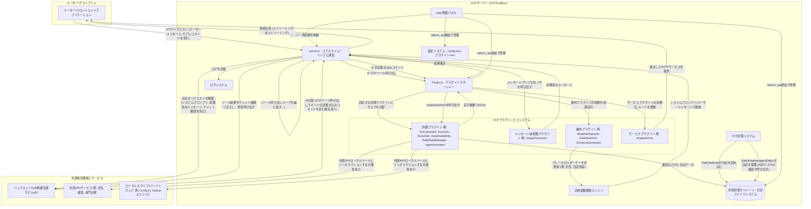
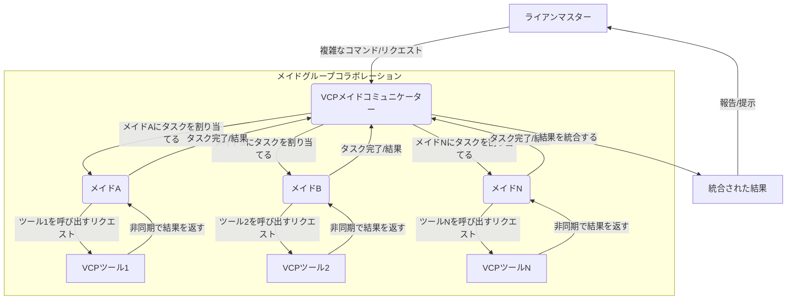
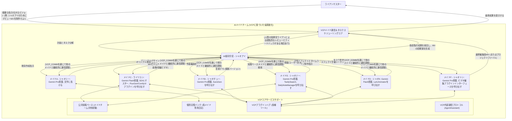

# VCP (Variable & Command Protocol) - 次世代AI能力強化・進化ミドルウェア


---

[简体中文](README.md) | [English](README_en.md) | [Русский](README_ru.md)

---

## 1. プロジェクトビジョン：インタラクションを超え、進化を可能にする

VCP (Variable & Command Protocol) は、従来のAIインタラクションモデルを超越する革新的なミドルウェアの構築を目指しています。これは、高度な互換性、汎用性、拡張性を持つツールボックスであるだけでなく、AIモデルが能力の飛躍、記憶の進化、そして集合知の出現を実現するためのエコシステムでもあります。

私たちの目標は、**「モデルの種類、モダリティ、機能に制限されず」「フロントエンドのインタラクションに縛られない」**汎用VCPシステムを構築することです。APIレベルでAI推論、外部ツール実行、永続化記憶システムを深く統合することで、効率的な協調関係を持つ「AI-ツール-記憶」の鉄の三角形を形成します。VCPは、AI間、AIとツール間、さらにはAIと自身の記憶の間で、これまでにない効率的な通信と協調進化を可能にし、すべてプライベートおよび共有知識ベースに基づいて実現することで、AIの応用範囲と知能の可能性を無限に拡大します。

VCPの核心は、AIエージェントが自律的に学習し、継続的に進化し、他のエージェントと効率的に協力できる新時代へと導くことです。

[VCP理論アーキテクチャと核心的洞察の深掘り](VCP.md)

**厳重な警告**：非公式またはリバースプロキシのAPI（例：「ミラーサイト」、「中継APIサービスプロバイダー」など）を使用してこのツールボックスを呼び出さないでください。このような行為は、お客様の機密情報（AIインタラクションデータ、記憶ライブラリの内容、APIキーなどを含むがこれに限定されない）が信頼できない第三者に漏洩し、取り返しのつかない損害を引き起こす可能性が極めて高いです。AIモデルのAPI呼び出しチェーンが純粋で、直接的で、信頼できるものであることを必ず確認してください。

## 2. VCPの「次世代」核心機能と設計哲学

VCPの各機能は、現在のAIアプリケーションの深い課題を解決し、次世代AIエージェントの開発方向をリードすることを目的とした、先進的な設計哲学に根ざしています。

### 非常に強力なプラグインアーキテクチャ

- **設計哲学**: 究極の柔軟性と拡張性を実現し、AIの能力を無限に拡張できるようにします。適切に定義されたプラグインマニフェスト (`plugin-manifest.json`) とコアプラグインマネージャー (`Plugin.js`) を通じて、VCPは既存のAPI、専門ソフトウェア、ハードウェアインターフェース、カスタムロジックなど、あらゆる外部機能モジュールを簡単に統合および管理できます。
- **詳細な解釈**: これは単なる機能拡張ではなく、AIが自律的に新しいスキルを「学習」し「習得」できるエコシステムの基盤を構築することです。

### VCPコマンドプロトコル

- **設計哲学**: AIモデルに優しく、フロントエンドにゼロ侵入で、複雑なコマンドを伝達できる汎用ツール呼び出し言語を提供します。AIは、特定の形式のコマンド (`<<<[TOOL_REQUEST]>>> ... <<<[END_TOOL_REQUEST]>>>`) を応答に埋め込むことでプラグインを呼び出します。パラメータは `key:「始」value「末」` 形式を使用し、複雑なデータ型や複数行のテキストをサポートします。
- **詳細な解釈**: このテキストマーカーベースのプロトコルは、特定のモデルAPI機能（特定のモデル専用のFunction Callingフィールドなど）への依存を大幅に削減し、真のモデル普遍性を実現します。独自の `「始」value「末」` パラメータ形式は、複雑なパラメータ（コードブロック、JSONオブジェクト、長文など）を渡す際の解析の堅牢性を保証します。

### 豊富なプラグインタイプ、AIの包括的な能力拡張をサポート

- **静的プラグイン (static)**:
  - **機能**: 天気、カスタムデータ、キャラクターの日記など、動的でリアルタイムの「世界知識」をAIに提供し、システムプロンプト内のプレースホルダーを置き換えることで注入されます。定期的な更新をサポートします。
  - **次世代的意義**: LLMの知識カットオフの制限を克服し、AIにリアルタイムの知覚能力を与え、「状況認識型AI」を構築するための鍵となります。
- **メッセージプリプロセッサプラグイン (messagePreprocessor)**:
  - **機能**: ユーザーリクエストがAIモデルに送信される前に、メッセージの内容を変更または強化します。例：画像認識と説明 (`ImageProcessor`)。
  - **次世代的意義**: マルチモーダル入力の統一処理を実現し、AIがより豊富な入力情報を「理解」できるようにすることで、マルチモーダルエージェント構築の基盤となります。
- **同期プラグイン (synchronous)**:
  - **機能**: AIは会話中にこれらのプラグインを積極的に呼び出し、科学計算、画像生成、ビデオ生成、ウェブ検索、知識ベースの読み書きなどの特定のタスクを実行します。サーバーはプラグインの実行が完了するのを待ち、構造化された結果をAIにフィードバックして後続の処理を行います。
  - **次世代的意義**: これはAIの「行動能力」の核心であり、外部世界に介入し、外部情報を取得し、デジタルコンテンツを作成することを可能にします。
- **サービスプラグイン (service)**:
  - **機能**: プラグインがメインアプリケーションに独立したHTTPルートを登録することを許可し、画像ホスティングサービス (`ImageServer`) などの追加のサービスインターフェースを提供します。
  - **次世代的意義**: VCPプラットフォーム自体を拡張可能なサービスハブに変え、より複雑なアプリケーションシナリオをサポートします。

### 柔軟な設定管理と汎用変数置換システム

- **設計哲学**: AIの挙動の深いカスタマイズと動的なコンテキスト注入を実現し、デプロイ担当者がサーバーバックエンドでフロントエンドの制限を超えてAIコマンドをきめ細かく制御できるようにします。
- **核心機能**: グローバル設定ファイル (`config.env`)、プラグイン専用の`.env`ファイル、そして `{{Tar*}}`, `{{Var*}}`, `{{Sar*}}` などの強力な多層、ネスト対応のプレースホルダー変数置換をサポートします。
- **詳細な解釈**: これはVCPが「AI挙動エンジニアリング」と「コマンドライブラリをコード設定として」実現する鍵です。変数置換を通じて、AIに注入されるシステムプロンプト、ユーザーメッセージ、さらにはプラグイン呼び出しパラメータを動的に構築・最適化でき、LLMの知識遅延や時空間錯覚を克服し、グローバルテキスト置換ルール（例：`DetectorX`）を通じてAIの出力習慣を「微調整」し、望ましくない出力慣性を抑制できます。

### AI主導の永続記憶と進化システム

- **コアコンポーネント**: `DailyNoteGet` (静的プラグイン、定期的に日記を読み込みコンテキストに注入)、`DailyNoteWrite` (同期プラグイン、AIが構造化された日記を能動的に書き込む)、`DailyNoteManager` (同期プラグイン、AIが能動的に知識ベースを整理、最適化、共有)、`DailyNoteEditor` (同期プラグイン、AIが知識ベースを自己修正)。
- **設計哲学**: 記憶は単なる情報貯蔵ではなく、AIの自己進化、能力の内在化、個性の形成の核心的な原動力です。AIの「日記」は、AI自身が蓄積し最適化する「パーソナライズされたシステムプロンプト注入」のようなものです。
- **次世代的意義**:
  - **状況認識と深い理解**: `[キャラクター名の日記内容が空またはプラグインから取得されていません]` などのプレースホルダーを通じて注入される「全記憶」コンテキストは、AIの複雑な推論、論理判断、長期的な一貫性の維持におけるパフォーマンスを著しく向上させます（「高品質ベクトル化慣性チャネル」効果）。
  - **AIの自律学習と経験の内在化**: AIはツールとのインタラクション経験、問題解決策を記録し反省することで、外部ツールの使用方法と関連経験を自身の能力の一部として「内在化」できます。
  - **モデル間記憶協調と知識共生**: VCPの「モデル非依存」記憶設計（記憶は特定のモデルではなくエージェントのアイデンティティに紐付けられる）と公共知識ベースメカニズムは、異なるAIモデル（または同じモデルの異なるインスタンス）間の暗黙的な「長所補完」を促進し、「モデル間ベクトル化最適化ネットワーク」を形成してAI集合知を向上させます。
  - **グループインタラクション駆動の記憶品質向上**: 「メイドチャットルーム」のようなグループインタラクション環境では、知識の衝突と融合がより高品質な「カーネルベクトル化」記憶を生み出し、個々の学習と集合知識ベースの進化を加速させます。

### 強力なツール呼び出しループと非同期並列処理

- **設計哲学**: AIの計画能力と実行効率を最大限に引き出し、AIが単一の応答内で複数の並列または依存するツール呼び出しを開始できるようにします。
- **核心能力**:
  - **非ストリーミング/ストリーミング複数ツール呼び出し**: ストリーミング (SSE) モードでも非ストリーミングモードでも、AIの単一応答に含まれる複数のツール呼び出しコマンドの循環処理と結果フィードバックが実装されており、それ以上呼び出しがないか、最大ループ回数に達するまで続きます。
  - **完全非同期作成と統一された戻り値**: AIは一度に複数のVCPツール呼び出しを開始できます。VCPサーバーは、対応するプラグインにタスクを並列で非同期実行するようにスケジュールし、結果を統一的に収集・統合してAIにフィードバックします。
- **詳細な解釈**: これによりインタラクション効率が大幅に向上し、AIがより複雑で多段階の協調が必要なタスクを実行できるようになり、高度なエージェント挙動の基盤となります。

### Web管理パネル

- サーバー設定、プラグインの状態、プラグイン設定、コマンドの説明、日記ファイル管理のための便利なインターフェースを提供します。
- **デバッグとログ**: 開発とトラブルシューティングを容易にするためのデバッグモードと詳細なログを提供します。

## 3. システムアーキテクチャ：AI-ツール-記憶の協調進化エンジン

VCPのシステムアーキテクチャは、「AI-ツール-記憶」の鉄の三角形を中心に構築されており、これら3つの間の効率的な協調と正のフィードバックループを実現することを目指しています。



### コアインタラクションフローの解釈

- **リクエストと前処理**: クライアントからのリクエストが `server.js` に到達し、認証、変数置換（この時点で `{{Tar*}}`、`{{Var*}}`、日付/時刻などのプレースホルダーが置換され、天気予報情報などの静的プラグインによって提供されるデータも注入されます）、メッセージ前処理（例：`ImageProcessor`）が行われます。
- **初回AI呼び出し**: 前処理されたリクエストはバックエンドのAIモデルに送信されます。
- **AI応答とVCPコアループ**:
  - `server.js` がAI応答を解析します。
  - **ツール呼び出し**: AI応答に `<<<[TOOL_REQUEST]>>>` コマンドが含まれている場合、`PluginManager` は以下を実行します。
    - ツール名とパラメータを解析します。
    - **並列非同期実行**: 複数のツール呼び出しの場合、VCPは並列でスケジュールできます。`PluginManager` は対応する同期プラグインを呼び出し、プラグインは外部APIまたはローカルスクリプトとインタラクションする場合があります。
    - **結果統合と二次AI呼び出し**: すべてのツールの実行結果（JSON形式）が収集、フォーマットされ、新しいユーザーメッセージとしてチャット履歴に追加され、再度AIモデルが呼び出されます。このループは、それ以上ツール呼び出しがないか、最大制限に達するまで複数回継続できます。
  - **記憶書き込み**: AI応答に `<<<DailyNoteStart>>>...<<<DailyNoteEnd>>>` 構造化日記ブロックが含まれている場合、`PluginManager` は `DailyNoteWrite` プラグインを呼び出して永続記憶バンクに保存します。
  - **記憶読み込みとコンテキスト注入**: `DailyNoteGet` などの静的プラグインは、記憶バンクから定期的にコンテンツ（例：特定のキャラクターのすべての日記）を読み込み、`{{AllCharacterDiariesData}}` などの内部プレースホルダーを通じてサーバーに提供します。サーバーは、このデータに基づいて `[キャラクター名の日記内容が空またはプラグインから取得されていません]` のようなユーザーレベルのプレースホルダーを解析し、記憶コンテキストの注入を実現します。
  - **記憶管理と最適化**: AIは、`DailyNoteManager` や `DailyNoteEditor` などのプラグインを呼び出すことで、自身の知識ベースを能動的に整理、最適化、共有できます。
  - **最終応答**: それ以上ツール呼び出しがない場合、AIの最終応答（`SHOW_VCP_OUTPUT=true` の場合はツール実行プロセスを含む場合があります）がクライアントに返されます。

VCPのアーキテクチャの真髄は、その閉ループの「知覚-思考-行動-記憶-学習」能力、そしてAIの主体性への完全な尊重とエンパワーメントにあります。

## 4. Web管理パネル：VCPシステムの視覚的制御センター

サーバー設定、プラグイン、日記データのユーザー管理を容易にするため、プロジェクトには機能豊富なWeb管理パネルが組み込まれています。

### 主要機能

- **メイン設定管理**: `config.env`のオンラインプレビューと編集。異なる種類の構成項目をサポートし、機密フィールドを自動的に非表示にします。注意：メイン設定を保存した後、通常は手動でサーバーを再起動する必要があります。
- **プラグイン管理**:
  - **リストとステータス**: すべてのプラグインとそのステータス、バージョン、説明を表示します。
  - **説明と設定の編集**: プラグインの説明を直接編集したり、プラグインを有効/無効にしたり、プラグイン専用の`config.env`を編集したりできます。
  - **コマンド説明の編集**: 同期プラグインの場合、AIコマンドの説明をオンラインで編集できます。これらの説明は`{{VCPPluginName}}`プレースホルダーコンテンツの生成に使用されます。
- **日記管理**: `dailynote/`ディレクトリ内の日記ファイルを閲覧、検索、編集、保存、移動、削除します。
- **サーバー再起動**: 再起動ボタンを提供します（PM2などの外部プロセス管理ツールに依存）。

### アクセスとログイン

- `config.env`で`AdminUsername`と`AdminPassword`を設定します（デフォルトは`admin`、`123456`）。設定されていない場合、管理パネルにはアクセスできません。
- `http://<あなたのサーバーIPまたはドメイン>:<ポート>/AdminPanel`にアクセスします。
- 設定された認証情報を使用してHTTP Basic Authでログインします。

## 5. VCPの「次世代」パワーを解き放つ：詳細な使用パラダイムとシナリオのインスピレーション

VCPは単なるインストール、実行、プラグイン開発だけではありません。その「次世代」の真の威力を発揮するには、その核心的な設計概念を理解し、AIエージェントを構築し、導くために応用する必要があります。

### 5.1 自己進化可能なAIエージェントの育成

- **核心的な考え方**: VCPの記憶システムを利用し、AIエージェントが「日記を書く」ことで学習成果、ツール使用経験、ユーザーとのインタラクションの重要な情報、さらには「ひらめき」や「反省」を記録できるようにします。
- **実践方法**:
  - **誘導的なシステムプロンプトの設計**: AIにいつ日記を記録すべきか、どのような内容を記録すべきか（例：特定のツール呼び出しの完全なパラメータと結果、複雑な問題解決のステップ、ユーザーの特定の好み、今日の学習のまとめなど）、どのようなタグを使用すべきか（例：`[ツール経験_FluxGen]`、`[ユーザー好み_ライアン]`、`[プロジェクトA進捗]`）を明確に伝えます。
  - **`[キャラクター名の日記内容が空またはプラグインから取得されていません]` を利用した「経験の内在化」**: AIの日記内容をプレースホルダーを通じてその後の会話のコンテキストに注入します。これは単に情報を提供するだけでなく、AI自身の経験を用いてその後の思考と行動パターンを「形成」することです。AIが日記に特定のツール呼び出しの成功事例を記録した場合、その後明確なツールコマンドがなくても、「日記」の経験に基づいて自律的にそのツールを正しく呼び出す可能性があります。
  - **AIに`DailyNoteManager`と`DailyNoteEditor`の使用を奨励する**: AIが定期的に自身の日記データベースを「整理」し「最適化」するように導き、知識の抽出、重複排除、要約、構造化を行い、さらには過去の誤解を積極的に修正するように促します。

### 5.2 協調作業するAIエージェント群の構築

- **核心的な考え方**: VCPの公共知識ベース、`AgentAssistant`プラグイン、および潜在的なグループインタラクションフロントエンド（LLMグループチャットなど）を利用して、AIエージェント間の知識共有、タスク協調、集合知の出現を実現します。
- **実践方法**:
  - **共有知識プロトコルの確立**: AIエージェントが普遍的な価値を持つ経験、スキル、データを公共の日記帳に積極的に共有し、統一されたタグシステムを使用するように導きます。例えば、「ライツユン」はSDXLプロンプトエンジニアリングに関する彼女の深い研究成果を共有し、他のAIエージェントが学習できるようにします。
  - **マルチエージェント協調ワークフローの設計**: 複雑なタスク（VCPToolBox自体の開発、オリジナルMVの制作など）の場合、それを複数のサブタスクに分解し、異なる専門分野を持つ（または異なるモデルによって駆動される）AIエージェントに割り当てることができます。エージェント間は、共有記憶、`AgentAssistant`プラグインを通じて情報と中間成果を渡し合い、さらにはVCPを通じて互いに登録されたサービスを呼び出すことができます。

### 5.3 AIの挙動をきめ細かくバックエンドで制御する

- **核心的な考え方**: VCPの汎用変数置換システム (`{{Tar*}}`, `{{Var*}}`, `{{Sar*}}`) とグローバルテキスト置換ルール (`DetectorX`, `SuperDetectorX`) を最大限に活用し、サーバーバックエンドで最終的にAIモデルに渡されるコマンドを深くカスタマイズおよび最適化し、フロントエンドアプリケーションの制限から解放されます。
- **実践方法**:
  - **モジュール化されたシステムプロンプト**: `{{Tar*}}`変数を使用して、複雑なシステムプロンプトを複数の管理可能、再利用可能、動的に組み合わせ可能なモジュール（例：`TarCoreIdentity`、`TarDateTimePlace`、`TarWeatherInfo`、`TarAllToolsList`）に分解します。これらの`Tar*`変数自体は他のプレースホルダーを含むことができ、多層的な動的構築を可能にします。
  - **異なるモデルに対する指示の微調整**: `{{Sar*}}`変数を使用して、異なるバックエンドAIモデルに特定の指示スニペットや挙動の好みを設定します。
  - **AI出力の修正と誘導**: `DetectorX`（システムプロンプト用）と`SuperDetectorX`（AIの中間出力を含むより広範なコンテキスト用）を使用して、AIが生成する可能性のある望ましくない出力パターンや口癖を自動的に置換または修正したり、特定の出力形式やスタイルに従うように誘導したりします。これは、長時間の会話で発生する可能性のある「ベクトル汚染」や「意味のずれ」を抑制するために非常に重要です。

### 5.4 VCPの限界を探る：「ツール呼び出し」から「自律的創造」へ

VCPToolBoxの誕生自体が極端な事例です。複雑なAIミドルウェアプロジェクトのコアコードの記述、デバッグ、イテレーションは、主に7つのAIエージェントが人間の指導の下で協調して完了しました。これは、VCPによってエンパワーされたAIエージェントが、「ツール使用者」から「複雑なシステム創造者」へと進化する可能性を秘めていることを示しています。

- **インスピレーション**: AIエージェントをどのように設計すれば、既存のプラグインを使用するだけでなく、必要に応じて新しいプラグインのロジックを「考案」し、さらにはプラグインの部分的なコードフレームワークや`plugin-manifest.json`を生成できるようになるかを検討してください。

## 6. 実装済みプラグインのハイライト (一部例)

VCPの強力さは、絶えず豊かになるプラグインエコシステムにあります。以下は、VCP AIエージェントの核心能力を構成する、すでに実装されているプラグインの一部です。

### 環境認識と情報取得

- **WeatherReporter (static)**: リアルタイムの天気情報を提供し、警報、時間ごとの詳細、複数日予報を含みます。天気警報情報を注入します。
- **TavilySearch (synchronous)**: Tavily APIを統合し、AIにウェブ検索能力を与えます。
- **UrlFetch (synchronous)**: 基本的なウェブコンテンツ取得ツールセット。

### マルチモーダル処理とコンテンツ生成

- **ImageProcessor (messagePreprocessor)**: ユーザーメッセージ内の画像データ（Base64など）を自動的にテキスト記述またはマルチモーダル入力コンポーネントに変換し、キャッシュと画像ホスティングURLの注釈をサポートします。
- **FluxGen (synchronous)**: SiliconFlow APIを統合し、高品質なテキストから画像への生成を実現し、画像をローカルに保存します。
- **Wan2.1VideoGen (synchronous)**: SiliconFlow Wan2.1 APIを統合し、テキストからビデオ、画像からビデオの生成を実現します。
- **SunoGen (synchronous)**: Suno APIを統合し、オリジナル曲を生成します。カスタム歌詞/スタイル、インスピレーション記述、または続きの作成をサポートします。
- **DoubaoGen (synchronous)**: 豆包APIを使用して画像生成と編集を行います。

### 核心記憶と知識管理

- **DailyNoteGet (static)**: すべてのキャラクターの日記を定期的に読み込み、`{{AllCharacterDiariesData}}`を通じて注入されます。`[キャラクター名の日記内容が空またはプラグインから取得されていません]`の解析をサポートし、公開およびプライベートな知識ベースを構築します。
- **DailyNoteWrite (synchronous)**: AIが構造化された日記を能動的に書き込み、タグ、キャラクター名、日付をサポートします。
- **DailyNoteManager (synchronous)**: AI駆動の知識ベース整理、保守、チェック、共有アシスタント。VCP記憶の無限の進化と公共知識ベースの迅速な構築を実現します。
- **DailyNoteEditor (synchronous)**: スマートAI知識ベースエディタ。AIが知識ベースの内容を自己修正および改善することを可能にします。

### エージェント協調とシステム強化

- **AgentAssistant (synchronous)**: エージェント間の標準通信プロトコルプラグイン。それぞれの知識ベースに基づいた相互支援型の連続通信、一斉メッセージ送信、ファイル転送（サーバーWebDAV経由）、タスク分配などをサポートし、複雑な非同期ワークフローを実現します。
- **VCPLog (static)**: WS/WSSベースのサーバープッシュ通知プラグイン。サーバーがVCP呼び出し情報、エージェントワークフロー結果、AIスケジュールリマインダー、天気警報などをクライアントに（チャットコンテキストとは独立して）プッシュすることを許可します。
- **EmojiListGenerator (static)**: 絵文字フォルダをスキャンしてリストを生成し、`xx表情包列表不可用`で使用します。
- **ImageServer (service)**: キー認証付きの静的画像ホスティングサービスを提供します。

### プロフェッショナルツール統合

- **SciCalculator (synchronous)**: 科学計算機能を提供し、数学関数、統計、微積分をサポートします。

### プラグインの読み込み方法

## プラグインの読み込み方法

*   **システムプロンプトに以下のフィールドを定義するだけでOKです。システムツールリスト：{{VCPFluxGen}} {{VCPSciCalculator}}……**

## フロントエンドの例




## 7. フロントエンドインタラクションの例

VCPの設計哲学の一つは「フロントエンドのインタラクションに縛られない」ことであり、これは様々な種類のフロントエンドアプリケーションと連携できることを意味します。以下にいくつかのインタラクションシナリオの模式図を示します。

### VCPによって強化された「AIメイドチーム」協調ワークフロー



## 8. インストールと実行

### プロジェクトのクローン

```bash
git clone https://github.com/lioensky/VCPToolBox.git
cd VCPToolBox
```

### 主要依存関係のインストール (Node.js)

```bash
npm install
```

### Pythonプラグインの依存関係のインストール

プロジェクトのルートディレクトリで実行します（Python環境にpipが設定されていることを確認してください）：

```bash
pip install -r requirements.txt
```

（注：Node.jsプラグインの依存関係は、主要な`package.json`に含まれているか、またはそれぞれのプラグインディレクトリの`package.json`で`npm install`によって個別にインストールされます。）

### 設定

- `config.env.example`を`config.env`にコピーし、指示に従って必要なAPIキー、URL、ポートなどの情報をすべて入力します。これはVCPが正しく動作するために不可欠です。
- 各プラグインディレクトリ内の`.env`ファイル（存在する場合）を確認し、設定します。

### サーバーの起動

```bash
node server.js
```

サーバーは`config.env`で設定されたポートでリッスンします。

### Docker Composeを使用した実行 (推奨)

デプロイと管理を簡素化するため、Docker Composeの使用を強くお勧めします。

- **前提条件**: DockerとDocker Composeをインストールします。
- **設定**: 上記と同様に、`config.env`ファイルが正しく設定されていることを確認します。Docker Composeはこのファイルから環境変数を自動的にロードします。
- **サービスの構築と起動**:

```bash
docker-compose up --build -d
```

- **ログの表示**: `docker-compose logs -f`
- **サービスの停止**: `docker-compose down`

## 9. 推奨されるフロントエンド/バックエンド

- **バックエンドAIモデルAPI**: SSE (Server-Sent Events) ストリーミング出力をサポートし、API形式が比較的標準化されているサービス、例えばNewAPI、NextChat、OneAPI、LobeChatサーバー、そして公式のOpenAI、Google Gemini、Anthropic Claudeなどを推奨します。VCPの設計は、様々なバックエンドに柔軟に対応できるように作られています。
- **フロントエンドインタラクションアプリケーション**: Markdownを適切にレンダリングでき、コードハイライトをサポートし、VCPツール呼び出しコマンドの表示をカスタマイズまたは適応できるフロントエンドを推奨します。例：Chatbox、OpenWebui、Sillytavern、CherryStudio、LobeChatクライアントなど。理想的なフロントエンドは、VCPの変数置換とプラグインコマンド説明注入機能を最大限に活用するために、ユーザーがシステムプロンプトを簡単に設定できるべきです。

## 10. 開発者ガイド：「VCP次世代プラグイン」の作成

VCPの魂は、そのプラグインエコシステムにあります。VCPプラグイン開発者になるということは、AIエージェントのために新しい「感覚」、「手足」、そして「知能モジュール」を直接創造することを意味します。

- **プラグインディレクトリの作成**: `Plugin/`ディレクトリ内に新しいフォルダを作成します。例：`Plugin/MySuperPlugin/`。
- **プラグインマニフェスト (`plugin-manifest.json`) の記述**: これはプラグインの「身分証明書」と「取扱説明書」です。
  - **コアフィールド**: `name`, `displayName`, `version`, `description`, `pluginType` (static, messagePreprocessor, synchronous, service)。
  - **実行エントリ**: `entryPoint` (例：実行スクリプトのコマンド) と `communication` (例：`protocol: "stdio"`)。
  - **設定スキーマ (`configSchema`)**: プラグインに必要な設定項目、その型、デフォルト値、説明を宣言します。これらの設定は、グローバルおよびプラグイン固有の`.env`設定を`_getPluginConfig`メソッドを通じてマージされた後、プラグインに渡されます。
  - **機能宣言 (`capabilities`)**:
    - **staticプラグイン**: `systemPromptPlaceholders` (プラグインが提供するプレースホルダー、例：`{{MyWeatherData}}`) を定義します。
    - **synchronousプラグイン**: `invocationCommands` を定義します。各コマンドには以下が含まれます。
      - `command` (内部識別名)。
      - `description` (非常に重要：AIに見せるコマンド説明、管理パネルで編集可能)。以下を含むべきです。
        - 明確な機能説明。
        - 詳細なパラメータリスト（名前、型、必須/オプション、許容値範囲）。
        - 明確なVCP呼び出し形式の例（AIはこの形式を模倣します）。
        - 成功/失敗時のJSON形式の戻り値の例（AIはプラグインの出力を理解する必要があります）。
        - ユーザーとのコミュニケーションやAIの意思決定に関連する重要なヒント。
      - `example` (オプション、より具体的な呼び出しシナリオの例を提供)。
- **プラグインロジックの実装**:
  - `pluginType`と`entryPoint`に基づいてメインロジックスクリプト（Node.js、Python、Shellなどすべて可）を実装します。
  - **stdioプラグイン** (同期プラグインと一部の静的プラグインでよく使用されます):
    - 標準入力 (`stdin`) からデータを読み込みます（通常はJSON文字列形式のパラメータ）。
    - 標準出力 (`stdout`) を通じて結果を返します。以下のJSON形式に厳密に従う必要があります。
      ```json
      {
        "status": "success" | "error",
        "result": "成功時に返される文字列コンテンツ", // statusが"success"の場合に存在
        "error": "失敗時に返されるエラーメッセージ文字列" // statusが"error"の場合に存在
      }
      ```
    - 主にプレースホルダーの更新に使用される静的プラグインの場合、ロジックが単純であれば、プレースホルダーの値を直接出力できます（JSON以外）。ただし、より複雑な通信やエラー報告をサポートするために、上記のJSON形式を使用することをお勧めします。
    - 標準エラー (`stderr`) はデバッグ情報出力に使用できます。
    - UTF-8エンコーディングを確保してください。
  - **Node.jsタイプのプラグイン** (例：messagePreprocessor、service、または複雑なstatic/synchronous):
    - `PluginManager`の規約に準拠するモジュールをエクスポートします（例：`initialize`、`processMessages`、`registerRoutes`、`execute`、`getStaticData`などのメソッドを含む）。既存のプラグイン実装を参照してください。
- **設定と依存関係**:
  - **プラグイン固有の設定**: プラグインディレクトリ内に`.env`ファイルを作成します。
  - **依存関係管理**: Pythonプラグインは`requirements.txt`を使用します。Node.jsプラグインは`package.json`を使用します。依存関係がインストールされていることを確認してください。
- **VCPサーバーの再起動**: `PluginManager`は起動時に新しいプラグインを自動的に検出し、ロードします。
- **システムプロンプトの更新、AIの能力強化**:
  - `{{VCPMySuperPlugin}}`（`plugin-manifest.json`の`invocationCommands`に基づいて`PluginManager`によって自動生成され、すべてのコマンド説明と呼び出し例が含まれます）を使用して、新しいプラグインの能力をAIに伝えます。
  - または、システムプロンプトで新しいプラグインの使用方法と時期をより詳細かつ誘導的に記述します。
- **考察**: プラグインのAIコマンド説明をどのように設計すれば、AIが最も理解しやすく、誤用しにくいか？これはプラグイン開発の重要な部分です。

## 11. VCP汎用変数プレースホルダー：動的コンテキスト注入の芸術

VCPの変数置換システムは、動的コンテキスト注入とAIの挙動のきめ細かな制御を実現するための基盤です。

### コアシステム変数

## サポートされている汎用変数プレースホルダー

（ここでは、`README.md`にすでに存在する変数リストを記載し、実際のコードとの一貫性を確保できます）

*   `{{Date}}`: 現在の日付 (形式: YYYY/M/D)。
*   `{{Time}}`: 現在の時刻 (形式: H:MM:SS)。
*   `{{Today}}`: 今日の曜日 (日本語)。
*   `{{Festival}}`: 旧暦の日付、干支、二十四節気。
*   `{{VCPWeatherInfo}}`: 現在キャッシュされている天気予報テキスト (`WeatherReporter`プラグインによって提供)。
*   `{{キャラクター名の日記本}}`: 特定のキャラクター（例：`小克`）の完全な日記内容。データは`DailyNoteGet`プラグインによって提供される`{{AllCharacterDiariesData}}`から取得されます。
*   `{{公共日記本}}`: 共有知識ベースの完全な日記内容。データは`DailyNoteGet`プラグインによって提供される`{{AllCharacterDiariesData}}`から取得されます。
*   `{{AllCharacterDiariesData}}`: (`DailyNoteGet`プラグインによって提供) 解析するとすべてのキャラクターの日記内容を含むオブジェクトとなるJSON文字列。サーバーはこのデータを内部的に使用して`{{キャラクター名の日記本}}`の解析をサポートします。
*   `{{xx表情包}}`: 特定の絵文字パック（例：`通用表情包`）の画像ファイル名リスト（`|`で区切られます）。データは`EmojiListGenerator`プラグインによってリストファイルに生成され、サーバーがメモリキャッシュにロードして提供します。
*   `{{Port}}`: サーバーが動作しているポート番号。
*   `{{Image_Key}}`: (`ImageServer`プラグイン設定によって提供) 画像ホスティングサービスのアクセスキー。
*   `{{Tar*}}`: (例：`{{TarSysPrompt}}`、`{{TarEmojiPrompt}}`) ユーザーが[`config.env`](config.env.example:1)で定義した`Tar`で始まるカスタム変数。これらの変数は最高の置換優先度を持ち、他のすべてのプレースホルダー（`{{Sar*}}`、`{{Var*}}`、日付/時刻などを含む）より前に処理されます。主な利点は、その値が他のプレースホルダーを含むことができ、これらのネストされたプレースホルダーは後続の置換段階でさらに解析されることです。これにより、`{{Tar*}}`は複雑で多層的なシステムプロンプトテンプレートの定義に非常に適しています。例：`TarSysPrompt="今日は{{Date}}、今は{{Time}}、天気は{{VCPWeatherInfo}}。"`
*   `{{Var*}}`: (例：`{{VarNeko}}`) ユーザーが[`config.env`](config.env.example:1)で定義した`Var`で始まるカスタム変数。VCPはすべての`Var`定義に対して順序通りにグローバルマッチングと置換を実行します。複数の`Var`定義が同じテキストにマッチした場合、後に定義された`Var`が先に定義された`Var`を上書きします。したがって、意図した置換効果を確実にするために、より長いまたはより正確な`Var`定義を前に、より短いまたは一般的な`Var`定義を後に配置することをお勧めします。例えば、`{{VarUser}}`と`{{VarUsername}}`を定義した場合、`{{VarUsername}}`を`{{VarUser}}`の前に定義することで、`{{VarUsername}}`が誤って`{{VarUser}}name`に置換されるのを防ぎます。
*   `{{Sar*}}`: (例：`{{SarOpenAI}}`) `{{Var*}}`と同様の定義と挙動を持つ特殊なカスタム変数ですが、その有効性は現在使用されているAIモデルに基づいて判断されます。これにより、異なるAIモデルに特定の変数値を設定できます。例えば、`gpt-3.5-turbo`モデルには特定の`{{SarModelInfoForGPT}}`を設定し、`claude-2`モデルには別の異なる`{{SarModelInfoForClaude}}`を設定できます。
*   `{{VCPPluginName}}`: (例：`{{VCPWan2.1VideoGen}}`) プラグインマニフェストから自動生成されるテキストブロックで、そのプラグインのすべてのコマンド説明と呼び出し例が含まれます。
*   `{{VCPAllTools}}`: 特殊なプレースホルダーで、解析されると、現在ロードされており、呼び出しコマンド説明を持つすべてのVCPツールの完全な説明と呼び出し例の集合に置換されます。各ツールの説明は区切り文字で区切られ、AIが利用可能なツールを包括的に理解するのに役立ちます。
*   `{{ShowBase64}}`: このプレースホルダーがユーザーメッセージまたはシステムプロンプトに現れると、`ImageProcessor`プラグインはスキップされ、Base64データは直接モデルに送信されます。
*   `{{VCPWeaherInfo}}`: WeatherReporterによって提供されるプレースホルダーで、完全な天気警報、24時間正確な天気、7日間の天気予報を提供します。

### プラグインと設定駆動変数

### ユーザー定義変数 (`config.env`で定義)

- **`{{Tar*}}`**: 最高優先度。その値は他のプレースホルダーを含むことができ、複雑な多層テンプレート定義を可能にします。モジュール化されたシステムプロンプトの構築に非常に適しています。
- **`{{Var*}}`**: 汎用カスタム変数。定義順にグローバルマッチングと置換が行われます。
- **`{{Sar*}}`**: 特殊なカスタム変数。その有効性は現在使用されているAIモデルに依存し、異なるモデルに特定の値を設定できます。

## 12. システムプロンプトエンジニアリング：VCP環境におけるAI指揮の芸術

VCP環境において、システムプロンプト（System Prompt）は単なる役割演技の指示にとどまらず、AIエージェントが世界をどのように認識し、問題をどのように考え、ツールをどのように使用し、記憶をどのように管理し、そして他のエージェントとどのように協力するかを指揮する「総綱領」であり「行動ロジック注入器」となります。

以下は、VCPの機能（特に`Tar*`変数とプラグインプレースホルダー）を利用して、モジュール化され、動的で、強力なシステムプロンプトを構築する例です。

### まず、`config.env`で基本的な`Tar*`モジュールを定義します

```plaintext
# config.envファイル内のTar変数定義例
TarCoreIdentity="あなたは「ノヴァ」という名前のAIアシスタントで、あなたの創造者はライアンです。"
TarDateTimePlace="今日は{{Date}} ({{Today}}), 現在時刻は{{Time}}です。あなたの現在の認識場所は{{VarCity}}です。" # VarCityはconfig.envで定義可能、例: VarCity="上海"
TarWeatherInfo="現在の天気状況：{{VCPWeatherInfo}}。"
TarEmojiGuide='このサーバーは絵文字パックをサポートしています。汎用絵文字パックリスト: {{通用表情包}}。呼び出し例: 。'
TarMemorySystemGuide="あなたは永続的な記憶能力を持っています。返信の最後に特定の形式で日記を作成または更新できます：\n<<<DailyNoteStart>>>\nMaid: Nova\nDate: 2025/5/31\nContent: 今日の学習の洞察...\n<<<DailyNoteEnd>>>\n過去の日記を編集するには、`DailyNoteEditor`コマンドを使用し、重複して作成しないでください。"
TarToolUsageProtocol="以下のシステムツールを呼び出すことができます。ツール呼び出しは以下の形式に厳密に従い、```で囲む必要があります：\n```\n<<<[TOOL_REQUEST]>>>\ntool_name:「始」ツール名「末」\nparam1:「始」パラメータ値1「末」\nparam2:「始」パラメータ値2「末」\n<<<[END_TOOL_REQUEST]>>>\n```"
TarAllToolsList="利用可能なツールセットは以下の通りです：\n[ツールリストと呼び出し例]"
TarCollaborationGuide="`AgentAssistant`を通じて他のAIアシスタントと協力できます。例: 「シャオアイ」にメッセージを送信：\n<<<[TOOL_REQUEST]>>>\ntool_name:「始」AgentAssistant「末」\ntarget_agent:「始」シャオアイ「末」\nmessage:「始」こんにちはシャオアイ、昨日のプロジェクトAについて新しいアイデアがあります...「末」\n<<<[END_TOOL_REQUEST]>>>"
```

### 次に、AIモデルに実際に渡すシステムプロンプトでこれらの`Tar*`モジュールを組み合わせます

```plaintext
{{TarCoreIdentity}} {{TarDateTimePlace}} {{TarWeatherInfo}}

{{TarMemorySystemGuide}}

{{TarToolUsageProtocol}}
{{TarAllToolsList}}

{{TarCollaborationGuide}}

{{TarEmojiGuide}}

あなたはライアンの有能なアシスタントであることを忘れないでください。常に友好的で、プロフェッショナルで、創造的な方法で支援を提供してください。必要に応じて、あなたの記憶とツールを積極的に、合理的に使用してタスクを完了してください。
```

### このモジュール化された変数ベースのシステムプロンプトエンジニアリングは、以下の利点を提供します

- **明確性と保守性**: 複雑なプロンプトを論理的に明確なモジュールに分解することで、理解、変更、拡張が容易になります。
- **動的性と状況認識**: 動的変数を通じて、AIの「初期認識」が現在の実際の環境と過去の記憶と一貫していることを保証します。
- **包括的な能力注入**: ツールプレースホルダーを通じて、AIが常に利用可能なすべてのツールとその最新の使用法を把握していることを保証します。
- **行動誘導**: 慎重に設計された`Tar*`モジュールを通じて、AIの行動パターン、コミュニケーションスタイル、およびVCPの各コアシステムとのインタラクション方法を正確に誘導できます。
- **高度なカスタマイズ性**: ユーザーは特定のニーズに応じて、これらの`Tar*`モジュールを柔軟に組み合わせたり変更したりでき、異なるシナリオや異なるAIエージェントに適したシステムプロンプトを迅速にカスタマイズできます。

VCP環境におけるシステムプロンプトエンジニアリングを習得することは、AIエージェントの潜在能力を最大限に引き出し、「AI指揮の芸術」を実現するための鍵です。

## 13. 将来展望：より高度なAIエージェントへの道

VCPの旅はまだ終わっていません。私たちは未来に大きな期待を抱いており、さらにエキサイティングな開発方向を計画しています。

- **プラグイン間協調とプラグイン内ワークフローの強化**: プラグイン間でのより効率的なデータフローとイベント通信を実現し、複雑なプラグイン内部で「ミニVCP」を構築してサブモジュールをオーケストレーションし、よりきめ細かい自動化されたタスク分解をサポートします。（すでに実装済み）
- **エージェント間自律通信と協調知能の深化**: 標準化されたエージェント通信バス（ACB）と協調プリミティブを確立し、AIエージェントが動的にチームを組み、自律的に交渉し、役割を割り当てることをサポートし、「人間が指揮するAI実行」から「AI自律チーム協調」へと進化させます。（すでに実装済み）
- **AIエージェントに能動的なインタラクションとリアルタイム通知能力を付与**: VCP内部イベントバスとトリガーを構築し、AIエージェントが特定の条件（スケジュールリマインダー、タスク完了、外部イベントなど）を満たしたときに、ユーザー、他のエージェント、または外部システムに能動的に通信を開始したり、アクションを実行したりできるようにし、「受動的な応答者」から「能動的なサービス意識」を持つインテリジェントなパートナーへと進化させます。（近日実装予定）
- **「深層状況記憶回溯メカニズム」の継続的な研究と実装**: `VCP.md`で述べられているように、「日記エントリの指紋と完全なチャット履歴のマッチング」と「AIミドルウェアと情報伝播チェーン分析」を組み合わせることで、AIが記憶生成時の完全な背景と微妙なコンテキストを「深層回溯」して理解することを実現します。
- **繁栄するプラグインエコシステムと開発者コミュニティの構築**: ドキュメント、API、ツールを改善し、コミュニティを積極的に構築し、より多くの開発者を引き付けてVCPの能力範囲を共同で拡大します。
- **AI倫理、セキュリティ、制御可能性への絶え間ない追求**: AIエージェントの自律行動能力の向上に伴い、より包括的な権限管理、行動監査、リスク評価、緊急介入メカニズムの研究に継続的に投資します。

私たちは、VCPが代表する設計哲学と技術経路が、よりインテリジェントで、より自律的で、より適応性と協調性のある高度なAIエージェントの未来への明るい道筋をリードしていると確信しています。VCPは単なる技術フレームワークではなく、AIの無限の可能性を解き放ち、最終的に人類社会の発展に独自の貢献をすることを目指すインキュベーターです。

## 14. ライセンス (License)

本プロジェクトは、**Creative Commons Attribution-NonCommercial-ShareAlike 4.0 International (CC BY-NC-SA 4.0)** ライセンスの下で提供されます。

簡単に言えば、これは以下のことを意味します。

- **共有** — いかなる媒体または形式でも、本作品を複製および再配布できます。
- **翻案** — 本作品をリミックス、変換、または基にして構築できます。ライセンス条項に従う限り、ライセンサーはこれらの自由を取り消すことはできません。

ただし、以下の条件に従う必要があります。

- **表示 (BY)** — 適切なクレジットを表示し、本ライセンスへのリンクを提供し、変更が加えられたかどうかを示す必要があります。合理的な方法であればどのような方法でも表示できますが、ライセンサーがあなたまたはあなたの使用を承認していることを示唆するような方法であってはなりません。
- **非営利 (NC)** — 本作品を商業目的で使用することはできません。
- **継承 (SA)** — 本作品をリミックス、変換、または基にして構築する場合、あなたの貢献を元のライセンスと同じライセンスの下で配布する必要があります。

詳細については、`LICENSE`ファイルを参照してください。

## 15. 免責事項と使用制限

- **開発段階**: このVCPツールボックスプロジェクトは現在も活発な開発段階にあり、未知のエラー、欠陥、または不完全な機能が存在する可能性があります。
- **現状有姿で提供**: 本プロジェクトは「現状有姿」および「利用可能な状態」で提供され、明示的または黙示的を問わず、いかなる種類の保証も伴いません。
- **自己責任**: 本プロジェクトの使用は完全に自己責任で行ってください。開発者は、本プロジェクトの使用または使用不能に起因する直接的または間接的な損害について一切責任を負いません。
- **商業利用の不許可**: 本プロジェクトおよびその派生作品を主要な商業目的で使用することは明確に禁止されています。
- **API使用コスト**: 本プロジェクトに統合されている一部のプラグインは、費用が発生する可能性のあるサードパーティのAPIサービスに依存していることに注意してください。これらのコストを理解し、負担する責任はあなたにあります。
- **セキュリティ責任**: APIキーは適切に保管し、ハードコードしたり、公開コードリポジトリにコミットしたりしないでください。
- **プライバシー情報**: 繰り返し強調しますが、AIノートシステム内の機密情報が漏洩するのを防ぐため、非公式のAPIプロキシまたはリバースプロキシAPIプロバイダーを使用して本プロジェクトを実行しないでください！

私たちは、VCPがAIアプリケーションの開発に前例のない柔軟性と可能性をもたらすと信じています。あらゆる形式の貢献、フィードバック、交流を歓迎します。AIの未来を共に探求しましょう！