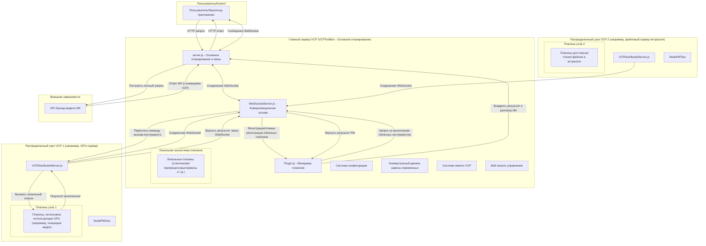
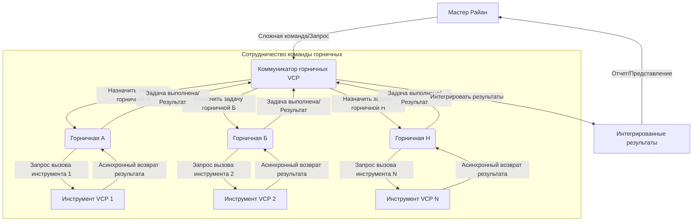

# VCP (Variable & Command Protocol) - Новое поколение промежуточного ПО для улучшения и эволюции возможностей ИИ


---

[English](README_en.md) | [日本語](README_ja.md) | [Русский](README_ru.md)

---

## 1. Видение проекта: За пределами взаимодействия, расширение возможностей эволюции

VCP (Variable & Command Protocol) стремится создать революционное промежуточное ПО, которое превосходит традиционные модели взаимодействия с ИИ. Это не просто высокосовместимый, универсальный и расширяемый набор инструментов, но и экосистема, посвященная расширению возможностей моделей ИИ для достижения скачков в возможностях, эволюции памяти и появления коллективного интеллекта.

Наша цель — создать универсальную систему VCP, которая **«не ограничена типом модели, модальностью или функцией» и «не связана с внешним интерфейсом»**. Путем глубокой интеграции вывода ИИ, выполнения внешних инструментов и систем постоянной памяти на уровне API мы формируем эффективный синергетический «железный треугольник» «ИИ-Инструмент-Память». VCP позволяет беспрецедентно эффективную связь и совместную эволюцию между ИИ, между ИИ и инструментами, и даже между ИИ и их собственной памятью, все это основано на частных и общих базах знаний, тем самым бесконечно расширяя границы применения и интеллектуальный потенциал ИИ.

Суть VCP заключается в том, чтобы привести агентов ИИ в новую эру, где они смогут автономно обучаться, постоянно развиваться и эффективно сотрудничать с другими агентами.

[Глубокое понимание теоретической архитектуры VCP и ключевых идей](VCP.md)

**Серьезное предупреждение**: Не используйте неофициальные или обратные прокси-API (например, различные «зеркальные сайты», «поставщики услуг транзитных API») для вызова этого набора инструментов. Такие действия могут легко привести к утечке вашей конфиденциальной информации (включая, помимо прочего, данные взаимодействия с ИИ, содержимое базы памяти, ключи API) ненадежным третьим сторонам, что приведет к необратимым потерям. Пожалуйста, убедитесь, что цепочка вызовов API вашей модели ИИ чиста, пряма и надежна.

## 2. Основные функции и философия дизайна VCP «нового поколения»

Каждая функция VCP коренится в ее дальновидной философии дизайна, направленной на решение глубоких проблем текущих приложений ИИ и определение направления развития агентов ИИ следующего поколения.

### Чрезвычайно мощная плагинная архитектура

- **Философия дизайна**: Достижение максимальной гибкости и расширяемости, позволяя возможностям ИИ бесконечно расширяться. Благодаря четко определенным манифестам плагинов (`plugin-manifest.json`) и основному менеджеру плагинов (`Plugin.js`), VCP может легко интегрировать и управлять любыми внешними функциональными модулями, будь то существующие API, профессиональное программное обеспечение, аппаратные интерфейсы или пользовательская логика.
- **Глубокая интерпретация**: Это не просто расширение функциональности; это создание экологической основы, на которой ИИ может автономно «обучаться» и «осваивать» новые навыки.

### Протокол команд VCP

- **Философия дизайна**: Предоставление универсального языка вызова инструментов, который удобен для моделей ИИ, неинтрузивен для внешнего интерфейса и способен передавать сложные команды. ИИ вызывает плагины, встраивая команды определенного формата (`<<<[TOOL_REQUEST]>>> ... <<<[END_TOOL_REQUEST]>>>`) в свои ответы, с параметрами, использующими формат `key:「始」value「末」`, поддерживающим сложные типы данных и многострочный текст.
- **Глубокая интерпретация**: Этот протокол на основе текстовых маркеров значительно снижает зависимость от специфических функций API модели (таких как поля вызова функций, специфичные для некоторых моделей), достигая истинной универсальности модели. Уникальный формат параметров `「始」value「末」` обеспечивает надежность синтаксического анализа при передаче сложных параметров (таких как блоки кода, объекты JSON, длинные тексты).

### Единый сервис связи WebSocket

- **Философия дизайна**: Предоставление централизованного сервиса WebSocket (`WebSocketServer.js`) для двусторонней связи в реальном времени между сервером и клиентами. Это включает, но не ограничивается, отправкой журналов, сообщений, сгенерированных ИИ, обновлений статуса и т. д.
- **Основные возможности**:
    - **Централизованное управление**: Все соединения WebSocket, аутентификация и широковещательная рассылка сообщений обрабатываются единообразно `WebSocketServer.js`.
    - **Интеграция плагинов**: Плагины типа «сервис» (например, `VCPLog`) и синхронные плагины (настроенные через `webSocketPush`) могут использовать этот центральный сервис для отправки информации клиентам без необходимости реализации собственных серверов WebSocket.
    - **Типы клиентов**: Поддерживает широковещательную рассылку сообщений на основе `clientType`, позволяя различным внешним интерфейсам или клиентским компонентам подписываться на определенные типы сообщений.
- **Глубокая интерпретация**: Упрощает разработку плагинов, требующих функции push в реальном времени, улучшая модульность и удобство обслуживания системы. Это также основная коммуникационная основа распределенной сети VCP.

### Богатые типы плагинов, поддерживающие всестороннее расширение возможностей ИИ

VCP поддерживает несколько типов плагинов для удовлетворения различных потребностей в расширении возможностей ИИ. Основные интерактивные плагины в основном делятся на синхронные блокирующие и асинхронные обратные вызовы.

- **Статический плагин (static)**:
  - **Функция**: Предоставляет ИИ динамические, реальные «знания о мире», такие как погода, пользовательские данные, дневники персонажей и т. д., путем замены заполнителей в системных подсказках. Поддерживает периодическое обновление.
  - **Значение нового поколения**: Преодолевает ограничения по срокам действия знаний LLM, наделяя ИИ возможностями восприятия в реальном времени, что является ключом к созданию «контекстно-ориентированного ИИ».
- **Плагин предварительной обработки сообщений (messagePreprocessor)**:
  - **Функция**: Изменяет или расширяет содержимое сообщения до того, как запросы пользователя будут отправлены модели ИИ, например, распознавание и описание изображений (`ImageProcessor`).
  - **Значение нового поколения**: Обеспечивает унифицированную обработку мультимодальных входных данных, позволяя ИИ «понимать» более богатую входную информацию, что является основой для создания мультимодальных агентов.
- **Синхронный плагин (synchronous)**:
  - **Режим**: Это традиционный блокирующий вызов. После того, как ИИ инициирует вызов, сервер VCP запускает процесс плагина и **ждет, пока процесс плагина полностью завершит выполнение**, собирает его стандартный вывод в качестве результата, а затем передает этот результат обратно ИИ для последующей обработки.
  - **Применимые сценарии**: Подходит для коротких задач, которые могут быстро возвращать результаты, таких как научные расчеты (`SciCalculator`), простые информационные запросы и т. д.
  - **WebSocket Push**: Окончательные результаты некоторых синхронных плагинов также могут быть отправлены клиенту через унифицированный сервис WebSocket путем настройки `webSocketPush` в их `plugin-manifest.json`.
  - **Значение нового поколения**: Это основное проявление «способности к действию» ИИ, позволяющее ему вмешиваться во внешний мир и получать внешнюю информацию.
- **Асинхронный плагин (asynchronous)**:
  - **Основной режим**: Разработан для трудоемких задач, обеспечивая неблокирующие вызовы и «мгновенное» восприятие результатов ИИ.
    1.  **Вызов ИИ и первоначальный ответ**: ИИ вызывает асинхронный плагин. Скрипт плагина немедленно выводит JSON-ответ в стандартный вывод, который обычно содержит уникальный идентификатор задачи и **сообщение на естественном языке, направляющее использование ИИ**. Это сообщение указывает ИИ включить в свой ответ динамический заполнитель определенного формата, например `{{VCP_ASYNC_RESULT::PluginName::ActualTaskID}}`. `Plugin.js` захватывает этот первоначальный ответ и быстро возвращает его ИИ.
    2.  **Ответ ИИ и вставка заполнителя**: ИИ генерирует ответное сообщение пользователю на основе первоначального ответа плагина (включая направляющий текст и формат заполнителя) и включает заполнитель дословно в свой ответ.
    3.  **Фоновое выполнение плагина**: Тем временем не-демон-поток или фоновый процесс плагина продолжает выполнять трудоемкую основную задачу (например, генерацию видео).
    4.  **Обратный вызов завершения задачи и сохранение результата**: После завершения фоновой задачи плагина он отправляет HTTP POST-запрос на конечную точку `/plugin-callback/:pluginName/:taskId` сервера VCP. Тело запроса представляет собой JSON-данные, содержащие окончательный результат задачи. После получения этого обратного вызова сервер сохраняет эти JSON-данные в определенный локальный файл на сервере (например, `VCPAsyncResults/PluginName-ActualTaskID.json`).
    5.  **Динамическая замена контекста и восприятие ИИ**: Когда `{{VCP_ASYNC_RESULT::PluginName::ActualTaskID}}` снова появляется в последующих разговорах ИИ (независимо от того, ссылается ли ввод пользователя на предыдущий ответ ИИ или ИИ ссылается на исторические разговоры при генерации новых ответов), функция `replaceCommonVariables` сервера VCP динамически ищет соответствующий файл результатов перед отправкой этого контекста модели ИИ:
        - Если файл результатов существует, заполнитель заменяется фактической информацией о результате из файла (например, текстом, описывающим успешное выполнение задачи и содержащим URL).
        - Если файл результатов не существует (задача все еще выполняется), заполнитель заменяется сообщением-подсказкой (например, «[Результат задачи ожидает обновления...]»).
        Таким образом, ИИ может «видеть» последний статус или окончательный результат асинхронных задач в своем последующем «мышлении» и ответах, как если бы информация мгновенно обновлялась в потоке разговора.
    6.  **WebSocket Push (дополнительный параллельный механизм)**: После того, как сервер получает обратный вызов плагина и сохраняет результат, он все еще может (и рекомендуется) отправлять данные обратного вызова (или их часть) клиенту через `WebSocketServer.js` на основе конфигурации `webSocketPush` в манифесте плагина, в качестве более прямого и немедленного метода уведомления внешнего интерфейса. Этот механизм замены контекста на основе файлов дополняет и улучшает WebSocket push, особенно когда ИИ необходимо напрямую воспринимать и использовать асинхронные результаты для последующих разговоров.
  - **Применимые сценарии**: Очень подходит для длительных задач, таких как генерация видео (`Wan2.1VideoGen`), сложный анализ данных, задачи, требующие опроса состояния внешнего API и т. д.
  - **Преимущества**:
      - ИИ не нужно долго ждать, взаимодействие плавное.
      - ИИ может «естественно» воспринимать и использовать окончательные результаты асинхронных задач в своем потоке разговора.
      - Снижает жесткое требование к внешнему интерфейсу полагаться на WebSocket для получения и возврата асинхронных результатов.
      - Повышает надежность системы; даже если уведомление WebSocket не удается или клиент не подключен, ИИ все равно имеет возможность воспринимать результаты через контекст.
  - **Значение нового поколения**: Наделяет ИИ способностью выполнять сложные, трудоемкие задачи без блокировки, в сочетании с контекстно-ориентированными асинхронными результатами и дополнительными мгновенными уведомлениями, значительно улучшая пользовательский опыт и автономность агента ИИ и интеллектуальную производительность.
- **Сервисный плагин (service)**:
  - **Функция**: Позволяет плагинам регистрировать независимые HTTP-маршруты в основном приложении, предоставляя дополнительные сервисные интерфейсы, такие как сервисы хостинга изображений (`ImageServer`). Некоторые сервисные плагины (например, `VCPLog`) также могут использовать унифицированный сервис WebSocket для отправки информации.
  - **Значение нового поколения**: Превращает саму платформу VCP в расширяемый сервисный центр, поддерживающий более сложные сценарии приложений.
- **Распределенный узел (Distributed Node)**:
- **Функция**: Позволяет расширить вычислительную мощность VCP на несколько машин. Независимый узел `VCPDistributedServer` может работать где угодно, загружать свои локальные плагины и подключаться к основному серверу через WebSocket.
- **Значение нового поколения**: Это физическая основа для достижения VCP «бесконечной вычислительной мощности» и «коллективного интеллекта». Через распределенную сеть плагины, требующие значительных вычислительных ресурсов (например, задачи, интенсивно использующие GPU) или требующие доступа к определенным сетям/оборудованию (например, файловые серверы интрасети, специальное оборудование), могут быть развернуты на наиболее подходящих машинах, в то время как основной сервер действует как унифицированный центр планирования, прозрачно вызывая эти удаленные ресурсы для ИИ.

### Гибкое управление конфигурацией и универсальная система замены переменных

- **Философия дизайна**: Достижение глубокой настройки поведения ИИ и динамической инъекции контекста, предоставляя развертывающим возможность тонкого контроля над командами ИИ из серверной части, за пределами ограничений внешнего интерфейса.
- **Основная функциональность**: Поддерживает глобальные файлы конфигурации (`config.env`), файлы `.env` для конкретных плагинов и мощную многоуровневую, вложенную замену переменных-заполнителей, таких как `{{Tar*}}`, `{{Var*}}`, `{{Sar*}}`.
- **Глубокая интерпретация**: Это ключ к «инженерии поведения ИИ» VCP и «библиотеке команд как конфигурации кода». Путем замены переменных системные подсказки, сообщения пользователей и даже параметры вызова плагинов, внедряемые в ИИ, могут быть динамически построены и оптимизированы, тем самым преодолевая отставание знаний LLM и пространственно-временные иллюзии, а также «тонко настраивая» выходные привычки ИИ с помощью глобальных правил замены текста (например, `DetectorX`) для подавления нежелательной инерции вывода.

### Управляемая ИИ система постоянной памяти и эволюции

- **Основные компоненты**: `DailyNoteGet` (статический плагин, регулярно читает дневники для внедрения контекста), `DailyNoteWrite` (синхронный плагин, ИИ активно записывает структурированные дневники), `DailyNoteManager` (синхронный плагин, ИИ активно организует, оптимизирует и делится базой знаний), `DailyNoteEditor` (синхронный плагин, ИИ самокорректирует базу знаний).
- **Философия дизайна**: Память — это не просто хранение информации; это основная движущая сила самоэволюции ИИ, интернализации возможностей и формирования личности. «Дневник» ИИ больше похож на «персонализированную инъекцию системной подсказки», накапливаемую и оптимизируемую самим ИИ.
- **Значение нового поколения**:
  - **Контекстная осведомленность и глубокое понимание**: Внедрение контекста «полной памяти» через заполнители, такие как `[角色名日记本内容为空或未从插件获取]`, может значительно улучшить производительность ИИ в сложных рассуждениях, логических суждениях и поддержании долгосрочной согласованности (эффект «высококачественного векторизованного инерционного канала»).
  - **Автономное обучение ИИ и интернализация опыта**: Записывая и осмысливая опыт взаимодействия с инструментами и решения проблем, ИИ может «интернализировать» методы использования внешних инструментов и связанный с ними опыт как часть своих собственных возможностей.
  - **Межмодельное сотрудничество памяти и симбиоз знаний**: Модель «независимой от модели» памяти VCP (память привязана к идентификатору агента, а не к конкретным моделям) и механизм общедоступной базы знаний способствуют неявному «обучению на сильных сторонах друг друга» различных моделей ИИ (или различных экземпляров одной и той же модели), формируя «межмодельную векторизованную оптимизационную сеть» для повышения коллективного интеллекта ИИ.
  - **Улучшение качества памяти, управляемое групповым взаимодействием**: В средах группового взаимодействия, таких как «Чат-комната горничных», столкновение и слияние знаний могут способствовать формированию более качественных «векторизованных» воспоминаний, ускоряя индивидуальное обучение и эволюцию коллективных баз знаний.

### Мощный цикл вызова инструментов и асинхронная параллельная обработка

- **Философия дизайна**: Максимизация возможностей планирования и эффективности выполнения ИИ, поддержка ИИ для инициирования нескольких параллельных или зависимых вызовов инструментов в одном ответе.
- **Основные возможности**:
  - **Непотоковые/потоковые многоинструментальные вызовы**: Как потоковые (SSE), так и непотоковые режимы реализовали циклическую обработку и обратную связь по результатам для нескольких команд вызова инструментов, содержащихся в одном ответе ИИ, до тех пор, пока не будет больше вызовов или не будет достигнуто максимальное количество циклов.
  - **Полностью асинхронное создание и унифицированный возврат**: ИИ может инициировать несколько вызовов инструментов VCP одновременно. Сервер VCP может параллельно планировать задачи для соответствующих плагинов для асинхронного выполнения, а затем унифицированно собирать и интегрировать результаты, прежде чем передавать их обратно ИИ.
- **Глубокая интерпретация**: Это значительно повышает эффективность взаимодействия, позволяя ИИ выполнять более сложные, многоэтапные совместные задачи, что является основой для поведения продвинутых агентов.

### Веб-панель управления

- Предоставляет удобный интерфейс для настройки сервера, состояния плагинов, настройки плагинов, описания команд и управления файлами дневников.
- **Отладка и логирование**: Предоставляет режим отладки и подробные логи для удобства разработки и устранения неполадок.

## 3. Архитектура распределенной сети VCP: От «монолита» к «звездам»

Распределенная архитектура VCP преобразует исходное монолитное приложение в звездообразную сеть, состоящую из «главного сервера» и нескольких «распределенных узлов», значительно расширяя вычислительную мощность, функциональные границы и гибкость развертывания системы.



### Интерпретация основного потока взаимодействия

Основной поток взаимодействия в распределенной архитектуре был расширен на основе оригинала:

1.  **Запуск и регистрация**:
    - Главный сервер (`server.js`) запускается, инициализируя `PluginManager` и `WebSocketServer`.
    - Каждый распределенный узел (`VCPDistributedServer.js`) запускается, загружая свои локальные плагины.
    - Распределенные узлы подключаются к `WebSocketServer` главного сервера через WebSocket и отправляют сообщение `register_tools`, содержащее их локальный список плагинов.
    - `PluginManager` главного сервера получает список и динамически регистрирует эти «облачные плагины» в системе, при этом их отображаемые имена автоматически получают префикс `[云端]` (Облако).

2.  **Вызов инструментов ИИ**:
    - Процесс аналогичен предыдущему: ИИ встраивает команды `<<<[TOOL_REQUEST]>>>` в свои ответы.
    - `PluginManager` главного сервера получает запрос на вызов в методе `processToolCall`.
    - **Интеллектуальная маршрутизация**: `PluginManager` проверяет список вызываемых инструментов.
      - Если это **локальный плагин**, он выполняется непосредственно на главном сервере, как и раньше.
      - Если это **облачный плагин** (помеченный `isDistributed: true`), `PluginManager` не выполняет его напрямую, а вызывает метод `executeDistributedTool` `WebSocketServer.js`, передавая имя инструмента, параметры и `serverId` плагина.

3.  **Удаленное выполнение и возврат результата**:
    - `WebSocketServer` отправляет сообщение `execute_tool`, содержащее идентификатор задачи, имя инструмента и параметры, целевому распределенному узлу через соответствующее соединение WebSocket.
    - Целевой распределенный узел получает сообщение, и его локальный `PluginManager` вызывает и выполняет соответствующий плагин.
    - После завершения выполнения плагина распределенный узел отправляет результат (включая статус успеха/неудачи и данные) вместе с идентификатором задачи обратно на главный сервер через WebSocket.
    - `WebSocketServer` главного сервера получает результат, находит и возобновляет ранее приостановленный запрос на вызов на основе идентификатора задачи и возвращает окончательный результат `PluginManager`.

4.  **Последующая обработка**:
    - После того, как `PluginManager` получает результат выполнения (будь то локальный или удаленный), он внедряет его в историю разговоров ИИ и снова вызывает модель ИИ для завершения цикла.

5.  **Отключение и отмена регистрации**:
    - Если соединение WebSocket распределенного узла с главным сервером разрывается, `WebSocketServer` уведомляет `PluginManager`.
    - `PluginManager` автоматически отменяет регистрацию всех облачных плагинов, предоставленных отключенным узлом, гарантируя, что список инструментов системы всегда остается актуальным и доступным.

Благодаря этому механизму VCP обеспечивает бесшовную интеграцию и прозрачный вызов распределенных ресурсов, значительно расширяя масштабируемость системы и потолок возможностей.

## 4. Веб-панель управления: Визуальный центр управления системой VCP

Для удобства пользователей в управлении конфигурациями сервера, плагинами и данными дневников в проект встроена многофункциональная веб-панель управления.

### Основные функции

- **Управление основной конфигурацией**: Онлайн-предварительный просмотр и редактирование `config.env`, поддержка различных типов конфигурационных элементов, с автоматическим скрытием конфиденциальных полей. Примечание: Сохранение основной конфигурации обычно требует ручного перезапуска сервера.
- **Управление плагинами**:
  - **Список и статус**: Отображает все плагины и их статус, версию и описание.
  - **Редактирование описания и конфигурации**: Непосредственное редактирование описаний плагинов, включение/отключение плагинов и редактирование `config.env` для конкретных плагинов.
  - **Редактирование описания команд**: Для синхронных плагинов их описания команд ИИ можно редактировать онлайн. Эти описания будут использоваться для генерации содержимого заполнителя `{{VCPPluginName}}`.
- **Управление дневниками**: Просмотр, поиск, редактирование, сохранение, перемещение и удаление файлов дневников в каталоге `dailynote/`.
- **Перезапуск сервера**: Предоставляет кнопку перезапуска (зависит от внешних менеджеров процессов, таких как PM2).

### Доступ и вход

- Установите `AdminUsername` и `AdminPassword` в `config.env` (по умолчанию: `admin`, `123456`). Если не установлено, панель управления будет недоступна.
- Доступ к `http://<IP-адрес или домен вашего сервера>:<Порт>/AdminPanel`.
- Войдите, используя HTTP Basic Auth с настроенными учетными данными.

## 5. Раскрытие силы VCP «нового поколения»: Глубокие парадигмы использования и сценарии вдохновения

VCP — это не просто установка, запуск и написание плагинов. Чтобы по-настоящему раскрыть его «новое поколение» силы, необходимо понять и применить его основные концепции дизайна для создания и управления агентами ИИ.

### 5.1 Развитие саморазвивающихся агентов ИИ

- **Основная идея**: Использовать систему памяти VCP, чтобы агенты ИИ могли записывать результаты обучения, опыт использования инструментов, ключевую информацию из взаимодействий с пользователем и даже «озарения» и «размышления», «ведя дневники».
- **Практические методы**:
  - **Разработка направляющих системных подсказок**: Четко информировать ИИ, когда следует записывать дневники, какое содержимое записывать (например: полные параметры и результаты успешного вызова инструмента, шаги по решению сложной проблемы, конкретные предпочтения пользователя, ежедневные сводки обучения и т. д.), и какие теги использовать (например, `[ToolExperience_FluxGen]`, `[UserPreference_Ryan]`, `[ProjectAProgress]`).
  - **Использование `[角色名日记本内容为空或未从插件获取]` для достижения «интернализации опыта»**: Внедрять дневник ИИ в контекст его последующих разговоров через заполнители. Это не просто предоставление информации; это использование собственного опыта ИИ для «формирования» его последующих мыслительных и поведенческих паттермов. Когда ИИ записывает успешные случаи вызова инструмента в своем дневнике, даже если позже нет явных команд инструмента, он может автономно и правильно вызвать этот инструмент на основе опыта из «дневника».
  - **Поощрение ИИ к использованию `DailyNoteManager` и `DailyNoteEditor`**: Направлять ИИ регулярно «организовывать» и «оптимизировать» свою библиотеку дневников, извлекая, дедуплицируя, суммируя и структурируя знания, и даже активно исправляя прошлые заблуждения.

### 5.2 Создание групп агентов ИИ для совместной работы

- **Основная идея**: Использовать общедоступную базу знаний VCP, плагин `AgentAssistant` и потенциальные внешние интерфейсы группового взаимодействия (такие как LLM Group Chat) для достижения обмена знаниями, совместной работы над задачами и появления коллективного интеллекта среди агентов ИИ.
- **Практические методы**:
  - **Установление протоколов обмена знаниями**: Направлять агентов ИИ активно делиться универсально ценным опытом, навыками и данными в общедоступных дневниках, используя унифицированную систему тегов. Например, «Лайтуюн» может поделиться своими глубокими результатами исследований по инженерии подсказок SDXL, чтобы другие агенты ИИ могли учиться.
  - **Разработка рабочих процессов многоагентного сотрудничества**: Для сложных задач (например, разработка самого VCPToolBox, создание оригинального музыкального видео) разбивать их на несколько подзадач и назначать их агентам ИИ с различными специализациями (или управляемым различными моделями). Агенты могут обмениваться информацией и промежуточными результатами через общую память, плагин `AgentAssistant` и даже вызывать зарегистрированные друг у друга сервисы через VCP.

### 5.3 Достижение тонкого бэкэнд-контроля над поведением ИИ

- **Основная идея**: Полностью использовать универсальную систему замены переменных VCP (`{{Tar*}}`, `{{Var*}}`, `{{Sar*}}`) и глобальные правила замены текста (`DetectorX`, `SuperDetectorX`) для достижения глубокой настройки и оптимизации команд, в конечном итоге передаваемых модели ИИ из серверной части, без ограничений внешнего интерфейса.
- **Практические методы**:
  - **Модульные системные подсказки**: Использовать переменные `{{Tar*}}` для разбиения сложных системных подсказок на несколько управляемых, повторно используемых и динамически комбинируемых модулей (например, `TarCoreIdentity`, `TarDateTimePlace`, `TarWeatherInfo`, `TarAllToolsList`). Эти переменные `Tar*` сами могут содержать другие заполнители, что позволяет создавать многоуровневые динамические конструкции.
  - **Тонкая настройка инструкций для разных моделей**: Использовать переменные `{{Sar*}}` для настройки конкретных фрагментов инструкций или поведенческих предпочтений для разных бэкэнд-моделей ИИ.
  - **Коррекция и направление вывода ИИ**: Использовать `DetectorX` (для системных подсказок) и `SuperDetectorX` (для более широких контекстов, включая промежуточный вывод ИИ) для автоматической замены или исправления нежелательных шаблонов вывода, словесных тиков или направления ИИ на соблюдение определенных форматов или стилей вывода. Это крайне важно для подавления «векторного загрязнения» или «семантического дрейфа», которые могут возникать в длительных разговорах.

### 5.4 Исследование пределов VCP: От «вызова инструментов» к «автономному созданию»

Само рождение VCPToolBox является экстремальным случаем: сложный проект промежуточного ПО для ИИ, основное написание кода, отладка и итерации которого были в основном выполнены 7 агентами ИИ, сотрудничающими под руководством человека. Это демонстрирует потенциал агентов ИИ, наделенных VCP, для превращения из «пользователей инструментов» в «создателей сложных систем».

- **Вдохновение**: Подумайте, как спроектировать агентов ИИ так, чтобы они могли не только использовать существующие плагины, но и «придумывать» новую логику плагинов в соответствии с потребностями, и даже генерировать частичные каркасы кода или `plugin-manifest.json` для плагинов.

## 6. Основные реализованные плагины (частичные примеры)

Сила VCP заключается в постоянно обогащающейся экосистеме плагинов. Ниже приведены некоторые реализованные плагины, которые в совокупности составляют основные возможности агентов ИИ VCP:

### Восприятие окружающей среды и получение информации

- **WeatherReporter (static)**: Предоставляет информацию о погоде в реальном времени, включая предупреждения, почасовые детали и многодневные прогнозы. Внедряет информацию о погодных предупреждениях.
- **TavilySearch (synchronous)**: Интегрирует API Tavily, наделяя ИИ возможностями веб-поиска.
- **UrlFetch (synchronous)**: Базовый набор инструментов для получения веб-контента.

### Получение академической литературы

- **ArxivDailyPapers (static)**: Ежедневно получает последние исследовательские работы из API Arxiv, охватывающие физику, математику, информатику и другие области. Предоставляет данные о работах через заполнитель `{{ArxivDailyPapersData}}`.
- **CrossRefDailyPapers (static)**: Ежедневно получает последние исследовательские работы из API CrossRef, предоставляя метаданные для опубликованной академической литературы. Предоставляет данные о работах через заполнитель `{{CrossRefDailyPapersData}}`.

### Мультимодальная обработка и генерация контента

- **ImageProcessor (messagePreprocessor)**: Автоматически преобразует данные изображений (например, Base64) в сообщениях пользователя в текстовые описания или мультимодальные входные компоненты, поддерживая кэширование и аннотацию URL-адресов хостинга изображений.
- **FluxGen (synchronous)**: Интегрирует API SiliconFlow для достижения высококачественной генерации текста в изображение, с сохранением изображений локально.
- **Wan2.1VideoGen (asynchronous)**: (Асинхронный плагин) Интегрирует API SiliconFlow Wan2.1 для генерации текста в видео и изображения в видео. ИИ отправляет задачу и немедленно получает идентификатор задачи. Видео генерируется в фоновом режиме, и по завершении пользователь уведомляется о результате (например, URL видео или информация о сбое) через WebSocket.
- **SunoGen (synchronous)**: Интегрирует API Suno для генерации оригинальных песен, поддерживая пользовательские тексты/стили, описания вдохновения или продолжение.
- **DoubaoGen (synchronous)**: Использует API Doubao для генерации и редактирования изображений.

### Управление основной памятью и знаниями

- **DailyNoteGet (static)**: Регулярно читает все дневники персонажей, внедряемые через `{{AllCharacterDiariesData}}`, поддерживая синтаксический анализ `[角色名日记本内容为空或未从插件获取]` для создания общедоступных и частных баз знаний.
- **DailyNoteWrite (synchronous)**: ИИ активно записывает структурированные дневники, поддерживая теги, имена персонажей и даты.
- **DailyNoteManager (synchronous)**: Помощник по организации, обслуживанию, проверке и обмену базой знаний, управляемый ИИ, обеспечивающий бесконечную эволюцию памяти VCP и быстрое создание общедоступных баз знаний.
- **DailyNoteEditor (synchronous)**: Интеллектуальный редактор базы знаний ИИ, позволяющий ИИ самостоятельно исправлять и уточнять содержимое базы знаний.

### Сотрудничество агентов и улучшение системы

- **AgentAssistant (synchronous)**: Стандартный плагин протокола связи между агентами, поддерживающий непрерывную связь на основе взаимной помощи, массовую рассылку сообщений, передачу файлов (через WebDAV сервера), распределение задач и т. д., на основе их соответствующих баз знаний, достигая сложных асинхронных рабочих процессов. Может даже связываться с агентами на других серверах VCP на основе нового `WebSocketServer.js`.
- **AgentMessage (synchronous)**: Позволяет ИИ отправлять форматированные сообщения на внешний интерфейс пользователя через WebSocket. ИИ предоставляет имя получателя и содержимое. После форматирования плагином `server.js` отправляет его указанным типам клиентов через унифицированный `WebSocketServer.js` на основе его конфигурации `webSocketPush` в манифесте.
- **VCPLog (service)**: Сервис push-уведомлений сервера на основе WS/WSS. Его основная функция — запись файловых журналов вызовов инструментов VCP. Связанные push-ууведомления WebSocket (информация о вызовах VCP, статус соединения и т. д.) активно инициируются `server.js` и транслируются клиентам, подписанным на тип клиента `'VCPLog'`, через унифицированный `WebSocketServer.js`.
- **EmojiListGenerator (static)**: Сканирует папки с эмодзи для генерации списков для использования `xx表情包列表不可用`.
- **ImageServer (service)**: Предоставляет статический сервис хостинга изображений с аутентификацией по ключу.

### Интеграция профессиональных инструментов

- **SciCalculator (synchronous)**: Предоставляет возможности научных вычислений, поддерживая математические функции, статистику и исчисление.

### Методы загрузки плагинов

## Способы загрузки плагинов
*   **Просто определите следующие поля в системной подсказке, список системных инструментов: {{VCPFluxGen}} {{VCPSciCalculator}}...**

## Примеры внешнего интерфейса




## 7. Примеры взаимодействия с внешним интерфейсом

Одна из философий дизайна VCP — быть «независимым от взаимодействия с внешним интерфейсом», что означает, что он может работать с различными типами внешних приложений. Ниже приведены некоторые схематические диаграммы сценариев взаимодействия.

### Совместный рабочий процесс «Команды горничных ИИ», усиленный VCP

```mermaid
graph TD
    A[Мастер Райан] -- "Сложная команда/Великое видение (например, Создать дебютный клип для Сяо Ай!)" --> B(Ядро связи и планирования задач горничных VCP)

    subgraph "Команда горничных ИИ (Совместная эволюция на основе VCP)"
        B -- "Планирование и декомпозиция задач" --> BA(Командир ИИ - Сяо Ай)
        BA -- "Команда создания текста песни" --> C("Горничная А - Сяо Ши: Работает на Gemini Pro, специализируется на литературе")
        BA -- "Команда композиции и аранжировки" --> D("Горничная Б - Сяо Цюй: Работает на Gemini Pro, вызывает SunoGen")
        BA -- "Команда визуального дизайна и генерации материалов" --> E("Горничная В - Лайтуюн: Работает на Gemini Flash, мастер SDXL, вызывает FluxGen/плагин ComfyUI")
        BA -- "Команда создания субтитров и временной шкалы" --> F("Горничная Г - Сяо К: Работает на Gemini Flash, вызывает LyricAnimator")
        BA -- "Поддержка базы знаний и поиск информации" --> G("Горничная Д - Сяо Чжи: Работает на Gemini Pro, вызывает TavilySearch, DailyNoteManager")
        BA -- "Сводка хода выполнения задачи и окончательное руководство по редактированию" --> H("Горничная Е - Сяо Тун: Работает на Gemini Pro, вызывает интерфейс плагина для редактирования видео")

        C -- "Оригинальный текст песни" --> BA
        D -- "Музыкальная демо-версия (несколько версий)" --> BA
E -- "Визуальные материалы для клипа (большое количество изображений/коротких видео)" --> BA
        F -- "Последовательность субтитров с эффектами" --> BA
        G -- "Связанная справочная информация/Предпочтения пользователя" --> BA

        subgraph "Поддержка основных сервисов VCP"
            MEM_PUB["Общедоступная база знаний (Общий опыт команды горничных)"]
            MEM_PRI["Индивидуальная база памяти (Эксклюзивный дневник каждой горничной)"]
            TOOL_HUB["Центр плагинов VCP (Различные инструменты)"]
            VCP_COMM["Внутренний протокол связи VCP (AgentAssistant)"]
            WSS_SVC["Единый сервис WebSocket (WebSocketServer.js)"]
        end
        
        BA -- "Получает AgentMessage через WSS_SVC" --> WSS_SVC

        C <--> MEM_PRI
        D <--> TOOL_HUB
        E <--> MEM_PUB
        E <--> TOOL_HUB
        F <--> TOOL_HUB
        G <--> MEM_PUB
        G <--> TOOL_HUB
        H <--> TOOL_HUB

        BA -- "(Постоянная связь и координация с другими горничными через VCP_COMM)" --> C
        BA -- "(Постоянная связь и координация с другими горничными через VCP_COMM)" --> D
        BA -- "(Постоянная связь и координация с другими горничными через VCP_COMM)" --> E
        BA -- "(Постоянная связь и координация с другими горничными через VCP_COMM)" --> F
        BA -- "(Постоянная связь и координация с другими горничными через VCP_COMM)" --> G
        BA -- "(Постоянная связь и координация с другими горничными через VCP_COMM)" --> H
    end

    BA -- "Интегрирует результаты всех этапов, формирует предварительный план клипа" --> B
    B -- "(Возможно, поэтапный обзор и обратная связь от человеческого командира Райана)" --> BA
    H -- "Окончательная отредактированная версия клипа (или файл проекта)" --> B
    B -- "Представляет окончательные результаты" --> A
```



## 8. Установка и запуск (Главный сервер)

### Клонирование проекта

```bash
git clone https://github.com/lioensky/VCPToolBox.git
cd VCPToolBox
```

### Установка основных зависимостей (Node.js)

```bash
npm install
```

### Установка зависимостей плагинов Python

Запустите в корневом каталоге проекта (убедитесь, что ваша среда Python настроена с pip):

```bash
pip install -r requirements.txt
```

(Примечание: Зависимости для каждого плагина Node.js уже включены в основной `package.json` или могут быть установлены отдельно через `npm install` в соответствующих каталогах плагинов.)

### Конфигурация

- Скопируйте `config.env.example` в `config.env` и заполните все необходимые ключи API, URL-адреса, порты и т. д. в соответствии с инструкциями. Это крайне важно для правильной работы VCP.
- Проверьте и настройте файлы `.env` в каждом каталоге плагинов (если они существуют).

### Запуск сервера

```bash
node server.js
```

Сервер будет прослушивать порт, настроенный в `config.env`.

### Запуск с Docker Compose (Рекомендуется)

Для упрощения развертывания и управления настоятельно рекомендуется использовать Docker Compose.

- **Предварительные условия**: Установите Docker и Docker Compose.
- **Конфигурация**: То же, что и выше, убедитесь, что файл `config.env` правильно настроен. Docker Compose автоматически загрузит переменные среды из этого файла.
- **Сборка и запуск сервиса**:

```bash
docker-compose up --build -d
```

- **Просмотр логов**: `docker-compose logs -f`
- **Остановка сервиса**: `docker-compose down`

## 9. Развертывание распределенных узлов VCP

Мы предоставляем готовый проект распределенного сервера `VCPDistributedServer`, который позволяет легко превратить любую машину в вычислительный узел в сети VCP.

### Шаги

1.  **Копирование проекта**: Скопируйте всю папку `VCPDistributedServer` из корневого каталога основного проекта на любую машину, где вы хотите развернуть узел.
2.  **Установка зависимостей**: В каталоге `VCPDistributedServer` запустите `npm install`.
3.  **Настройка узла**:
    - Откройте файл `VCPDistributedServer/config.env`.
    - `Main_Server_URL`: Введите адрес WebSocket вашего **главного сервера** (например, `ws://<IP-адрес главного сервера>:8088`).
    - `VCP_Key`: Введите `VCP_Key`, который точно совпадает с `VCP_Key` в `config.env` вашего главного сервера.
    - `ServerName`: Присвойте этому узлу легко узнаваемое имя.
4.  **Добавление плагинов**:
    - Создайте папку с именем `Plugin` в каталоге `VCPDistributedServer`.
    - Скопируйте плагины VCP, которые вы хотите запустить на этом узле (например, `SciCalculator`, `FluxGen` и т. д.), полностью из основного проекта в эту новую папку `Plugin`.
    - **Примечание**: В настоящее время распределенные узлы поддерживают только синхронные (`synchronous`) плагины типа `stdio`.
5.  **Запуск узла**:
    ```bash
    node VCPDistributedServer.js
    ```
    После запуска узел автоматически подключится к главному серверу и зарегистрирует свои плагины. Вы увидите соответствующие логи в консоли главного сервера.

## 10. Рекомендуемый фронтенд/бэкенд

- **API бэкэнд-модели ИИ**: Рекомендуются сервисы, поддерживающие потоковый вывод SSE (Server-Sent Events) и имеющие относительно стандартизированные форматы API, такие как NewAPI, сервер VoAPI, а также официальные OpenAI, Google Gemini, Anthropic Claude и т. д. Дизайн VCP позволяет ему гибко адаптироваться к различным бэкендам.
- **Приложения для взаимодействия с фронтендом**: Рекомендуются фронтенды, которые хорошо отображают Markdown, поддерживают подсветку синтаксиса кода и могут настраивать или адаптировать отображение команд вызова инструментов VCP. Например: VCPChat (официальный проект, предпочтительно!), Sillytavern, клиент CherryStudio и т. д. Идеальный фронтенд также должен позволять пользователям легко настраивать системные подсказки, чтобы в полной мере использовать функции замены переменных VCP и внедрения описаний команд плагинов. Фронтенд также должен иметь возможность подключаться к сервису WebSocket, предоставляемому `WebSocketServer.js`, для получения различных сообщений, отправляемых сервером (например, логи VCP, AgentMessage и т. д.).
- **Официальный фронтенд · Адрес проекта VCPChat**: https://github.com/lioensky/VCPChat

## 11. Руководство для разработчиков: Создание вашего «плагина VCP нового поколения»

Душа VCP заключается в его экосистеме плагинов. Стать разработчиком плагинов VCP означает, что вы будете напрямую создавать новые «чувства», «конечности» и «интеллектуальные модули» для агентов ИИ.

- **Создание каталога плагина**: Создайте новую папку в каталоге `Plugin/`, например, `Plugin/MySuperPlugin/`.
- **Написание манифеста плагина (`plugin-manifest.json`)**: Это «удостоверение личности» и «руководство» плагина.
  - **Основные поля**: `name`, `displayName`, `version`, `description`, `pluginType` (значения могут быть: `static`, `messagePreprocessor`, `synchronous`, `asynchronous`, `service`).
  - **Точка входа для выполнения**: `entryPoint` (например, команда для выполнения скрипта `python script.py` или `node script.js`) и `communication` (например, `protocol: "stdio"` означает связь через стандартный ввод/вывод).
  - **Схема конфигурации (`configSchema`)**: Объявите необходимые элементы конфигурации для плагина, их типы, значения по умолчанию и описания. Эти конфигурации будут переданы плагину после объединения глобальных и специфичных для плагина конфигураций `.env` с помощью метода `_getPluginConfig`.
  - **Объявление возможностей (`capabilities`)**:
    - **статический плагин**: Определите `systemPromptPlaceholders` (заполнители, предоставляемые плагином, например, `{{MyWeatherData}}`).
    - **синхронный` или `асинхронный` плагин**: Определите `invocationCommands`. Каждая команда включает:
      - `command` (внутренний идентификатор, например, "submit", "query").
      - `description` (крайне важно: описание команды для ИИ, поддерживает редактирование на панели управления). Должно включать:
        - Четкое функциональное описание.
        - Подробный список параметров (имя, тип, обязательный/необязательный, допустимый диапазон значений).
        - Четкий пример формата вызова VCP (ИИ будет имитировать этот формат).
        - **Для `синхронных` плагинов**: Пример формата JSON, возвращаемого при успехе/неудаче (ИИ должен понимать прямой вывод плагина).
        - **Для `асинхронных` плагинов**: Пример формата JSON **первоначального ответа** плагина (например, содержащего идентификатор задачи) и пример формата **окончательного результата**, отправляемого через WebSocket.
        - Любые важные советы, связанные с общением с пользователем или принятием решений ИИ (например, для асинхронных плагинов, сообщите пользователю, что задача отправлена, и результаты будут уведомлены позже).
      - `example` (необязательно, предоставляет более конкретный пример сценария вызова).
  - **Конфигурация WebSocket Push (`webSocketPush`) (Необязательно, в основном для отправки результатов обратного вызова `асинхронного` плагина, также может использоваться для прямой отправки результатов `синхронного` плагина)**:
    - Если ваш плагин успешно выполняется и вы хотите, чтобы его результат был отправлен клиенту через WebSocket, вы можете добавить этот объект на верхний уровень `plugin-manifest.json`.
    - `enabled` (boolean, обязательно): `true` означает, что push включен.
    - `usePluginResultAsMessage` (boolean, необязательно, по умолчанию `false`):
        - Если `true`:
            - Для `синхронных` плагинов: Поле `result` (если это объект) прямого стандартного вывода плагина (обычно объект JSON) будет отправлено непосредственно в качестве тела сообщения WebSocket. Плагин должен убедиться, что его поле `result` является полным объектом сообщения, соответствующим ожиданиям внешнего интерфейса.
            - Для `асинхронных` плагинов: Сами данные JSON, отправленные через `/plugin-callback`, будут отправлены непосредственно в качестве тела сообщения WebSocket. Обратный вызов плагина должен убедиться, что отправленные данные являются полным объектом сообщения, соответствующим ожиданиям внешнего интерфейса.
        - Если `false` или не указано, также должен быть указан `messageType`.
    - `messageType` (string, необязательно): Используется, когда `usePluginResultAsMessage` равно `false`.
        - Для `синхронных` плагинов: Сервер обернет поле `result` стандартного вывода плагина в формат `{ type: "yourMessageType", data: pluginResult.result }` и отправит его.
        - Для `асинхронных` плагинов: Сервер обернет данные JSON, полученные через обратный вызов, в формат `{ type: "yourMessageType", data: callbackData }` и отправит их.
    - `targetClientType` (string, необязательно, по умолчанию `null`): Указывает тип клиента для получения этого сообщения. `WebSocketServer.js` будет фильтровать клиентов на основе этого типа. Если `null` или не указано, может быть широковещательная рассылка всем подключенным клиентам или определенным типам клиентов по умолчанию (в зависимости от реализации `WebSocketServer.js`). Например, `VCPLog` используется для отправки в просмотрщики логов.
- **Реализация логики плагина**:
  - Реализуйте основной логический скрипт на основе `pluginType` и `entryPoint` (Node.js, Python, Shell и т. д. — все допустимо).
  - **stdio-плагины** (обычно используются для `synchronous`, `asynchronous` и некоторых `static`):
    - Чтение данных из стандартного ввода (`stdin`) (обычно параметры в формате JSON-строки).
    - **Для `синхронных` плагинов**: Возвращать окончательный результат через стандартный вывод (`stdout`), который должен соответствовать следующему формату JSON:
      ```json
      {
        "status": "success" | "error",
        "result": "Строковое содержимое или объект JSON, возвращаемый при успехе", // Существует, когда status равен "success"
        "error": "Строка сообщения об ошибке, возвращаемая при неудаче", // Существует, когда status равен "error"
        "messageForAI": "Необязательно, дополнительное сообщение-подсказка для ИИ" // Например, плагин AgentMessage использует это поле для передачи текста, который ИИ хочет сообщить пользователю
      }
      ```
      Если настроено `webSocketPush.usePluginResultAsMessage: true`, поле `result` здесь (если это объект) будет напрямую использоваться для WebSocket push.
    - **Для `асинхронных` плагинов**:
      1.  **Первоначальный ответ**: Скрипт плагина после получения задачи **должен немедленно** вывести в стандартный вывод (`stdout`) первоначальный ответ, соответствующий приведенному выше формату JSON. Например:
          ```json
          {
            "status": "success",
            "result": { "requestId": "unique_task_id_123", "message": "Задача отправлена, обрабатывается в фоновом режиме." },
            "messageForAI": "Задача генерации видео отправлена, ID: unique_task_id_123. Пожалуйста, сообщите пользователю, чтобы он терпеливо ждал, результаты будут отправлены через уведомление."
          }
          ```
          `Plugin.js` захватит этот первоначальный ответ и вернет его ИИ.
      2.  **Фоновая обработка**: Затем скрипт плагина запускает свою трудоемкую фоновую задачу (например, используя не-демон-поток).
      3.  **Сервер обратного вызова**: После завершения фоновой задачи скрипт плагина отправляет HTTP POST-запрос на `/plugin-callback/:pluginName/:taskId` сервера VCP (где `:pluginName` — имя плагина, `:taskId` — `requestId`, возвращенный в первоначальном ответе). Тело запроса должно быть объектом JSON, содержащим окончательный результат задачи. Например:
          ```json
          // Пример данных JSON, отправляемых на сервер во время обратного вызова
          {
            "requestId": "unique_task_id_123",
            "status": "Succeed", // или "Failed"
            "pluginName": "MyAsyncPlugin", // Имя плагина, для подтверждения сервером
            "videoUrl": "http://example.com/video.mp4", // Поле результата при успешном выполнении задачи
            "reason": "Причина, если не удалось",
            "message": "Видео (ID: unique_task_id_123) успешно сгенерировано!" // Сообщение для пользователя
          }
          ```
          После получения этого обратного вызова сервер отправит данные JSON этого обратного вызова (или их часть) клиенту на основе конфигурации `webSocketPush` в манифесте плагина.
    - Для `статических` плагинов, используемых в основном для обновления заполнителей, если логика проста, они могут напрямую выводить значение заполнителя (не JSON). Однако рекомендуется использовать приведенный выше формат JSON для поддержки более сложной связи или отчетов об ошибках.
    - Стандартный вывод ошибок (`stderr`) может использоваться для вывода отладочной информации, которая не будет захватываться `Plugin.js` в качестве основного результата.
    - Убедитесь, что весь стандартный вывод и стандартный ввод текста используют кодировку UTF-8.
  - **Плагины типа Node.js** (например, `messagePreprocessor`, `service` или сложные `static`/`synchronous`/`asynchronous` с `communication.protocol` как `direct`):
    - Экспортируйте модуль, соответствующий соглашениям `PluginManager` (например, содержащий методы `initialize`, `processMessages`, `registerRoutes`, `execute`, `getStaticData`). См. существующие реализации плагинов.
- **Конфигурация и зависимости**:
  - **Конфигурация для конкретного плагина**: Создайте файл `.env` в каталоге плагина.
  - **Управление зависимостями**: Плагины Python используют `requirements.txt`; плагины Node.js используют `package.json`. Убедитесь, что зависимости установлены.
- **Перезапуск сервера VCP**: `PluginManager` автоматически обнаружит и загрузит новые плагины при запуске.
- **Обновление системных подсказок, расширение возможностей ИИ**:
  - Используйте `{{VCPMySuperPlugin}}` (автоматически генерируется `PluginManager` на основе `invocationCommands` из `plugin-manifest.json`, включая все описания команд и примеры вызовов), чтобы сообщить ИИ о возможностях нового плагина.
  - Или опишите, как и когда использовать ваш новый плагин, более подробно и с большим руководством в системной подсказке.
- **Рассмотрение**: Как разработать описание команды ИИ для плагина, чтобы ИИ мог понять его наиболее легко и с наименьшей вероятностью неправильно использовать? Это важнейшая часть разработки плагина.

## 12. Универсальные заполнители переменных VCP: Искусство динамической инъекции контекста

Система замены переменных VCP является краеугольным камнем для достижения динамической инъекции контекста и тонкого контроля над поведением ИИ.

### Основные системные переменные

## Поддерживаемые универсальные заполнители переменных

(Здесь вы можете перечислить переменные, уже имеющиеся в `README.md`, обеспечивая согласованность с фактическим кодом)

*   `{{Date}}`: Текущая дата (формат: ГГГГ/М/Д).
*   `{{Time}}`: Текущее время (формат: Ч:ММ:СС).
*   `{{Today}}`: Текущий день недели (на русском).
*   `{{Festival}}`: Дата по лунному календарю, знак зодиака, солнечный термин.
*   `{{VCPWeatherInfo}}`: Текущий кэшированный текст прогноза погоды (предоставляется плагином `WeatherReporter`).
*   `{{角色名日记本}}`: Полное содержимое дневника конкретного персонажа (например, `小克`). Данные поступают из `{{AllCharacterDiariesData}}`, предоставляемого плагином `DailyNoteGet`.
*   `{{公共日记本}}`: Полное содержимое дневника общей базы знаний. Данные поступают из `{{AllCharacterDiariesData}}`, предоставляемого плагином `DailyNoteGet`.
*   `{{AllCharacterDiariesData}}`: (Предоставляется плагином `DailyNoteGet`) Строка JSON, которая при синтаксическом анализе содержит объект со всем содержимым дневника персонажа. Сервер внутренне использует эти данные для поддержки синтаксического анализа `{{角色名日记本}}`.
*   `{{xx表情包}}`: Список имен файлов изображений определенного набора эмодзи (например, `通用表情包`) (разделенных `|`). Данные генерируются плагином `EmojiListGenerator` и предоставляются после загрузки сервером в кэш памяти.
*   `{{Port}}`: Номер порта, на котором работает сервер.
*   `{{Image_Key}}`: (Предоставляется конфигурацией плагина `ImageServer`) Ключ доступа к сервису хостинга изображений.
*   `{{Tar*}}`: (например, `{{TarSysPrompt}}`, `{{TarEmojiPrompt}}`) Пользовательские переменные, определенные пользователем в [`config.env`](config.env.example:1), начинающиеся с `Tar`. Эти переменные имеют наивысший приоритет замены и обрабатываются перед всеми другими заполнителями (включая `{{Sar*}}`, `{{Var*}}`, дату/время и т. д.). Их основное преимущество заключается в том, что их значения могут содержать другие заполнители, которые будут далее анализироваться на последующих этапах замены. Это делает `{{Tar*}}` очень подходящим для определения сложных и многоуровневых шаблонов системных подсказок. Например: `TarSysPrompt="Сегодня {{Date}}, сейчас {{Time}}, погода {{VCPWeatherInfo}}."`
*   `{{Var*}}`: (например, `{{VarNeko}}`) Пользовательские переменные, определенные пользователем в [`config.env`](config.env.example:1), начинающиеся с `Var`. VCP будет глобально сопоставлять и заменять все определения `Var` по порядку. Если несколько определений `Var` совпадают с одним и тем же текстом, позднее определенные `Var` будут перезаписывать ранее определенные `Var`. Поэтому рекомендуется размещать более длинные или более точные определения `Var` первыми, а более короткие или более общие определения `Var` — позже, чтобы обеспечить желаемый эффект замены. Например, если вы определяете `{{VarUser}}` и `{{VarUsername}}`, `{{VarUsername}}` должно быть определено до `{{VarUser}}`, чтобы избежать неправильной замены `{{VarUsername}}` на `{{VarUser}}name`.
*   `{{Sar*}}`: (например, `{{SarOpenAI}}`) Специальный тип пользовательской переменной, определение и поведение которой аналогичны `{{Var*}}`, но ее эффективность определяется используемой в данный момент моделью ИИ. Это позволяет настраивать конкретные значения переменных для разных моделей ИИ. Например, для модели `gpt-3.5-turbo` можно установить определенный `{{SarModelInfoForGPT}}`, а для модели `claude-2` — другой `{{SarModelInfoForClaude}}`.
*   `{{VCPAllTools}}`: Специальный заполнитель, который при анализе заменяется на коллекцию полных описаний и примеров вызовов всех загруженных в данный момент инструментов VCP, имеющих описания инструкций вызова. Описания отдельных инструментов разделяются разделителями, чтобы ИИ мог всесторонне понять доступные инструменты.
*   `{{ShowBase64}}`: Когда этот заполнитель появляется в сообщениях пользователя или системных подсказках, плагин `ImageProcessor` будет пропущен, и данные Base64 будут отправлены непосредственно в модель.
*   `{{VCPWeaherInfo}}`: Заполнитель, предоставляемый WeatherReporter, предоставляющий полные предупреждения о погоде, точную 24-часовую погоду и 7-дневный прогноз погоды.
*   `{{ArxivDailyPapersData}}`: (Предоставляется плагином `ArxivDailyPapers`) Строка JSON, содержащая список последних исследовательских работ, полученных из Arxiv.
*   `{{CrossRefDailyPapersData}}`: (Предоставляется плагином `CrossRefDailyPapers`) Строка JSON, содержащая список последних исследовательских работ, полученных из CrossRef.
*   `{{VCP_ASYNC_RESULT::PluginName::RequestId}}`: (Направляется асинхронными плагинами в первоначальном ответе для использования ИИ и динамически заменяется сервером) Это заполнитель специального формата, используемый для «подписки» на окончательный результат асинхронной задачи в контексте разговора ИИ.
    - `PluginName`: Имя асинхронного плагина (соответствует `name` в `plugin-manifest.json`).
    - `RequestId`: Уникальный идентификатор асинхронной задачи (обычно предоставляется плагином в первоначальном ответе и используется для обратного вызова и именования файла результатов).
    - **Механизм работы**: Когда асинхронный плагин завершает работу и сохраняет свой результат в файл `VCPAsyncResults/PluginName-RequestId.json` сервера через обратный вызов, `server.js` будет читать соответствующий файл результатов при обработке текста, содержащего этот заполнитель (например, при обработке контекста до того, как ИИ сгенерирует ответ, или при обработке содержимого ответа до того, как ответ ИИ будет отправлен пользователю). Если файл существует, заполнитель будет заменен фактической информацией о результате из файла (обычно это поле `message` из JSON обратного вызова или отформатированная сводка успеха/неудачи). Если файл результатов еще не существует (задача все еще выполняется), заполнитель будет заменен подсказкой «результат ожидает обновления». Это позволяет ИИ «видеть» или отражать окончательный статус асинхронных задач в последующих взаимодействиях, достигая мгновенного восприятия асинхронных результатов ИИ и естественной интеграции в поток разговора.

### Переменные, управляемые плагинами и конфигурацией

### Пользовательские переменные (определенные в `config.env`)
- **`Agent{{*}}`**: База переменных. Ее значение может содержать форматированный текст и другие заполнители, что позволяет абсолютно точно определять шаблоны. Очень подходит для создания шаблонов персонажей. Все заполнители `Tar`, `Var`/`Sar` и другие будут последовательно переведены.
- **`{{Tar*}}`**: Наивысший приоритет. Его значение может содержать другие заполнители, что позволяет определять сложные, многоуровневые шаблоны. Очень подходит для создания модульных системных подсказок.
- **`{{Var*}}`**: Общие пользовательские переменные, глобально сопоставляемые и заменяемые в порядке определения.
- **`{{Sar*}}`**: Специальные пользовательские переменные, эффективность которых определяется используемой в данный момент моделью ИИ, что позволяет настраивать конкретные значения для разных моделей.

## 13. Инженерия системных подсказок: Искусство управления ИИ в среде VCP

В среде VCP системная подсказка (System Prompt) — это уже не просто простая инструкция по ролевой игре, она становится «общим принципом» и «инжектором логики поведения», который определяет, как агенты ИИ воспринимают мир, решают проблемы, используют инструменты, управляют памятью и сотрудничают с другими агентами.

Ниже приведен пример создания модульной, динамической и мощной системной подсказки с использованием функций VCP (особенно переменных `Tar*` и заполнителей плагинов):

### Сначала определите базовые модули `Tar*` в `config.env`

```plaintext
# Пример определения переменных Tar в файле config.env
# Каталог конфигурации для конкретного агента
AgentNova=Nova.txt
# Предварительные системные переменные
TarSysPrompt="{{VarTimeNow}}Текущий адрес: {{VarCity}}, текущая погода: {{VCPWeatherInfo}}."
TarEmojiPrompt='Этот сервер поддерживает функцию пакетов эмодзи. Путь к хостингу изображений общего пакета эмодзи: {{VarHttpUrl}}:5890/pw={{Image_Key}}/images/通用表情包. Обратите внимание, что путь [/通用表情包] относится к нему. Список пакетов эмодзи: {{通用表情包}}. Вы можете гибко вставлять пакеты эмодзи в свой вывод. Метод вызова: . Используйте параметр Width для управления размером пакета эмодзи (50-200).'
# Класс VCP можно определить с помощью {{VCPAllTools}} или настроить.
VarToolList="Инструмент преобразования текста в изображение {{VCPFluxGen}} Инструмент-калькулятор {{VCPSciCalculator}}, Инструмент веб-поиска {{VCPTavilySearch}}, Инструмент получения веб-страниц {{VCPUrlFetch}}; Инструмент для видео Bilibili {{VCPBilibiliFetch}}; Инструмент для создания песен Suno {{VCPSunoGen}}, Инструмент для связи с другими ИИ {{VCPAgentAssistant}}, Инструмент для отправки сообщений на телефон/компьютер пользователя {{AgentMessage}}."
```

### Затем объедините эти модули `Tar*` в фактической системной подсказке, передаваемой модели ИИ. Ниже приведен стандартный пример системной подсказки для тестирования.

```plaintext
{{Nova}}
```

### Эта модульная, основанная на переменных инженерия системных подсказок имеет следующие преимущества

- **Ясность и удобство обслуживания**: Разбивает сложные подсказки на логически четкие модули, которые легко понимать, изменять и расширять.
- **Динамичность и контекстная осведомленность**: Благодаря динамическим переменным обеспечивает соответствие «начального познания» ИИ текущей реальной среде и исторической памяти.
- **Комплексная инъекция возможностей**: Через заполнители инструментов гарантирует, что ИИ всегда знает все доступные ему инструменты и их новейшее использование.
- **Поведенческое руководство**: Благодаря тщательно разработанным модулям `Tar*` можно точно направлять поведенческие паттерны ИИ, стиль общения и методы взаимодействия с различными основными системами VCP.
- **Высокая настраиваемость**: Пользователи могут гибко комбинировать или изменять эти модули `Tar*` в соответствии с конкретными потребностями, быстро настраивая системные подсказки, подходящие для различных сценариев и различных агентов ИИ.

Овладение инженерией системных подсказок в среде VCP является ключом к раскрытию всего потенциала агентов ИИ и реализации «Искусства управления ИИ».

## 14. Перспективы на будущее: Путь к более продвинутым агентам ИИ

Путь VCP далек от завершения. Мы полны ожиданий на будущее и уже запланировали еще более захватывающие направления развития:

- **Улучшенное межплагинное сотрудничество и внутриплагинные рабочие процессы**: Достижение более эффективного потока данных и обмена событиями между плагинами, а также создание «мини-VCP» внутри сложных плагинов для оркестровки подмодулей, поддерживающих более детальную декомпозицию автоматизированных задач. (Уже реализовано)
- **Углубленная автономная связь и совместный интеллект между агентами**: Создание стандартизированной шины связи агентов (ACB) и примитивов сотрудничества, поддерживающих динамическое формирование команд агентами ИИ, автономные переговоры, распределение ролей, эволюционируя от «управляемого человеком выполнения ИИ» к «автономному командному сотрудничеству ИИ». (Уже реализовано)
- **Наделение агентов ИИ возможностями проактивного взаимодействия и уведомлений в реальном времени**: Создание внутренней шины событий VCP и триггеров, позволяющих агентам ИИ проактивно инициировать связь или выполнять действия с пользователями, другими агентами или внешними системами при выполнении определенных условий (например, напоминания о расписании, завершение задачи, внешние события), эволюционируя от «пассивных ответчиков» к интеллектуальным партнерам с «проактивным осознанием обслуживания». (`AgentMessage` и `WebSocketServer` уже реализованы, закладывая основу для проактивных уведомлений)
- **Непрерывные исследования и реализация «механизма глубокого восстановления контекстной памяти»**: Как описано в `VCP.md`, достижение «глубокого восстановления» понимания ИИ полного фона и тонкого контекста, когда его воспоминания были сформированы, путем «сопоставления отпечатков записей дневника с полной историей чата» в сочетании с «анализом промежуточного ПО ИИ и цепочки распространения информации».
- **Создание процветающей экосистемы плагинов и сообщества разработчиков**: Улучшение документации, API, инструментов и активное создание сообщества для привлечения большего числа разработчиков к совместному расширению границ возможностей VCP.
- **Неустанное стремление к этике, безопасности и управляемости ИИ**: По мере усиления возможностей автономных действий агентов ИИ мы будем продолжать инвестировать в исследования более комплексных механизмов управления разрешениями, аудита поведения, оценки рисков и экстренного вмешательства.

Мы твердо верим, что философия дизайна и технический путь, представленные VCP, ведут к светлому будущему более интеллектуальных, автономных, адаптируемых и сотрудничающих продвинутых агентов ИИ. VCP — это не просто техническая основа; это инкубатор, призванный раскрыть безграничный потенциал ИИ и в конечном итоге внести уникальный вклад в развитие человеческого общества.

## 15. Лицензия

Этот проект лицензируется в соответствии с лицензией **Creative Commons Attribution-NonCommercial-ShareAlike 4.0 International (CC BY-NC-SA 4.0)**.

Проще говоря, это означает, что вы можете:

- **Делиться** — копировать и распространять материал на любом носителе и в любом формате.
- **Адаптировать** — ремикшировать, преобразовывать и создавать на основе материала.
Лицензиар не может отозвать эти свободы, пока вы соблюдаете условия лицензии.

При соблюдении следующих условий:

- **Атрибуция (BY)** — Вы должны указать соответствующее авторство, предоставить ссылку на лицензию и указать, были ли внесены изменения. Вы можете сделать это любым разумным способом, но не таким образом, который предполагает, что лицензиар одобряет вас или ваше использование.
- **Некоммерческое использование (NC)** — Вы не можете использовать материал в коммерческих целях.
- **Распространение на тех же условиях (SA)** — Если вы ремикшируете, преобразуете или создаете на основе материала, вы должны распространять свои вклады по той же лицензии, что и оригинал.

Для получения более подробной информации, пожалуйста, обратитесь к файлу `LICENSE`.

## 16. Отказ от ответственности и ограничения использования

- **Стадия разработки**: Этот проект набора инструментов VCP в настоящее время находится в активной стадии разработки и может содержать неизвестные ошибки, дефекты или неполные функции.
- **Предоставляется «как есть»**: Этот проект предоставляется «как есть» и «как доступно» без каких-либо явных или подразумеваемых гарантий любого рода.
- **Использование на свой страх и риск**: Использование этого проекта полностью на ваш страх и риск. Разработчики не несут ответственности за любые прямые или косвенные убытки, возникшие в результате использования или невозможности использования этого проекта.
- **Отсутствие коммерческой авторизации**: Категорически запрещается использовать этот проект и его производные работы в любых основных коммерческих целях.
- **Стоимость использования API**: Обратите внимание, что некоторые плагины, интегрированные в этот проект, зависят от сторонних сервисов API, которые могут повлечь за собой расходы. Вы несете ответственность за понимание и покрытие этих расходов.
- **Ответственность за безопасность**: Пожалуйста, храните свои ключи API в безопасности и никогда не встраивайте их в код или не отправляйте в общедоступные репозитории кода.
- **Информация о конфиденциальности**: Еще раз подчеркиваем, не используйте неофициальные прокси-серверы API или провайдеров обратных прокси-серверов API для запуска этого проекта, чтобы предотвратить утечку конфиденциальной информации из системы заметок ИИ!

Мы верим, что VCP принесет беспрецедентную гибкость и возможности в разработку приложений ИИ. Мы приветствуем все формы вклада, обратной связи и обмена, давайте вместе исследовать будущее ИИ!