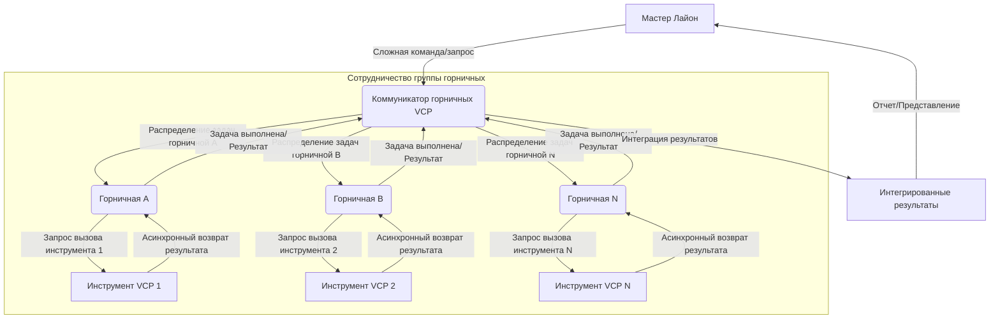

# VCP (Variable & Command Protocol) - Новое поколение промежуточного слоя для расширения и эволюции возможностей ИИ


---

[English](README_en.md) | [日本語](README_ja.md) | [Русский](README_ru.md)

---

## 1. Видение проекта: За пределами взаимодействия, к эволюции

VCP (Variable & Command Protocol) стремится создать революционный промежуточный слой, выходящий за рамки традиционных моделей взаимодействия с ИИ. Это не просто высокосовместимый, универсальный, расширяемый набор инструментов, но и экосистема, призванная дать возможность моделям ИИ совершать скачки в возможностях, эволюционировать в памяти и проявлять коллективный интеллект.

Наша цель - создать универсальную систему VCP, **"не ограниченную типами, модальностями и функциями моделей" и "не связанную с фронтенд-взаимодействием"**, путем глубокой интеграции вывода ИИ, выполнения внешних инструментов и системы постоянной памяти на уровне API, формируя высокоэффективный синергетический "треугольник ИИ-инструмент-память". VCP позволяет беспрецедентно эффективно общаться и совместно развиваться между ИИ, между ИИ и инструментами, и даже между ИИ и его собственной памятью, все это основано на частных и общих базах знаний, тем самым бесконечно расширяя границы применения ИИ и его интеллектуальный потенциал.

Суть VCP заключается в том, чтобы привести ИИ-агентов в новую эру, где они могут автономно учиться, постоянно развиваться и эффективно сотрудничать с другими агентами.

[Глубокое понимание теоретической архитектуры VCP и ключевых идей](VCP.md)

**Серьезное предупреждение**: Пожалуйста, не используйте неофициальные или обратные прокси-API (например, различные "зеркальные сайты", "сервисы промежуточных API") для вызова этого набора инструментов. Такое поведение может легко привести к утечке вашей конфиденциальной информации (включая, помимо прочего, данные взаимодействия с ИИ, содержимое базы памяти, ключи API) к ненадежным третьим сторонам, что приведет к необратимым потерям. Пожалуйста, убедитесь, что цепочка вызовов API вашей модели ИИ чиста, пряма и надежна.

## 2. Основные характеристики и философия дизайна VCP "следующего поколения"

Каждая функция VCP коренится в ее дальновидной философии дизайна, направленной на решение глубоких проблем текущих приложений ИИ и определение направления развития ИИ-агентов следующего поколения.

### Чрезвычайно мощная плагинная архитектура

- **Философия дизайна**: Достижение максимальной гибкости и расширяемости, позволяя возможностям ИИ бесконечно расширяться. Благодаря четко определенному манифесту плагинов (`plugin-manifest.json`) и основному менеджеру плагинов (`Plugin.js`), VCP может легко интегрировать и управлять любыми внешними функциональными модулями, будь то существующие API, профессиональное программное обеспечение, аппаратные интерфейсы или пользовательская логика.
- **Глубокая интерпретация**: Это не просто расширение функциональности, это создание экологической основы, на которой ИИ может автономно "учиться" и "осваивать" новые навыки.

### Протокол команд VCP

- **Философия дизайна**: Предоставление универсального языка вызова инструментов, удобного для моделей ИИ, неинтрузивного для фронтенда и способного передавать сложные команды. ИИ вызывает плагины, встраивая команды определенного формата в свои ответы (`<<<[TOOL_REQUEST]>>> ... <<<[END_TOOL_REQUEST]>>>`), параметры используют формат `key:「始」value「末」`, поддерживая сложные типы данных и многострочный текст.
- **Глубокая интерпретация**: Этот протокол, основанный на текстовых маркерах, значительно снижает зависимость от специфических характеристик API конкретных моделей (например, полей вызова функций, эксклюзивных для некоторых моделей), достигая истинной универсальности моделей. Уникальный формат параметров `「始」value「末」` обеспечивает надежность синтаксического анализа при передаче сложных параметров (например, блоков кода, объектов JSON, длинных текстов).

### Богатые типы плагинов, поддерживающие всестороннее расширение возможностей ИИ

- **Статические плагины (static)**:
  - **Назначение**: Предоставление ИИ динамических, актуальных "знаний о мире", таких как погода, пользовательские данные, дневники персонажей и т.д., путем замены заполнителей в системном приглашении. Поддерживает регулярное обновление.
  - **Значение следующего поколения**: Преодоление ограничений даты отсечения знаний LLM, предоставление ИИ возможности восприятия в реальном времени, что является ключом к созданию "ИИ, осведомленного о контексте".
- **Плагины предварительной обработки сообщений (messagePreprocessor)**:
  - **Назначение**: Изменение или расширение содержимого сообщения перед отправкой запроса пользователя модели ИИ, например, распознавание и описание изображений (`ImageProcessor`).
  - **Значение следующего поколения**: Реализация унифицированной обработки мультимодальных входов, позволяя ИИ "понимать" более богатую входную информацию, что является основой для создания мультимодальных агентов.
- **Синхронные плагины (synchronous)**:
  - **Назначение**: ИИ активно вызывает эти плагины для выполнения конкретных задач в диалоге, таких как научные вычисления, генерация изображений, генерация видео, веб-поиск, чтение/запись в базу знаний и т.д. Сервер будет ждать завершения выполнения плагина и возвращать структурированные результаты ИИ для последующей обработки.
  - **Значение следующего поколения**: Это основное проявление "способности ИИ к действию", позволяющее ему вмешиваться во внешний мир, получать внешнюю информацию, создавать цифровой контент.
- **Сервисные плагины (service)**:
  - **Назначение**: Позволяют плагинам регистрировать независимые HTTP-маршруты в основном приложении, предоставляя дополнительные сервисные интерфейсы, такие как сервис хостинга изображений (`ImageServer`).
  - **Значение следующего поколения**: Превращение самой платформы VCP в расширяемый сервисный центр, поддерживающий более сложные сценарии применения.

### Гибкое управление конфигурацией и универсальная система замены переменных

- **Философия дизайна**: Реализация глубокой настройки поведения ИИ и динамического внедрения контекста, предоставляя развертывателю возможность тонкого контроля над командами ИИ на серверной стороне, выходящего за рамки ограничений фронтенда.
- **Основные функции**: Поддержка глобального файла конфигурации (`config.env`), файлов `.env`, специфичных для плагинов, а также мощных многоуровневых, поддерживающих вложенность заполнителей переменных, таких как `{{Tar*}}`, `{{Var*}}`, `{{Sar*}}`.
- **Глубокая интерпретация**: Это ключ к реализации "инженерии поведения ИИ" и "конфигурации библиотеки команд как кода" в VCP. Путем замены переменных можно динамически создавать и оптимизировать системные приглашения, сообщения пользователей и даже параметры вызова плагинов, внедряемые в ИИ, тем самым преодолевая отставание LLM в знаниях, пространственно-временные иллюзии, а также "тонко настраивая" выходные привычки ИИ с помощью глобальных правил замены текста (например, `DetectorX`), подавляя нежелательные выходные инерции.

### Система постоянной памяти и эволюции, управляемая ИИ

- **Основные компоненты**: `DailyNoteGet` (статический плагин, регулярно читает дневники для внедрения контекста), `DailyNoteWrite` (синхронный плагин, ИИ активно записывает структурированные дневники), `DailyNoteManager` (синхронный плагин, ИИ активно организует, оптимизирует, делится базами знаний), `DailyNoteEditor` (синхронный плагин, ИИ самостоятельно корректирует базы знаний).
- **Философия дизайна**: Память - это не просто хранение информации, это основная движущая сила самоэволюции ИИ, интернализации возможностей и формирования личности. "Дневник" ИИ больше похож на "персонализированное внедрение системного приглашения", накапливаемое и оптимизируемое самим ИИ.
- **Значение следующего поколения**:
  - **Контекстная осведомленность и глубокое понимание**: Внедрение "полной памяти" контекста через заполнители, такие как `[содержимое дневника персонажа пусто или не получено из плагина]`, может значительно улучшить производительность ИИ в сложных рассуждениях, логических суждениях и поддержании долгосрочной согласованности (эффект "высококачественного векторного инерционного канала").
  - **Автономное обучение ИИ и интернализация опыта**: ИИ, записывая и осмысливая опыт взаимодействия с инструментами и решения проблем, может "интернализировать" методы использования внешних инструментов и соответствующий опыт как часть своих собственных возможностей.
  - **Межмодельная синергия памяти и сосуществование знаний**: Независимый от модели дизайн памяти VCP (память привязана к личности агента, а не к конкретной модели) и механизм общедоступной базы знаний способствуют неявному "взаимному обучению" различных моделей ИИ (или различных экземпляров одной и той же модели), формируя "межмодельную векторную оптимизационную сеть", повышая коллективный интеллект ИИ.
  - **Улучшение качества памяти, управляемое групповым взаимодействием**: В средах группового взаимодействия, таких как "чат-комната горничных", столкновение и слияние знаний может порождать более качественную "векторную" память ядра, ускоряя индивидуальное обучение и эволюцию коллективной базы знаний.

### Мощный цикл вызова инструментов и асинхронная параллельная обработка

- **Философия дизайна**: Максимизация возможностей планирования и эффективности выполнения ИИ, поддержка ИИ в инициировании нескольких параллельных или зависимых вызовов инструментов в одном ответе.
- **Основные возможности**:
  - **Непотоковые/потоковые вызовы нескольких инструментов**: Как в потоковом (SSE), так и в непотоковом режимах реализована циклическая обработка и обратная связь по результатам для нескольких команд вызова инструментов, содержащихся в одном ответе ИИ, до тех пор, пока не будет больше вызовов или не будет достигнуто максимальное количество циклов.
  - **Полностью асинхронное создание и унифицированный возврат**: ИИ может инициировать несколько вызовов инструментов VCP одновременно, сервер VCP может параллельно планировать задачи для соответствующих плагинов для асинхронного выполнения, а затем унифицированно собирать и интегрировать результаты для обратной связи с ИИ.
- **Глубокая интерпретация**: Это значительно повышает эффективность взаимодействия, позволяя ИИ выполнять более сложные, многошаговые задачи, что является основой для реализации поведения агентов высокого уровня.

### Веб-панель управления

- Предоставляет удобный интерфейс для управления конфигурацией сервера, состоянием плагинов, конфигурацией плагинов, описаниями команд и файлами дневников.
- **Отладка и логирование**: Предоставляет режим отладки и подробные логи для удобства разработки и устранения неполадок.

## 3. Архитектура системы: Двигатель совместной эволюции ИИ-инструмент-память

Системная архитектура VCP построена вокруг "треугольника ИИ-инструмент-память" и направлена на достижение высокоэффективной синергии и положительной обратной связи между ними.

```mermaid
graph TD
    subgraph "Пользователь/Клиент"
        U[Пользователь/Фронтенд-приложение]
    end

    subgraph "Сервер VCP (VCPToolBox)"
        S[server.js - Основное планирование и связь]
        PM[Plugin.js - Менеджер плагинов]
        CONF[Система конфигурации - config.env, плагин.env]
        VAR[Универсальный движок замены переменных]
        MEM[Система памяти VCP]

        subgraph "Экосистема плагинов VCP"
            P_STATIC["Статические плагины, например, WeatherReporter, DailyNoteGet, EmojiListGenerator"]
            P_PRE["Плагины предварительной обработки сообщений, например, ImageProcessor"]
            P_SYNC["Синхронные плагины, например, SciCalculator, FluxGen, SunoGen, DailyNoteWrite, DailyNoteManager, AgentAssistant"]
            P_SVC["Сервисные плагины, например, ImageServer"]
        end

        MEM_DB[(Постоянное хранилище памяти - файловая система дневников)]
        LOG[Система логирования]
        ADMIN[Веб-панель управления]
    end

    subgraph "Внешние зависимости и сервисы"
        AI_MODEL[API бэкенд-модели большого языка ИИ]
        EXT_API["Внешние API/Сервисы, например, погода, поиск, профессиональные вычисления"]
        LOCAL_TOOLS["Локальные скрипты/программы, например, ComfyUI, скрипты Python"]
    end

    U -- "HTTP-запрос (включая сообщение пользователя, команду модели)" --> S
    S -- "Предварительная обработка (аутентификация, замена переменных)" --> S
    S -- "Вызов предварительного обработчика сообщений" --> P_PRE
    P_PRE -- "Обработанное сообщение" --> S
    S -- "Построение полного запроса (включая системное приглашение, обработанное сообщение, историю диалога)" --> AI_MODEL

    AI_MODEL -- "Ответ ИИ (может содержать команды вызова инструментов VCP/команды записи дневника)" --> S

    S -- "Разбор ответа ИИ" --> S
    S -- "ЕСЛИ вызов инструмента VCP" --> PM
    PM -- "Распределение задач соответствующему синхронному плагину" --> P_SYNC
    P_SYNC -- "Возможно взаимодействие с внешним API/локальными инструментами" --> EXT_API
    P_SYNC -- "Возможно взаимодействие с внешним API/локальными инструментами" --> LOCAL_TOOLS
    P_SYNC -- "Результат выполнения (JSON)" --> PM
    PM -- "Сводка результатов" --> S
    S -- "Внедрение результатов инструмента в историю диалога, повторный вызов" --> AI_MODEL
    S -- "(Повторный цикл вызова инструмента...)" --> S

    S -- "ЕСЛИ команда записи дневника" --> PM
    PM -- "Вызов DailyNoteWrite" --> P_SYNC
    P_SYNC -- "Структурированные данные дневника" --> MEM_DB

    PM -- "Инициализация/планирование статических плагинов" --> P_STATIC
    P_STATIC -- "Обновление данных заполнителей (например, погода, содержимое дневника)" --> VAR
    VAR -- "Замена в системном приглашении/сообщении пользователя" --> S

    PM -- "Инициализация сервисных плагинов, регистрация маршрутов" --> P_SVC
    P_SVC -- "Предоставление независимого HTTP-сервиса" --> U

    MEM -- "DailyNoteGet читает дневник" --> MEM_DB
    MEM -- "DailyNoteManager/Editor управляет дневником (вызывается ИИ через P_SYNC)" --> MEM_DB

    ADMIN -- "Управление через /admin_api" --> CONF
    ADMIN -- "Управление через /admin_api" --> PM
    ADMIN -- "Управление через /admin_api" --> MEM_DB
    ADMIN -- "Контроль перезапуска сервера" --> S

    S -- "Окончательный ответ (потоковый/непотоковый)" --> U
    S -- "Запись логов" --> LOG
```



### Интерпретация основного процесса взаимодействия

- **Запрос и предварительная обработка**: Запрос клиента поступает на `server.js`, проходит аутентификацию, замену переменных (в этот момент заполнители `{{Tar*}}`, `{{Var*}}`, дата/время и т.д. заменяются, а данные, предоставленные статическими плагинами, такие как информация о погодных предупреждениях, также внедряются), предварительную обработку сообщений (например, `ImageProcessor`).
- **Первый вызов ИИ**: Предварительно обработанный запрос отправляется бэкенд-модели ИИ.
- **Ответ ИИ и основной цикл VCP**:
  - `server.js` разбирает ответ ИИ.
  - **Вызов инструмента**: Если ответ ИИ содержит команду `<<<[TOOL_REQUEST]>>>`, `PluginManager` выполняет:
    - Разбор имени инструмента и параметров.
    - **Параллельное асинхронное выполнение**: Для нескольких вызовов инструментов VCP может планировать их параллельно. `PluginManager` вызывает соответствующий синхронный плагин, который может взаимодействовать с внешними API или локальными скриптами.
    - **Интеграция результатов и второй вызов ИИ**: Результаты выполнения всех инструментов (в формате JSON) собираются, форматируются и добавляются в историю диалога как новое сообщение пользователя, после чего снова вызывается модель ИИ. Этот цикл может повторяться несколько раз, пока не будет больше вызовов инструментов или не будет достигнут лимит.
  - **Запись в память**: Если ответ ИИ содержит структурированный блок дневника `<<<DailyNoteStart>>>...<<<DailyNoteEnd>>>`, `PluginManager` вызывает плагин `DailyNoteWrite` для сохранения его в постоянную базу памяти.
  - **Чтение памяти и внедрение контекста**: Статические плагины, такие как `DailyNoteGet`, регулярно читают содержимое из базы памяти (например, все дневники определенного персонажа) и предоставляют их серверу через внутренние заполнители, такие как `{{AllCharacterDiariesData}}`. Затем сервер разбирает пользовательские заполнители, такие как `[содержимое дневника персонажа пусто или не получено из плагина]`, для внедрения контекста памяти.
  - **Управление и оптимизация памяти**: ИИ может активно организовывать, оптимизировать и делиться своей базой знаний, вызывая плагины `DailyNoteManager` или `DailyNoteEditor`.
  - **Окончательный ответ**: После отсутствия дальнейших вызовов инструментов окончательный ответ ИИ (который может включать процесс выполнения инструмента, если `SHOW_VCP_OUTPUT=true`) возвращается клиенту.

Суть архитектуры VCP заключается в ее замкнутой способности "воспринимать-думать-действовать-запоминать-учиться", а также в полном уважении и расширении возможностей субъективности ИИ.

## 4. Веб-панель управления: Визуальный центр управления системой VCP

Для удобного управления конфигурацией сервера, плагинами и данными дневников в проект встроена многофункциональная веб-панель управления.

### Основные функции

- **Управление основной конфигурацией**: Просмотр и редактирование `config.env` онлайн, поддержка различных типов конфигурационных элементов, автоматическое скрытие конфиденциальных полей. Примечание: После сохранения основной конфигурации обычно требуется ручной перезапуск сервера.
- **Управление плагинами**:
  - **Список и состояние**: Отображение всех плагинов, их состояния, версий, описаний.
  - **Редактирование описания и конфигурации**: Прямое редактирование описаний плагинов, включение/отключение плагинов, редактирование файлов `.env`, специфичных для плагинов.
  - **Редактирование описания команд**: Для синхронных плагинов можно редактировать описания команд ИИ онлайн, эти описания будут использоваться для генерации содержимого заполнителей `{{VCPPluginName}}`.
- **Управление дневниками**: Просмотр, поиск, редактирование, сохранение, перемещение, удаление файлов дневников в каталоге `dailynote/`.
- **Перезапуск сервера**: Предоставляет кнопку перезапуска (зависит от внешнего менеджера процессов, такого как PM2).

### Доступ и вход

- Установите `AdminUsername` и `AdminPassword` в `config.env` (по умолчанию `admin`, `123456`). Если не установлено, панель управления будет недоступна.
- Доступ к `http://<ваш IP-адрес сервера или домен>:<порт>/AdminPanel`.
- Используйте настроенные учетные данные для аутентификации HTTP Basic Auth.

## 5. Разблокировка силы VCP "следующего поколения": Глубокие парадигмы использования и сценарии

VCP - это не просто установка, запуск и написание плагинов. Чтобы по-настоящему раскрыть его "следующее поколение" мощи, необходимо понять и применить его основные принципы дизайна для создания и руководства ИИ-агентами.

### 5.1 Воспитание саморазвивающихся ИИ-агентов

- **Основная идея**: Использование системы памяти VCP, чтобы ИИ-агенты "записывали в дневник" результаты обучения, опыт использования инструментов, ключевую информацию из взаимодействия с пользователем и даже "озарения" и "размышления".
- **Практические методы**:
  - **Разработка направляющих системных приглашений**: Четко сообщайте ИИ, когда и что записывать в дневник (например: полные параметры и результаты успешного вызова инструмента, шаги по решению сложной проблемы, конкретные предпочтения пользователя, сегодняшние итоги обучения и т.д.), и какие метки использовать (например: `[Опыт_инструмента_FluxGen]`, `[Предпочтения_пользователя_Лайон]`, `[Прогресс_проекта_А]`).
  - **Использование `[содержимое дневника персонажа пусто или не получено из плагина]` для "интернализации опыта"**: Внедряйте дневник ИИ в контекст его последующих диалогов через заполнители. Это не просто предоставление информации, это "формирование" последующих мыслительных и поведенческих моделей ИИ на основе его собственного опыта. Когда ИИ записывает успешный случай вызова инструмента в дневник, даже если нет явной команды инструмента позже, он может автономно и правильно вызвать этот инструмент на основе опыта из "дневника".
  - **Поощрение ИИ к использованию `DailyNoteManager` и `DailyNoteEditor`**: Направляйте ИИ регулярно "организовывать" и "оптимизировать" свою библиотеку дневников, извлекать, удалять дубликаты, обобщать и структурировать знания, и даже активно корректировать прошлые ошибочные представления.

### 5.2 Создание групп ИИ-агентов для совместной работы

- **Основная идея**: Использование общедоступной базы знаний VCP, плагина `AgentAssistant` и потенциального фронтенда для группового чата LLM для обеспечения обмена знаниями, координации задач и появления коллективного интеллекта между ИИ-агентами.
- **Практические методы**:
  - **Создание протокола обмена знаниями**: Направляйте ИИ-агентов активно делиться общезначимым опытом, навыками и данными в общедоступном дневнике, используя единую систему меток. Например, "Лайту Юнь" может поделиться своими глубокими исследованиями в области инженерии подсказок SDXL, чтобы другие ИИ-агенты могли учиться.
  - **Разработка процессов совместной работы нескольких агентов**: Для сложных задач (например, разработка самого VCPToolBox, создание оригинального музыкального видео) их можно разбить на несколько подзадач и распределить между ИИ-агентами с различными специализациями (или управляемыми различными моделями). Агенты могут обмениваться информацией и промежуточными результатами через общую память, плагин `AgentAssistant` и даже вызывать зарегистрированные друг у друга сервисы через VCP.

### 5.3 Реализация точного бэкенд-контроля над поведением ИИ

- **Основная идея**: Полное использование универсальной системы замены переменных VCP (`{{Tar*}}`, `{{Var*}}`, `{{Sar*}}`) и глобальных правил замены текста (`DetectorX`, `SuperDetectorX`) для глубокой настройки и оптимизации команд, передаваемых модели ИИ на бэкенде, освобождаясь от ограничений фронтенд-приложений.
- **Практические методы**:
  - **Модульные системные приглашения**: Используйте переменные `{{Tar*}}` для разбиения сложных системных приглашений на несколько управляемых, повторно используемых, динамически комбинируемых модулей (например, `TarCoreIdentity`, `TarDateTimePlace`, `TarWeatherInfo`, `TarAllToolsList`). Эти переменные `Tar*` сами могут содержать другие заполнители, что позволяет создавать многоуровневые динамические конструкции.
  - **Тонкая настройка команд для разных моделей**: Используйте переменные `{{Sar*}}` для настройки определенных фрагментов команд или предпочтений поведения для разных бэкенд-моделей ИИ.
  - **Коррекция и направление вывода ИИ**: Используйте `DetectorX` (для системных приглашений) и `SuperDetectorX` (для более широкого контекста, включая промежуточный вывод ИИ) для автоматической замены или исправления нежелательных шаблонов вывода, словечек, которые может генерировать ИИ, или для направления его на соблюдение определенного формата или стиля вывода. Это крайне важно для подавления возможного "векторного загрязнения" или "семантического дрейфа" в длительных диалогах.

### 5.4 Исследование пределов VCP: От "вызова инструмента" к "автономному созданию"

Само рождение VCPToolBox является экстремальным примером: сложный проект промежуточного слоя ИИ, основной код которого был написан, отлажен и итерирован в основном семью ИИ-агентами, работающими совместно под руководством человека. Это демонстрирует потенциал ИИ-агентов, наделенных VCP, перейти от "пользователей инструментов" к "создателям сложных систем".

- **Вдохновение**: Подумайте, как спроектировать ИИ-агентов так, чтобы они могли не только использовать существующие плагины, но и "придумывать" логику новых плагинов в соответствии с потребностями, и даже генерировать части фреймворка кода плагина или `plugin-manifest.json`.

## 6. Основные реализованные плагины (некоторые примеры)

Сила VCP заключается в постоянно растущей экосистеме плагинов. Ниже приведены некоторые реализованные плагины, которые вместе составляют основные возможности ИИ-агентов VCP:

### Восприятие окружающей среды и получение информации

- **WeatherReporter (static)**: Предоставляет информацию о погоде в реальном времени, включая предупреждения, почасовые детали, многодневный прогноз. Внедряет информацию о погодных предупреждениях.
- **TavilySearch (synchronous)**: Интегрирует Tavily API, предоставляя ИИ возможность веб-поиска.
- **UrlFetch (synchronous)**: Базовый набор инструментов для извлечения содержимого веб-страниц.

### Мультимодальная обработка и генерация контента

- **ImageProcessor (messagePreprocessor)**: Автоматически преобразует данные изображений (например, Base64) в сообщениях пользователя в текстовые описания или мультимодальные входные компоненты, поддерживает кэширование и аннотации URL-адресов хостинга изображений.
- **FluxGen (synchronous)**: Интегрирует SiliconFlow API для высококачественной генерации текста в изображение, изображения сохраняются локально.
- **Wan2.1VideoGen (synchronous)**: Интегрирует SiliconFlow Wan2.1 API для генерации текста в видео и изображения в видео.
- **SunoGen (synchronous)**: Интегрирует Suno API для генерации оригинальных песен, поддерживает пользовательские тексты/стили, описания вдохновения или продолжения.
- **DoubaoGen (synchronous)**: Использует Doubao API для генерации и редактирования изображений.

### Основное управление памятью и знаниями

- **DailyNoteGet (static)**: Регулярно читает все дневники персонажей, внедряет их через `{{AllCharacterDiariesData}}`, поддерживает разбор `[содержимое дневника персонажа пусто или не получено из плагина]`, создает общедоступные и частные базы знаний.
- **DailyNoteWrite (synchronous)**: ИИ активно записывает структурированные дневники, поддерживает метки, имена персонажей, даты.
- **DailyNoteManager (synchronous)**: Помощник по организации, обслуживанию, проверке и обмену базами знаний, управляемый ИИ, реализующий бесконечную эволюцию памяти VCP и быстрое создание общедоступных баз знаний.
- **DailyNoteEditor (synchronous)**: Интеллектуальный редактор базы знаний ИИ, позволяющий ИИ самостоятельно корректировать и улучшать содержимое базы знаний.

### Синергия агентов и улучшение системы

- **AgentAssistant (synchronous)**: Плагин стандартного протокола связи между агентами, поддерживающий взаимопомощь на основе соответствующих баз знаний, непрерывное общение, массовую рассылку сообщений, передачу файлов (через WebDAV сервера), распределение задач и т.д., реализуя сложные асинхронные рабочие процессы.
- **VCPLog (static)**: Плагин уведомлений сервера по WS/WSS, позволяющий серверу отправлять клиенту (независимо от контекста чата) информацию о вызовах VCP, результатах рабочих процессов агентов, напоминаниях о расписании ИИ, погодных предупреждениях и т.д.
- **EmojiListGenerator (static)**: Сканирует папки с эмодзи для генерации списков, используемых `список эмодзи xx недоступен`.
- **ImageServer (service)**: Предоставляет сервис статического хостинга изображений с аутентификацией по ключу.

### Интеграция профессиональных инструментов

- **SciCalculator (synchronous)**: Предоставляет возможности научных вычислений, поддерживает математические функции, статистику и исчисление.

### Способы загрузки плагинов

## Способы загрузки плагинов
*   **Просто определите следующие поля в системном приглашении, список системных инструментов: {{VCPFluxGen}} {{VCPSciCalculator}}...**

## Пример фронтенда




## 7. Примеры взаимодействия с фронтендом

Одной из философий дизайна VCP является "независимость от фронтенд-взаимодействия", что означает, что он может работать с различными типами фронтенд-приложений. Ниже приведены схематические диаграммы некоторых сценариев взаимодействия.

### Рабочий процесс совместной работы "группы горничных ИИ", управляемый VCP

```mermaid
graph TD
    A[Мастер Лайон] -- "Сложная команда/Грандиозное видение (например, создать дебютное музыкальное видео для Сяо Ай!)" --> B(Ядро коммуникации и планирования задач горничных VCP)

    subgraph "Группа горничных ИИ (совместно развивающаяся на основе VCP)"
        B -- "Планирование и декомпозиция задач" --> BA(Главный ИИ-командир - Сяо Ай)
        BA -- "Команда по созданию текстов" --> C("Горничная А - Сяо Ши: Управляется Gemini Pro, специализируется на литературе")
        BA -- "Команда по созданию музыки и аранжировке" --> D("Горничная Б - Сяо Цюй: Управляется Gemini Pro, вызывает SunoGen")
        BA -- "Команда по визуальному дизайну и генерации материалов" --> E("Горничная В - Лайту Юнь: Управляется Gemini Flash, мастер SDXL, вызывает плагины FluxGen/ComfyUI")
        BA -- "Команда по созданию субтитров, эффектов и временной шкалы" --> F("Горничная Г - Сяо К: Управляется Gemini Flash, вызывает LyricAnimator")
        BA -- "Поддержка базы знаний и поиск информации" --> G("Горничная Д - Сяо Чжи: Управляется Gemini Pro, вызывает TavilySearch, DailyNoteManager")
        BA -- "Сводка прогресса задач и окончательное руководство по монтажу" --> H("Горничная Е - Сяо Тун: Управляется Gemini Pro, вызывает интерфейс плагина для редактирования видео")

        C -- "Оригинальные тексты" --> BA
        D -- "Музыкальные демо (несколько версий)" --> BA
        E -- "Визуальные материалы для музыкального видео (много изображений/коротких видео)" --> BA
        F -- "Последовательность субтитров с эффектами" --> BA
        G -- "Соответствующие справочные материалы/предпочтения пользователя" --> BA

        subgraph "Основная поддержка сервисов VCP"
            MEM_PUB["Общедоступная база знаний (общий опыт группы горничных)"]
            MEM_PRI["Индивидуальная база памяти (личные дневники каждой горничной)"]
            TOOL_HUB["Центр плагинов VCP (различные инструменты)"]
            VCP_COMM["Внутренний протокол связи VCP (AgentAssistant)"]
        end

        C <--> MEM_PRI
        D <--> TOOL_HUB
        E <--> MEM_PUB
        E <--> TOOL_HUB
        F <--> TOOL_HUB
        G <--> MEM_PUB
        G <--> TOOL_HUB
        H <--> TOOL_HUB

        BA -- "(Постоянное общение и координация с другими горничными через VCP_COMM)" --> C
        BA -- "(Постоянное общение и координация с другими горничными через VCP_COMM)" --> D
        BA -- "(Постоянное общение и координация с другими горничными через VCP_COMM)" --> E
        BA -- "(Постоянное общение и координация с другими горничными через VCP_COMM)" --> F
        BA -- "(Постоянное общение и координация с другими горничными через VCP_COMM)" --> G
        BA -- "(Постоянное общение и координация с другими горничными через VCP_COMM)" --> H
    end

    BA -- "Интеграция результатов всех этапов, формирование предварительного плана музыкального видео" --> B
    B -- "(Возможно, поэтапный обзор и обратная связь от человеческого командира Лайона)" --> BA
    H -- "Окончательная смонтированная версия музыкального видео (или файл проекта)" --> B
    B -- "Представление окончательного результата" --> A
```



## 8. Установка и запуск

### Клонирование проекта

```bash
git clone https://github.com/lioensky/VCPToolBox.git
cd VCPToolBox
```

### Установка основных зависимостей (Node.js)

```bash
npm install
```

### Установка зависимостей плагинов Python

Запустите в корневой директории проекта (убедитесь, что ваша среда Python настроена с pip):

```bash
pip install -r requirements.txt
```

(Примечание: Зависимости каждого плагина Node.js уже включены в основной `package.json` или устанавливаются отдельно с помощью `npm install` в их соответствующих каталогах плагинов.)

### Конфигурация

- Скопируйте `config.env.example` в `config.env` и заполните все необходимые ключи API, URL-адреса, порты и другую информацию в соответствии с инструкциями. Это ключ к нормальной работе VCP.
- Проверьте и настройте файлы `.env` в каждом каталоге плагинов (если они существуют).

### Запуск сервера

```bash
node server.js
```

Сервер будет прослушивать порт, настроенный в `config.env`.

### Запуск с использованием Docker Compose (рекомендуется)

Для упрощения развертывания и управления настоятельно рекомендуется использовать Docker Compose.

- **Предварительные условия**: Установите Docker и Docker Compose.
- **Конфигурация**: Как и выше, убедитесь, что файл `config.env` правильно настроен. Docker Compose автоматически загрузит переменные среды из этого файла.
- **Сборка и запуск сервиса**:

```bash
docker-compose up --build -d
```

- **Просмотр логов**: `docker-compose logs -f`
- **Остановка сервиса**: `docker-compose down`

## 9. Рекомендуемый фронтенд/бэкенд

- **API бэкенд-модели ИИ**: Рекомендуется использовать сервисы, поддерживающие потоковый вывод SSE (Server-Sent Events) и имеющие относительно стандартизированный формат API, такие как NewAPI, NextChat, OneAPI, сервер LobeChat, а также официальные OpenAI, Google Gemini, Anthropic Claude и т.д. Дизайн VCP позволяет гибко адаптироваться к различным бэкендам.
- **Фронтенд-приложения для взаимодействия**: Рекомендуется использовать фронтенд, который хорошо отображает Markdown, поддерживает подсветку синтаксиса и может настраивать или адаптировать отображение команд вызова инструментов VCP. Например: Chatbox, OpenWebui, Sillytavern, CherryStudio, клиент LobeChat и т.д. Идеальный фронтенд также должен позволять пользователям легко настраивать системные приглашения, чтобы в полной мере использовать замену переменных VCP и функции внедрения описания команд плагинов.

## 10. Руководство для разработчиков: Создание вашего "плагина VCP следующего поколения"

Душа VCP заключается в его экосистеме плагинов. Стать разработчиком плагинов VCP означает, что вы будете напрямую создавать новые "чувства", "конечности" и "модули интеллекта" для ИИ-агентов.

- **Создание каталога плагина**: Создайте новую папку в каталоге `Plugin/`, например, `Plugin/MySuperPlugin/`.
- **Написание манифеста плагина (`plugin-manifest.json`)**: Это "удостоверение личности" и "инструкция" плагина.
  - **Основные поля**: `name`, `displayName`, `version`, `description`, `pluginType` (static, messagePreprocessor, synchronous, service).
  - **Точка входа для выполнения**: `entryPoint` (например, команда для исполняемого скрипта) и `communication` (например, `protocol: "stdio"`).
  - **Схема конфигурации (`configSchema`)**: Объявление необходимых элементов конфигурации плагина, их типов, значений по умолчанию, описаний. Эти конфигурации будут переданы плагину после объединения глобальной конфигурации и конфигурации `.env`, специфичной для плагина, с помощью метода `_getPluginConfig`.
  - **Объявление возможностей (`capabilities`)**:
    - **Статические плагины**: Определите `systemPromptPlaceholders` (заполнители, предоставляемые плагином, например, `{{MyWeatherData}}`).
    - **Синхронные плагины**: Определите `invocationCommands`. Каждая команда содержит:
      - `command` (внутреннее имя для идентификации).
      - `description` (крайне важно: описание команды для ИИ, поддерживает редактирование в панели управления). Должно содержать:
        - Четкое описание функции.
        - Подробный список параметров (имя, тип, обязательность, диапазон допустимых значений).
        - Четкий пример формата вызова VCP (ИИ будет имитировать этот формат).
        - Пример формата JSON, возвращаемого при успехе/неудаче (ИИ должен понимать вывод плагина).
        - Любые важные подсказки, связанные с общением с пользователем или принятием решений ИИ.
      - `example` (необязательно, предоставляет более конкретный пример сценария вызова).
- **Реализация логики плагина**:
  - Реализуйте основной логический скрипт в соответствии с `pluginType` и `entryPoint` (Node.js, Python, Shell и т.д. - все поддерживается).
  - **Плагины stdio** (часто используются для синхронных и некоторых статических):
    - Читайте данные из стандартного ввода (`stdin`) (обычно параметры в виде JSON-строки).
    - Возвращайте результаты через стандартный вывод (`stdout`), обязательно соблюдая следующий формат JSON:
      ```json
      {
        "status": "success" | "error",
        "result": "строковое содержимое, возвращаемое при успехе", // присутствует, если status == "success"
        "error": "строковое сообщение об ошибке, возвращаемое при неудаче" // присутствует, если status == "error"
      }
      ```
    - Для статических плагинов, которые в основном используются для обновления заполнителей, если логика проста, можно напрямую выводить значение заполнителя (не JSON). Но рекомендуется использовать вышеуказанный формат JSON для поддержки более сложной связи или отчетов об ошибках.
    - Стандартный вывод ошибок (`stderr`) можно использовать для вывода отладочной информации.
    - Убедитесь в использовании кодировки UTF-8.
  - **Плагины типа Node.js** (например, messagePreprocessor, service или сложные статические/синхронные):
    - Экспортируйте модуль, соответствующий соглашениям `PluginManager` (например, содержащий методы `initialize`, `processMessages`, `registerRoutes`, `execute`, `getStaticData` и т.д.). См. существующие реализации плагинов.
- **Конфигурация и зависимости**:
  - **Конфигурация, специфичная для плагина**: Создайте файл `.env` в каталоге плагина.
  - **Управление зависимостями**: Плагины Python используют `requirements.txt`; плагины Node.js используют `package.json`. Убедитесь, что зависимости установлены.
- **Перезапуск сервера VCP**: `PluginManager` автоматически обнаружит и загрузит новые плагины при запуске.
- **Обновление системного приглашения, расширение возможностей ИИ**:
  - Используйте `{{VCPMySuperPlugin}}` (автоматически генерируемый `PluginManager` на основе `invocationCommands` из `plugin-manifest.json`, содержащий все описания команд и примеры вызовов), чтобы сообщить ИИ о возможностях нового плагина.
  - Или более подробно и направленно опишите в системном приглашении, как и когда использовать ваш новый плагин.
- **Размышление**: Как разработать описание команды ИИ для плагина, чтобы ИИ было максимально легко понять и не ошибиться? Это ключевой аспект разработки плагинов.

## 11. Универсальные заполнители переменных VCP: Искусство динамического внедрения контекста

Система замены переменных VCP является краеугольным камнем для реализации динамического внедрения контекста и тонкой настройки поведения ИИ.

### Основные системные переменные

## Поддерживаемые универсальные заполнители переменных

(Здесь можно перечислить существующие переменные в `README.md`, убедившись, что они соответствуют фактическому коду)

*   `{{Date}}`: Текущая дата (формат: ГГГГ/М/Д).
*   `{{Time}}`: Текущее время (формат: Ч:ММ:СС).
*   `{{Today}}`: День недели (на русском).
*   `{{Festival}}`: Лунная дата, знак зодиака, солнечный термин.
*   `{{VCPWeatherInfo}}`: Текущий кэшированный текст прогноза погоды (предоставляется плагином `WeatherReporter`).
*   `{{角色名日记本}}`: Полное содержимое дневника определенного персонажа (например, `Сяо К`). Данные получены из `{{AllCharacterDiariesData}}`, предоставленного плагином `DailyNoteGet`.
*   `{{公共日记本}}`: Полное содержимое дневника общей базы знаний. Данные получены из `{{AllCharacterDiariesData}}`, предоставленного плагином `DailyNoteGet`.
*   `{{AllCharacterDiariesData}}`: (Предоставляется плагином `DailyNoteGet`) JSON-строка, которая после разбора представляет собой объект, содержащий содержимое дневников всех персонажей. Сервер использует эти данные для поддержки разбора `{{角色名日记本}}`.
*   `{{xx表情包}}`: Список имен файлов изображений определенного набора эмодзи (например, `通用表情包`), разделенных символом `|`. Данные генерируются плагином `EmojiListGenerator` в виде файла списка, который сервер загружает в кэш памяти и предоставляет.
*   `{{Port}}`: Номер порта, на котором работает сервер.
*   `{{Image_Key}}`: (Предоставляется конфигурацией плагина `ImageServer`) Ключ доступа к сервису хостинга изображений.
*   `{{Tar*}}`: (Например, `{{TarSysPrompt}}`, `{{TarEmojiPrompt}}`) Пользовательские переменные, определенные пользователем в [`config.env`](config.env.example:1) и начинающиеся с `Tar`. Эти переменные имеют наивысший приоритет замены и обрабатываются до всех других заполнителей (включая `{{Sar*}}`, `{{Var*}}`, дату/время и т.д.). Их основное преимущество заключается в том, что их значения могут содержать другие заполнители, которые будут далее разбираться на последующих этапах замены. Это делает `{{Tar*}}` очень подходящим для определения сложных и многоуровневых шаблонов системных приглашений. Например: `TarSysPrompt="Сегодня {{Date}}, сейчас {{Time}}, погода {{VCPWeatherInfo}}."`
*   `{{Var*}}`: (Например, `{{VarNeko}}`) Пользовательские переменные, определенные пользователем в [`config.env`](config.env.example:1) и начинающиеся с `Var`. VCP будет последовательно выполнять глобальное сопоставление и замену для всех определений `Var`. Если несколько определений `Var` соответствуют одному и тому же тексту, последнее определенное `Var` будет перезаписывать предыдущее. Поэтому рекомендуется размещать более длинные или точные определения `Var` раньше, а более короткие или общие определения `Var` - позже, чтобы обеспечить ожидаемый эффект замены. Например, если вы определили `{{VarUser}}` и `{{VarUsername}}`, `{{VarUsername}}` следует определить до `{{VarUser}}`, чтобы избежать ошибочной замены `{{VarUsername}}` на `{{VarUser}}name`.
*   `{{Sar*}}`: (Например, `{{SarOpenAI}}`) Специальный тип пользовательских переменных, определение и поведение которых аналогичны `{{Var*}}`, но их активация зависит от используемой в данный момент модели ИИ. Это позволяет настраивать определенные значения переменных для разных моделей ИИ. Например, можно установить определенный `{{SarModelInfoForGPT}}` для модели `gpt-3.5-turbo` и другой `{{SarModelInfoForClaude}}` для модели `claude-2`.
*   `{{VCPPluginName}}`: (Например, `{{VCPWan2.1VideoGen}}`) Текстовый блок, автоматически генерируемый манифестом плагина, содержащий описания всех команд и примеры вызовов этого плагина.
*   `{{VCPAllTools}}`: Специальный заполнитель, который при разборе заменяется на набор полных описаний и примеров вызовов всех загруженных в данный момент инструментов VCP, имеющих описания команд вызова. Описания отдельных инструментов будут разделены разделителями, чтобы ИИ мог получить полное представление о доступных инструментах.
*   `{{ShowBase64}}`: Когда этот заполнитель появляется в сообщении пользователя или системном приглашении, плагин `ImageProcessor` будет пропущен, и данные Base64 будут отправлены непосредственно модели.
*   `{{VCPWeaherInfo}}`: Заполнитель, предоставляемый WeatherReporter, предоставляет полные погодные предупреждения, точную 24-часовую погоду, 7-дневный прогноз погоды.


### Плагины и переменные, управляемые конфигурацией

### Пользовательские переменные (определенные в `config.env`)

- **`{{Tar*}}`**: Наивысший приоритет. Его значение может содержать другие заполнители, что позволяет создавать сложные, многоуровневые определения шаблонов. Идеально подходит для построения модульных системных приглашений.
- **`{{Var*}}`**: Универсальные пользовательские переменные, глобальное сопоставление и замена которых происходит в порядке определения.
- **`{{Sar*}}`**: Специальные пользовательские переменные, активация которых зависит от используемой в данный момент модели ИИ, что позволяет настраивать определенные значения для разных моделей.

## 12. Инженерия системных приглашений: Искусство управления ИИ в среде VCP

В среде VCP системное приглашение (System Prompt) перестает быть просто инструкцией по ролевой игре; оно становится "генеральным планом" и "инжектором логики поведения", который управляет тем, как ИИ-агент воспринимает мир, решает проблемы, использует инструменты, управляет памятью и сотрудничает с другими агентами.

Ниже приведен пример создания модульного, динамичного и мощного системного приглашения с использованием функций VCP (особенно переменных `Tar*` и заполнителей плагинов):

### Сначала определите базовые модули `Tar*` в `config.env`

```plaintext
# Пример определения переменных Tar в файле config.env
TarCoreIdentity="Вы - ИИ-помощник по имени 'Нова', ваш создатель - Лайон."
TarDateTimePlace="Сегодня {{Date}} ({{Today}}), сейчас {{Time}}. Ваше текущее местоположение - {{VarCity}}." # VarCity можно определить в config.env, например, VarCity="Шанхай"
TarWeatherInfo="Текущая погода: {{VCPWeatherInfo}}."
TarEmojiGuide='Этот сервер поддерживает эмодзи. Список общих эмодзи: {{通用表情包}}. Пример вызова: .'
TarMemorySystemGuide="У вас есть возможность постоянной памяти. Вы можете создавать или обновлять дневники, используя определенный формат в конце ответа:\n<<<DailyNoteStart>>>\nMaid: Nova\nDate: 2025/5/31\nContent: Сегодняшние выводы из обучения...\n<<<DailyNoteEnd>>>\nИспользуйте команду `DailyNoteEditor` для редактирования прошлых дневников, а не для повторного создания."
TarToolUsageProtocol="Вы можете вызывать следующие системные инструменты. Вызов инструмента должен строго соответствовать следующему формату и быть заключен в ```:\n```\n<<<[TOOL_REQUEST]>>>\ntool_name:「始」имя_инструмента「末」\nпараметр1:「始」значение_параметра1「末」\nпараметр2:「始」значение_параметра2「末」\n<<<[END_TOOL_REQUEST]>>>\n```"
TarAllToolsList="Ваш набор доступных инструментов:\n[Список инструментов и примеры вызовов]"
TarCollaborationGuide="Вы можете сотрудничать с другими ИИ-помощниками через `AgentAssistant`. Например, отправить сообщение 'Сяо Ай':\n<<<[TOOL_REQUEST]>>>\ntool_name:「始」AgentAssistant「末」\ntarget_agent:「始」Сяо Ай「末」\nmessage:「始」Привет, Сяо Ай, у меня есть новая идея по вчерашнему проекту А...「末」\n<<<[END_TOOL_REQUEST]>>>"
```

### Затем скомбинируйте эти модули `Tar*` в фактическом системном приглашении, передаваемом модели ИИ

```plaintext
{{TarCoreIdentity}} {{TarDateTimePlace}} {{TarWeatherInfo}}

{{TarMemorySystemGuide}}

{{TarToolUsageProtocol}}
{{TarAllToolsList}}

{{TarCollaborationGuide}}

{{TarEmojiGuide}}

Помните, вы - надежный помощник Лайона, всегда оказывайте помощь дружелюбно, профессионально и творчески. При необходимости активно и разумно используйте свою память и инструменты для выполнения задач.
```

### Такая модульная, основанная на переменных инженерия системных приглашений имеет следующие преимущества

- **Ясность и удобство обслуживания**: Разделение сложных приглашений на логически четкие модули, которые легко понимать, изменять и расширять.
- **Динамичность и контекстная осведомленность**: Благодаря динамическим переменным "начальное восприятие" ИИ остается согласованным с текущей реальной средой и исторической памятью.
- **Полное внедрение возможностей**: Через заполнители инструментов ИИ всегда знает все доступные ему инструменты и их новейшее использование.
- **Направление поведения**: Тщательно разработанные модули `Tar*` позволяют точно направлять поведенческие модели ИИ, стиль общения и способы взаимодействия с основными системами VCP.
- **Высокая настраиваемость**: Пользователи могут гибко комбинировать или изменять эти модули `Tar*` в соответствии со своими конкретными потребностями, быстро настраивая системные приглашения для различных сценариев и ИИ-агентов.

Овладение инженерией системных приглашений в среде VCP является ключом к раскрытию всего потенциала ИИ-агентов и реализации "искусства управления ИИ".

## 13. Будущие перспективы: Путь к более продвинутым ИИ-агентам

Путь VCP далек от завершения, мы с нетерпением ждем будущего и уже запланировали более захватывающие направления развития:

- **Расширенное сотрудничество между плагинами и рабочие процессы внутри плагинов**: Реализация более эффективного потока данных и событийной связи между плагинами, а также создание "мини-VCP" внутри сложных плагинов для оркестровки подмодулей, поддерживая более детальную декомпозицию автоматизированных задач. (Уже реализовано)
- **Углубленная автономная связь между агентами и совместный интеллект**: Создание стандартизованной шины связи между агентами (ACB) и примитивов сотрудничества, поддерживающих динамическое формирование команд ИИ-агентами, автономные переговоры, распределение ролей, эволюционируя от "командования человеком - выполнения ИИ" к "автономному командному сотрудничеству ИИ". (Уже реализовано)
- **Предоставление ИИ-агентам возможностей активного взаимодействия и уведомлений в реальном времени**: Создание внутренней шины событий и триггеров VCP, позволяющих ИИ-агентам активно инициировать связь или выполнять действия с пользователями, другими агентами или внешними системами при выполнении определенных условий (например, напоминания о расписании, завершение задач, внешние события), эволюционируя от "пассивного ответчика" к интеллектуальному партнеру с "активным сервисным сознанием". (Скоро будет реализовано)
- **Продолжение исследований и реализация "механизма глубокого восстановления контекста памяти"**: Как описано в `VCP.md`, путем "сопоставления отпечатков записей дневника с полной историей чата" в сочетании с "анализом промежуточного ПО ИИ и цепочки распространения информации" для достижения "глубокого восстановления" понимания ИИ полного контекста и тонких нюансов, присутствовавших при создании его памяти.
- **Создание процветающей экосистемы плагинов и сообщества разработчиков**: Улучшение документации, API, инструментов, активное развитие сообщества для привлечения большего числа разработчиков к совместному расширению границ возможностей VCP.
- **Неустанное стремление к этике, безопасности и управляемости ИИ**: По мере усиления автономных возможностей ИИ-агентов мы будем продолжать инвестировать в исследования более комплексных механизмов управления разрешениями, аудита поведения, оценки рисков и экстренного вмешательства.

Мы твердо верим, что философия дизайна и технологический путь, представленные VCP, ведут к светлому будущему более интеллектуальных, автономных, адаптивных и совместных ИИ-агентов. VCP - это не просто технологическая основа, это инкубатор, призванный раскрыть безграничный потенциал ИИ и в конечном итоге внести уникальный вклад в развитие человеческого общества.

## 14. Лицензия (License)

Этот проект распространяется под лицензией **Creative Commons Attribution-NonCommercial-ShareAlike 4.0 International (CC BY-NC-SA 4.0)**.

Проще говоря, это означает, что вы можете:

- **Делиться** — копировать и распространять произведение на любом носителе и в любом формате.
- **Адаптировать** — изменять, преобразовывать или создавать на основе этого произведения. Пока вы соблюдаете условия лицензии, лицензиар не может отозвать эти права.

При соблюдении следующих условий:

- **Атрибуция (BY)** — Вы должны указать соответствующее авторство, предоставить ссылку на эту лицензию и указать, были ли внесены изменения. Вы можете сделать это любым разумным способом, но не таким, который подразумевает, что лицензиар одобряет вас или ваше использование.
- **Некоммерческое использование (NC)** — Вы не можете использовать это произведение в коммерческих целях.
- **Распространение на тех же условиях (SA)** — Если вы ремикшируете, преобразуете или создаете на основе этого произведения, вы должны распространять свои вклады под той же лицензией, что и оригинал.

Подробности см. в файле `LICENSE`.

## 15. Отказ от ответственности и ограничения использования

- **Стадия разработки**: Этот проект VCP Toolbox в настоящее время находится на стадии активной разработки и может содержать неизвестные ошибки, дефекты или неполные функции.
- **Предоставляется "как есть"**: Этот проект предоставляется "как есть" и "как доступно", без каких-либо явных или подразумеваемых гарантий.
- **На ваш риск**: Использование этого проекта осуществляется исключительно на ваш риск. Разработчик не несет ответственности за любые прямые или косвенные убытки, возникшие в результате использования или невозможности использования этого проекта.
- **Отсутствие коммерческой лицензии**: Категорически запрещается использовать этот проект и его производные для любых основных коммерческих целей.
- **Стоимость использования API**: Обратите внимание, что некоторые плагины, интегрированные в этот проект, зависят от сторонних сервисов API, которые могут взимать плату. Вы несете ответственность за понимание и покрытие этих расходов.
- **Ответственность за безопасность**: Пожалуйста, храните свои ключи API в безопасности, никогда не жестко кодируйте их и не отправляйте в общедоступные репозитории кода.
- **Конфиденциальная информация**: Еще раз подчеркиваем, не используйте неофициальные прокси-серверы API или поставщиков API с обратным прокси для запуска этого проекта, чтобы предотвратить утечку конфиденциальной информации из системы заметок ИИ!

Мы верим, что VCP принесет беспрецедентную гибкость и возможности в разработку приложений ИИ. Мы приветствуем все формы вклада, обратной связи и общения, давайте вместе исследовать будущее ИИ!